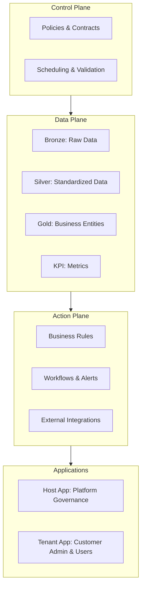

# The Concept: System of Actions

Enterprises already run on systems of record.
ERP, CRM, HR, and manufacturing systems capture every transaction.
They are precise within their scope and enforce compliance with statutory and operational rules.
Their job is to log and safeguard business events as they happen.

The limitation is fragmentation. Each system speaks its own language.
Finance knows invoices, sales know opportunities, operations know batches, but they do not align naturally.
When leadership asks a cross-functional question, different teams bring different numbers.
Time is lost reconciling, and confidence erodes.

This platform builds on top of those systems of record.
Where the record systems ensure data exists and is correct locally, 
the platform ensures data is consistent, explainable, and actionable across the enterprise. 
It acts as the system of action: 
refining what records produce, unifying it through contracts, and activating outcomes through governed workflows. 
KPIs are not static reports here; they are living metrics tied to evidence and directly linked to next steps.

## The Model
This conceptual model shows the platform as a system of action on top of systems of record. 
The platform is divided into four planes, each with a distinct role.

* **Control Plane: Manages** the overall system. It schedules when data should be processed, checks that rules and contracts are followed, and applies enterprise policies before any work is allowed.
* **Data Plane: Processes** data from source systems. It stores raw copies, standardizes them, applies business meaning, and calculates key metrics.
* **Action Plane: Responds** to those metrics. It applies rules, creates tasks or alerts, and connects with other enterprise systems so that numbers lead to action.
* **Applications: Provide** the human interface. The Host App is for the platform host or central administrator to manage governance, contracts, and tenants. The Tenant App is for customer organizations. It serves both customer data administrators, who manage onboarding, roles, and approvals, and business end users, who consume metrics, evidence, and activation features.

### Control Plane

The Control Plane manages the platform’s operation. 
It validates contracts, schedules work, enforces policies, and ensures that only compliant jobs are executed. 
It is responsible for governance, not computation. 
Business data never flows through it; instead it issues instructions and guardrails to the Data Plane.
[Read More...](../platform-working/pc-02-control-plane.md)

### Data Plane

The Data Plane processes information from source systems. 
It ingests raw data into Bronze, standardizes it into Silver, applies business meaning in Gold, 
and calculates metrics in the KPI layer. 
Contracts govern each step. 
The Data Plane is where numbers are computed, lineage is captured, and evidence is assembled.
[Read More...](../platform-working/pc-03-data-plane.md)

### Action Plane

The Action Plane takes KPI results and applies business rules to create tasks, alerts, or integrations. 
It is what makes KPIs actionable. 
Instead of passive reporting, the Action Plane ensures that breaches, thresholds, 
or anomalies trigger workflows that can be audited and explained.
[Read More...](../platform-working/pc-03-data-plane.md)

### Applications Plane

Applications provide the human interface. 
The Host App is for the platform host or central administrator: defining contracts, managing tenants, and enforcing governance. 
The Tenant App is for customer organizations: it serves both customer data administrators, 
who handle onboarding, roles, and approvals, and business end users, who consume metrics, evidence, and activation features.

[Read More: Host App Overview...](../host-app/ha-01-overview.md)
[Read More: Tenant App Overview...](../tenant/index.md)

## Model Features

### Layers of Data Refinement

Within the Data Plane, information advances through layers. 
**Bronze** captures immutable raw data. 
**Silver** standardizes it into predictable form. 
**Gold** applies business semantics through GDP Contracts. 
**KPI** computes results as pure functions with thresholds and ownership. 
This progression transforms raw transactions into trustworthy metrics.

### Contracts as the Operating System

The platform runs on contracts. 
**Source Contracts** define ingested data. 
**GDP Contracts** define business entities. 
**KPI Contracts** define metrics. 
**Activation Contracts** define delivery. 
No job runs without a contract. 
Compatibility and migration rules ensure safe evolution.

### Tenancy as a First-Class Dimension

Every storage path, compute role, and encryption key is tenant-scoped. 
Shared services are multi-tenant-aware but never leak data. 
Cross-tenant access is explicit and logged. 
This makes the platform safe for many enterprises at once.

### Cross-Cutting Guarantees

Security, observability, reliability, and cost governance apply everywhere. 
Secrets are managed with KMS. Logs, metrics, and traces are available for every run. 
Jobs are idempotent with retries and clear error taxonomies. 
Quotas and budgets are enforced to control cost.

### Evidence-Based Metrics

Every KPI comes with an evidence bundle: 
input datasets, queries, validations, hashes, and run identifiers. Executives see the number; 
auditors see how it was derived. Evidence transforms metrics from opinions into records.

### Action Plane as Differentiator

Most systems stop at dashboards. 
The platform extends KPIs into workflows. 
A receivable breach opens a credit task. 
A margin drop notifies plant managers with affected SKUs. 
Actions are governed and auditable, closing the loop from data to execution.

### Boundaries

The platform is not a BI tool. 
BI tools consume its metrics. 
It is not a generic ETL engine. 
Transformations occur only through contracts. 
It is not a data lake. 
Bronze is immutable audit storage, not a sandbox. 
Clear boundaries preserve guarantees.
