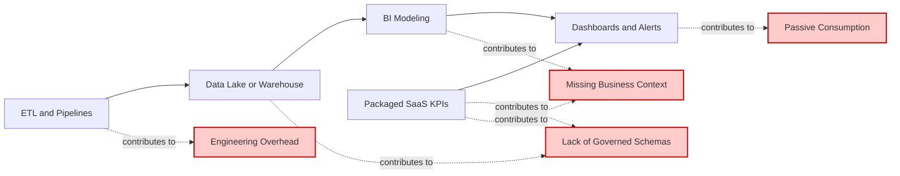

# The Solution

Enterprises already operate a stack of data tools. Each plays a role, but none close the structural gaps identified earlier. 
The result is a sequence of handoffs that introduces fragility and slows outcomes. 
BareCount™ addresses these gaps by replacing horizontal stitching with a vertically integrated system of action.

## Current Practices

_Figure 1: Current Data & Analytics Practices_{.figure-caption}

Most enterprise data stacks follow the same pattern:

- **ETL and pipeline tools** move data but do not enforce metric contracts.  
- **Data lakes and warehouses** store data but remain raw canvases without governed semantics.  
- **BI tools** visualize numbers but do not create, validate, or operationalize them.  
- **SaaS tools** ship packaged KPIs but lack breadth, governance, and explainability.  

The chain looks simple: connect → store → model → visualize → alert.
But each step depends on custom glue. 
Definitions drift, runbooks multiply, and trust erodes in the handoff.

## Our Approach: Vertical Integration

  <a href="#" class="close-btn">&times;</a>
  

_Figure 2: Simplified Solution Overview_{.figure-caption}

BareCount™ is designed as a vertically integrated system of action. 
It removes horizontal stitching and establishes one path from raw input to a governed outcome.

- **Contracts replace glue.** Numbers are bound to source, logic, validation, and delivery agreements. The platform generates and enforces runtime behavior.  
- **One refinement path.** Bronze → Silver → Gold → KPI lives inside the data plane with a single lineage and evidence model.  
- **One control surface.** Policy, scheduling, and governance operate in the control plane, not through external orchestrators.  
- **One action plane.** KPI outputs trigger workflows, approvals, and integrations natively.  
- **One place to trust.** Evidence, ownership, service levels, and cost are visible in the same system.  

Interoperability remains where it adds value. 
BI can consume governed KPIs, and warehouses can persist raw history. 
But outcomes do not depend on stitching.

## Core Solution

The BareCount™ platform redesigns how numbers are created, governed, and activated. 
It addresses the structural drag by tackling each root cause directly.

### Reduced Engineering Overhead

Numbers are qualified at the point of entry, not after months of pipeline work.

- Ingest from ERP, CRM, HR, MES, and operational systems with minimal setup.  
- Normalize, reconcile, and qualify fields automatically into enterprise-ready form.  
- Avoid rebuilding modeling layers for every KPI request.  
- Shorten delivery cycles and reduce dependency on scarce specialists.  

!!! success "Reduced Engineering Friction"  
    Business teams receive usable numbers in real-time. 
    Confidence rises through built-in qualification, and overall cost falls as engineering friction is reduced.

### Contracts for Numbers

Every business-critical field is bound to a transparent contract.

- **Origin** records where the number comes from.  
- **Logic** records how it is calculated.  
- **Validation** records the rules and thresholds that make it trustworthy.  
- **Delivery** records when the number must be available.  

!!! success "Data Trust by Design"  
    Numbers shift from loosely produced outputs to governed commitments. 
    Executives act with confidence because trust, lineage, and quality are explicit and auditable.

### Built-in Business Context

Business functions should not rebuild KPIs on top of raw tables. 
BareCount™ provides pre-built catalogs for Finance, Sales, Marketing, and Operations.

- Consistent definitions across functions with configurable rules for local needs.  
- KPIs inherit contracts for origin, logic, validation, and delivery.  
- Ready for reviews, approvals, and board reporting from day one.  

!!! success "Always Business Aware"  
    Adoption accelerates because numbers arrive in the language of each function. 
    Cross-functional alignment improves because everyone uses the same governed definitions.

### From Dashboards to Actions

Numbers should not stop at dashboards. BareCount™ extends them into governed actions.

- Exposes flows that are event-driven, scheduled, or manual.  
- Provides reverse connectors back into core systems such as ERP or CRM.  
- Enforces governance, quotas, and auditability for every action.  
- Surfaces these capabilities in the Tenant App UI as Action Panels.  

!!! success "Beyond Dashboards" 
    Data shifts from passive reporting to active outcomes. 
    Teams correct course mid-cycle instead of reacting after the fact.

## Benefits for Enterprises

BareCount™ delivers measurable improvements by addressing all four root causes together.

- **Real-time access to KPIs** reduces close cycles and removes bottlenecks.  
- **Improved trust in numbers** comes from contract-bound validation and clear lineage.  
- **Cross-functional alignment** ensures Finance, Sales, Marketing, and Operations work from the same governed definitions.  
- **Faster interventions** arise because Action Panels connect metrics to workflows.  
- **Reduced engineering cost** comes from configuration replacing custom builds.  
- **Higher ROI on core systems** is achieved by elevating ERP, CRM, MES, and HRMS data into enterprise assets.  
- **AI-ready consumption** is enabled by exposing governed numbers as APIs without extra transformation.

## Conclusion

BareCount™ works because it addresses root causes together.  
It reduces engineering overhead, binds numbers to contracts, embeds business context, and extends metrics into an action plane.  
By doing so, it transforms enterprise data from a drag into a reliable driver of outcomes.
