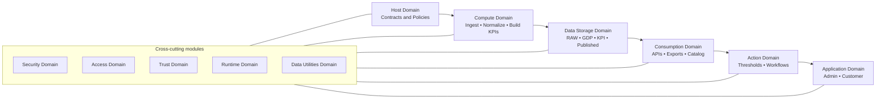

# Platform Working

The platform works as an ordered flow of modules. Each domain has a precise role and exposes modules that implement it. Together they form the complete lifecycle of data from request to action. This section explains how modules interact to deliver governed, reliable outcomes.

## Request and Approval
All activity begins in the Host Domain. Tenants submit requests to onboard sources, define schemas, or publish KPIs. The Host Domain evaluates these requests against contracts, policies, and tenant entitlements. Only approved contracts move forward, which ensures that every dataset, schema, and KPI is governed from the start.

## Ingestion and Storage
Once approved, the Compute Domain ingests data from connected sources. Ingested data lands in the RAW store of the Data Storage Domain. Storage is contract bound, so each dataset is tied to an extractor or raw schema. This guarantees completeness and traceability at the earliest stage.

## Normalization and GDP
The Compute Domain then normalizes raw data into Golden Data Points. Standard calendars, currencies, and organizational dimensions are applied so that data is consistent across sources and tenants. GDP datasets are stored in the GDP store and become the foundation for higher level metrics.

## KPI Construction
Using GDP datasets, the Compute Domain builds KPI datasets. Each KPI is materialized according to its contract, validated, and logged with evidence. KPI datasets are immutable and versioned in the KPI store, providing consistent and auditable insights.

## Publishing and Delivery
After KPIs are built, they are published into the Published store and made available through the Consumption Domain. Delivery options include APIs, scheduled exports, and webhooks. Consumers interact only with schema stable, versioned products that conform to activation contracts.

## Actions and Outcomes
The Action Domain extends the flow by interpreting KPI states against defined thresholds. When conditions are met, it generates actions and delivers them to external systems such as ERP, CRM, or ITSM platforms. Every action is contract bound, evidenced, and auditable, so insights translate directly into outcomes.

## Human Interaction
The Application Domain provides secure entry points for humans. The Admin App supports operator tasks such as approvals and monitoring, while the Customer App gives tenants visibility into their data products and actions. Applications remain thin; they surface state but do not embed business logic.

## Cross-cutting Services
Across the entire lifecycle, cross-cutting modules apply consistently. The Security Domain protects the perimeter. The Access Domain enforces authentication and authorization. The Trust Domain embeds encryption, secrets, and evidence into every operation. The Runtime Domain powers execution, scheduling, and observability. The Data Utilities Domain supplies schemas, discovery, and migration support. These assurances apply uniformly and make the end-to-end process predictable, secure, and compliant.

## End-to-End Flow

