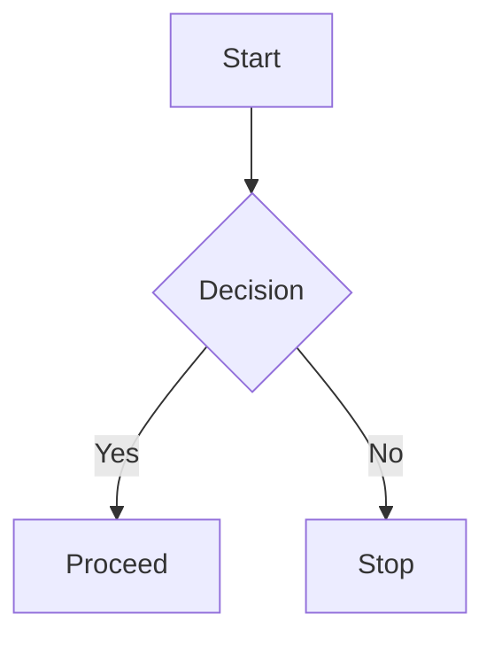

# Style & Typography Guide (Demo)

This page shows headings, lists, code, tables, admonitions, tabs, details, footnotes, quotes, and more.
So you can sanity-check your theme.

---

## Headings

# H1 — Page Title (use once)
## H2 — Section
### H3 — Subsection
#### H4 - Heading
##### H5 - Capital Badge
###### H6 - Fine Print

Paragraph with **bold**, *italic*, `inline code`, ==highlight==, ~~strikethrough~~, ^^inserted^^, and superscript/subscript like X^2^ and H~2~O. Emoji: :rocket: :memo:. Smart symbols: (c) (tm) 1/2 -> ½.

Keyboard: <kbd>Ctrl</kbd> + <kbd>K</kbd> to search.

Plain link: https://example.com

---

## Lists

### Unordered
- One
  - Nested
    - Deep nested
- Two
- Three

### Ordered
1. Step one
2. Step two
3. Step three

### Task list
- [x] Done item
- [ ] Todo item
- [ ] Another item

### Definition list
Term 1
: Definition for term 1.

Term 2
: Multi-line definition with **formatting** and `code`.

---

## Code

Inline: `pip install mkdocs-material`

Fenced with language and line numbers (see your config):

```python
def greet(name: str) -> str:
    msg = f"Hello, {name}!"
    return msg

if __name__ == "__main__":
    print(greet("World"))
```

JSON:

```json
{
  "name": "example",
  "enabled": true,
  "items": [1, 2, 3]
}
```

> Blockquote with code:
>
> ```bash
> mkdocs serve
> ```

---

## Tables

| Feature          | Support | Notes                         |
|------------------|:------:|-------------------------------|
| Bold/Italic      |  ✅    | Standard Markdown             |
| Code fences      |  ✅    | Language highlighting         |
| Admonitions      |  ✅    | See below                     |
| Tabs             |  ✅    | Requires `pymdownx.tabbed`    |
| Task list        |  ✅    | Clickable if enabled          |

Footnote reference[^a].

---

## Admonitions (Callouts)

!!! note "Note"
    Use callouts to highlight context.

!!! tip "Tip"
    Keep pages short. Link out the details.

!!! warning "Warning"
    Validate data sources before publishing.

!!! danger "Danger"
    Don’t commit secrets to your repo.

Collapsible:

???+ info "Expandable details"
    Hidden by default. Good for long explanations or examples.

---

## Tabs (content switcher)

=== "Python"
    ```python
    import sys
    print(sys.version)
    ```
=== "JavaScript"
    ```js
    console.log(`Hello, tabs`);
    ```
=== "Shell"
    ```bash
    echo "Hello, tabs"
    ```

---

## Details (without admonition)

<details>
<summary>Click to expand plain details</summary>

This is a native `<details>` block rendered via `pymdownx.details`. You can put **Markdown** here.

</details>

---

## Critic Markup (review mode)

{++ added text ++}, {-- removed text --}, {~~ old ~> new ~~}, {== highlighted ==}{>> reviewer comment <<}

---

## Small Utilities

- Abbreviations via HTML: <abbr title="As Soon As Possible">ASAP</abbr>.
- Inline HTML is allowed (`md_in_html`).
- Tooltips via the `title` attribute: <span title="Hover for tooltip">hover me</span>.

---

## Mermaid (optional)

> Will render if Mermaid JS is loaded; otherwise shows as code.



---

## Footnotes

This sentence has a footnote reference.[^b]

[^a]: Footnotes render at the bottom and auto-link back.
[^b]: Another footnote with **formatting** and `code`.
