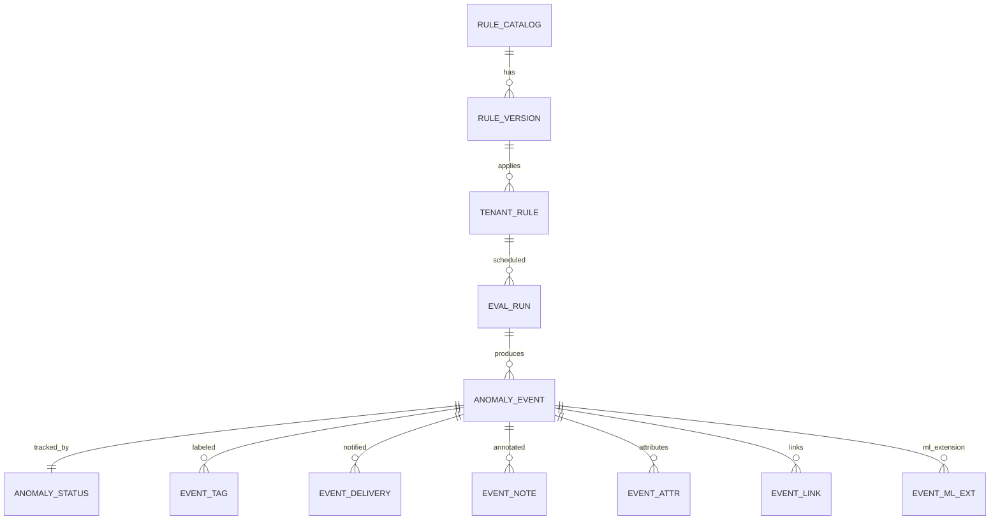

# Anomaly Detection Module — Data Models

Audience: Platform engineers, data engineers, DBAs  
Status: Version 1.0  
Purpose: Define the persistent schema for tenant scoped anomaly detection, including rules, runs, events, statuses, notifications, and catalogs. The design supports deterministic rule based detection today and extends to ML scoring without structural change.

---

## Modeling principles

- Tenant isolation first. Every record carries `tenant_id` and is partitioned by tenant and time where applicable.  
- Immutable facts and mutable status. Detection events are immutable. Resolution state is mutable and versioned.  
- Idempotency and replay. Identifiers include natural keys that avoid duplication during retries.  
- History by design. Rule specs and configuration snapshots are stored for audit and reproducibility.  
- Extension safe. ML detections reuse the same event envelope with additional fields in a side table.

---

## Entity overview



---

## Tables and columns

### rule_catalog

Authoritative library of rule templates and packs. Platform owned.

| Column | Type | Notes |
|--------|------|------|
| pack_name | text | logical group name |
| rule_key | text | unique key inside pack |
| title | text | human readable title |
| description | text | long form description |
| created_at | timestamptz | creation time |
| updated_at | timestamptz | last update |
| owner | text | system or user who owns template |

Primary key `(pack_name, rule_key)`.

### rule_version

Immutable versions of catalog rules after validation. Each change creates a new version.

| Column | Type | Notes |
|--------|------|------|
| pack_name | text | |
| rule_key | text | |
| version | text | semantic version |
| spec_yaml | text | canonical rule YAML |
| checksum | text | sha256 of spec |
| created_at | timestamptz | |
| created_by | text | actor id |

Primary key `(pack_name, rule_key, version)`.

### tenant_rule

Effective rule binding for a tenant. May originate from a catalog rule or be custom.

| Column | Type | Notes |
|--------|------|------|
| tenant_id | text | scope |
| rule_id | text | stable id visible to tenant |
| source_pack | text | nullable for custom |
| source_key | text | nullable for custom |
| source_version | text | nullable for custom |
| spec_yaml | text | effective spec after overrides |
| status | text | draft, validated, active, suspended, archived |
| created_at | timestamptz | |
| created_by | text | |
| updated_at | timestamptz | |
| updated_by | text | |

Primary key `(tenant_id, rule_id)`.

### eval_run

A single evaluation run of one or more rules for a tenant and window. Used for tracing and metrics.

| Column | Type | Notes |
|--------|------|------|
| run_id | text | unique id |
| tenant_id | text | scope |
| window_from | timestamptz | inclusive |
| window_to | timestamptz | exclusive |
| trigger_type | text | kpi_refresh or cron |
| trigger_ref | text | table name or cron expression |
| request_id | text | idempotency key |
| started_at | timestamptz | |
| completed_at | timestamptz | |
| evaluated_count | int | rules or slices evaluated |
| match_count | int | events produced |
| error_count | int | errors during run |
| worker_shard | text | evaluator identity |
| correlation_id | text | cross system tracing |

Primary key `(run_id)`.
Index by `(tenant_id, started_at)` and `(tenant_id, window_from, window_to)`.

### anomaly_event

Immutable detection record. Writes are idempotent on natural key.

| Column | Type | Notes |
|--------|------|------|
| event_id | text | unique id |
| tenant_id | text | scope |
| rule_id | text | reference to tenant_rule |
| metric | text | KPI or signal name |
| period_key | text | e.g., 2025-09-15 for daily or 2025-09 for monthly |
| baseline_fn | text | median, mean, pctl, previous, same_period_last_year |
| baseline_window | int | trailing periods |
| baseline_value | numeric | computed baseline |
| current_value | numeric | observed value |
| deviation | numeric | difference current - baseline |
| deviation_pct | numeric | deviation / max(epsilon, baseline) |
| severity | text | critical, high, medium, low |
| source_table | text | source of metric |
| run_id | text | producing eval_run |
| request_id | text | idempotency key |
| correlation_id | text | tracing |
| created_at | timestamptz | write time |

Primary key `(event_id)`.
Natural idempotency key `(tenant_id, rule_id, metric, period_key, request_id)`.

Indexes
- `(tenant_id, period_key)` for time range queries  
- `(tenant_id, rule_id, period_key)` for rule history  
- `(tenant_id, severity, created_at)` for alert feeds

### anomaly_status

Mutable resolution state for an event.

| Column | Type | Notes |
|--------|------|------|
| event_id | text | foreign key to anomaly_event |
| tenant_id | text | scope |
| state | text | open, acknowledged, dismissed, resolved |
| note | text | analyst note |
| updated_at | timestamptz | |
| updated_by | text | actor |

Primary key `(event_id)`.

### event_tag

Free form labels for search and grouping.

| Column | Type | Notes |
|--------|------|------|
| event_id | text | |
| tenant_id | text | |
| tag | text | |

Primary key `(event_id, tag)`.

### event_delivery

Tracking of webhook or email deliveries for each anomaly event.

| Column | Type | Notes |
|--------|------|------|
| delivery_id | text | unique id |
| event_id | text | |
| tenant_id | text | |
| channel | text | webhook or email |
| endpoint | text | url or recipient |
| attempt | int | 1 based |
| status | text | success, retry, failed, dead_letter |
| response_code | int | http code if applicable |
| created_at | timestamptz | attempt timestamp |

Primary key `(delivery_id)`.
Index `(event_id, channel, created_at)`.

### event_note

Analyst and system comments on events.

| Column | Type | Notes |
|--------|------|------|
| note_id | text | unique id |
| event_id | text | |
| tenant_id | text | |
| body | text | markdown allowed |
| author | text | actor id |
| created_at | timestamptz | |

Primary key `(note_id)`.
Index `(event_id, created_at)`.

### event_attr

Flexible key value attributes for events.

| Column | Type | Notes |
|--------|------|------|
| event_id | text | |
| tenant_id | text | |
| key | text | attribute name |
| value | text | attribute value |

Primary key `(event_id, key)`.

### event_link

External references such as tickets or dashboards.

| Column | Type | Notes |
|--------|------|------|
| link_id | text | unique id |
| event_id | text | |
| tenant_id | text | |
| kind | text | ticket, dashboard, dataset |
| url | text | absolute link |
| created_at | timestamptz | |

Primary key `(link_id)`.

### event_ml_ext

Optional ML extension table that stores model metadata and scores for an event. Empty in rule only phase.

| Column | Type | Notes |
|--------|------|------|
| event_id | text | |
| tenant_id | text | |
| model_id | text | model identifier |
| model_version | text | |
| score | numeric | model score |
| features_ref | text | pointer to feature vector location |
| created_at | timestamptz | |

Primary key `(event_id, model_id, model_version)`.

---

## Reference integrity

- anomaly_status.event_id references anomaly_event.event_id and must match tenant_id.  
- event_tag, event_delivery, event_note, event_attr, event_link, and event_ml_ext all reference anomaly_event.event_id and tenant_id.  
- anomaly_event.rule_id references tenant_rule.rule_id for the same tenant_id.  
- Deleting an event cascades to deliveries, notes, tags, attrs, links, and ml ext unless retention policy requires freeze.

---

## Partitioning and retention

Recommended partitioning strategy  
- anomaly_event partitioned by month and tenant id.  
- anomaly_status co located with anomaly_event partitions.  
- Delivery and note tables partitioned by month.

Retention policy  
- Events kept for 180 to 730 days by tenant policy.  
- Deliveries kept for 90 days.  
- Notes and tags retained with events.  
- Jobs and run metadata retained for 90 to 180 days.

Archival moves closed partitions to colder storage while preserving query access through external tables.

---

## Idempotency keys

For safe retries, the natural id for an anomaly is the tuple  
(tenant_id, rule_id, metric, period_key, request_id)  
The engine must not write duplicate events for the same tuple.  
This guard supports manual replays and network retries without duplication.

---

## Sample DDL (PostgreSQL)

The following subset demonstrates core constraints. Production schemas may include storage options not shown here.

```sql
create table anomaly_event (
  event_id text primary key,
  tenant_id text not null,
  rule_id text not null,
  metric text not null,
  period_key text not null,
  baseline_fn text not null,
  baseline_window int,
  baseline_value numeric,
  current_value numeric,
  deviation numeric,
  deviation_pct numeric,
  severity text not null,
  source_table text,
  run_id text,
  request_id text not null,
  correlation_id text,
  created_at timestamptz not null default now()
);

create unique index uq_anomaly_event_natural
  on anomaly_event(tenant_id, rule_id, metric, period_key, request_id);

create table anomaly_status (
  event_id text primary key references anomaly_event(event_id) on delete cascade,
  tenant_id text not null,
  state text not null,
  note text,
  updated_at timestamptz not null default now(),
  updated_by text not null
);
```

---

## Query patterns

- Recent anomalies by severity for a tenant  
```sql
select * from anomaly_event
where tenant_id = $1
  and created_at >= now() - interval '7 days'
  and severity in ('critical','high')
order by created_at desc;
```

- Event with full context  
```sql
select e.*, s.state, s.note
from anomaly_event e
left join anomaly_status s on s.event_id = e.event_id
where e.event_id = $1;
```

- Rule performance statistics  
```sql
select rule_id, count(*) as events, avg(deviation_pct) as avg_dev
from anomaly_event
where tenant_id = $1
  and created_at between $2 and $3
group by rule_id
order by events desc;
```

---

## Privacy and security

- All tables include tenant_id and follow tenant encryption keys.  
- Access paths are restricted by role and tenant scope.  
- Exports use signed URLs with short expiry.  
- Sensitive notes should avoid PII; enforce redaction on ingest if required by policy.

---

## Migration guidance

- Introduce new optional columns with defaults and backfill asynchronously.  
- Use views for compatibility when reshaping attributes.  
- For heavy partitions, perform rolling maintenance during off peak hours.  
- Keep DDL changes versioned and apply with transactional migrations.

---

## Summary

The data model separates immutable facts from mutable resolution state and keeps tenant isolation central.  
It supports replay safe evaluations, efficient retrieval, and detailed audit trails.  
The schema provides a stable foundation for rule based detection today and seamlessly accommodates ML scoring in future releases.
