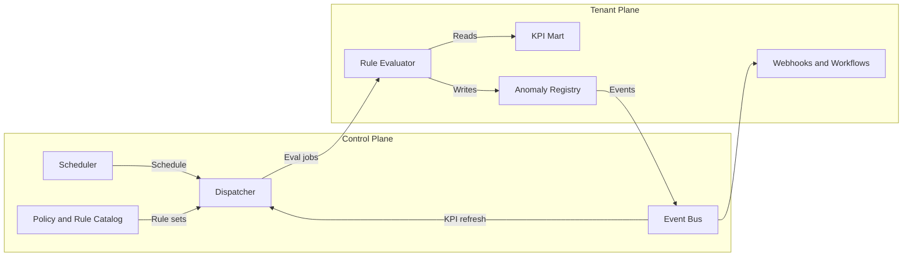
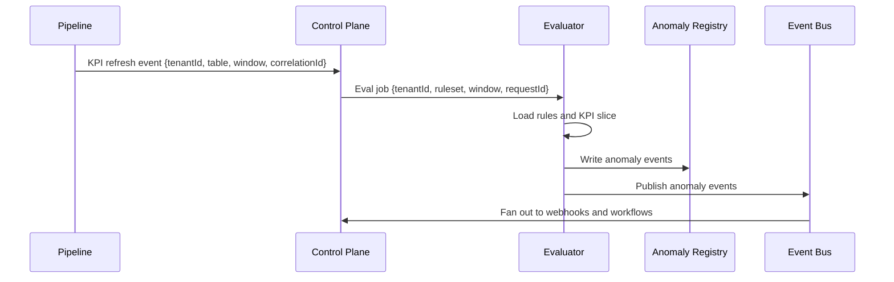
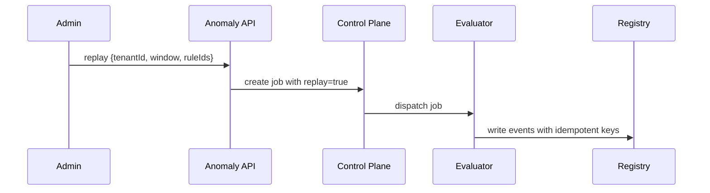

# Anomaly Detection Module — Architecture

Audience: Platform engineers, solution architects, SRE, tenant administrators  
Status: Version 1.0  
Purpose: Describe how the module detects irregular business behavior for each tenant through a rule-based engine, how it integrates with pipelines and control services, and how it prepares for a future ML engine without changing contracts.

---

## Position in the platform

Anomaly sits in the tenant intelligence layer. It evaluates business metrics after golden data and KPI materialization and before publication to analytics or downstream consumers.  
The module spans two planes.

- Tenant plane. Data marts, rule evaluation, and anomaly persistence inside the tenant boundary.  
- Control plane. Scheduling, policy management, multi tenant coordination, and event routing.

This separation preserves tenant isolation and enables shared orchestration without cross tenant leakage.



---

## Architectural principles

- Tenant first. All evaluation uses data that belongs to a single tenant.  
- Explainable by default. Every detection is traceable to a rule, a baseline, a data slice, and a decision.  
- Declarative control. Rules and policies are configuration, not code.  
- Idempotent operations. Re running an evaluation produces identical outcomes for identical inputs.  
- Stable contracts. API and event schemas remain compatible across versions.  
- Observability everywhere. Metrics, logs, and audit events exist for each stage.  
- Security invariant. No cross tenant data sharing and encryption under tenant policy always applied.

---

## Component model

### Control plane

- Scheduler. Plans evaluation windows from cron like definitions or after upstream events.  
- Policy and rule catalog. Stores rule templates, default packs, and validation logic.  
- Dispatcher. Expands schedules and events into per tenant evaluation jobs with rate and quota controls.  
- Event bus. Delivers evaluation triggers and fan out anomaly events to subscribers.

### Tenant plane

- KPI mart. Curated tables that represent business measures and dimensions in the tenant environment.  
- Rule evaluator. Stateless worker that computes expressions against KPI slices.  
- Anomaly registry. Authoritative store of anomaly events and their metadata.  
- Webhooks and workflows. Connectors that route anomalies to tenant destinations or platform workflows.

The evaluator and registry may be replicated per environment such as dev, staging, and prod.

---

## Data contracts

### Rule manifest

A rule is a declarative object that references a target KPI family, a metric, a period, a baseline function, and a decision predicate.

Example

```yaml
apiVersion: anomaly.v1
kind: Rule
metadata:
  ruleId: gm_trend_shift
  tenantId: t_23fd
spec:
  target: kpi_financials
  metric: gross_margin_percent
  period: monthly
  baseline: median(trailing=6)
  predicate: abs(current - baseline) / max(0.0001, baseline) > 0.10
  severity: high
  actions:
    - type: alert
    - type: workflow
      workflowId: wf_review_finance
```

Validation checks confirm that the metric exists, the baseline is defined, and the predicate is safe to evaluate.

### Anomaly event

An event captures detection context and is immutable.

```json
{
  "schema": "anomaly.v1",
  "tenantId": "t_23fd",
  "ruleId": "gm_trend_shift",
  "metric": "gross_margin_percent",
  "period": "2025-08",
  "baseline": {"fn": "median", "window": 6, "value": 0.34},
  "current": 0.30,
  "deviation": -0.04,
  "deviationPct": -0.1176,
  "severity": "high",
  "sourceTable": "kpi_financials_monthly",
  "correlationId": "c-8a9e",
  "requestId": "r-42b7",
  "createdAt": "2025-10-09T10:15:00Z"
}
```

### Job specification

The dispatcher produces jobs with explicit scope and replay semantics.

```json
{
  "schema": "anomaly.job.v1",
  "tenantId": "t_23fd",
  "ruleset": ["gm_trend_shift", "revenue_drop_rolling"],
  "window": {"from": "2025-07-01", "to": "2025-07-31"},
  "trigger": {"type": "kpi_refresh", "table": "kpi_financials_monthly"},
  "replay": false
}
```

---

## Evaluation lifecycle

1. Trigger. A KPI refresh or a scheduled window produces a job.  
2. Fetch. The evaluator retrieves active rules for the tenant and the relevant KPI slices.  
3. Compute. Expressions are evaluated with deterministic functions for baselines and deviation tests.  
4. Persist. Matches are written to the anomaly registry with full lineage.  
5. Publish. Events are emitted to the bus and forwarded to configured destinations.  
6. Acknowledge. The job completes and metrics record latency and counts.

Retries use idempotent keys composed of tenant id, rule id, and period window.  
If a retry arrives with identical inputs the evaluator writes no duplicate record.

---

## Baselines and predicates

Supported baseline functions

- Median trailing N periods  
- Mean trailing N periods with outlier clipping  
- Previous period value  
- Same period last year for seasonality checks  
- Percentile based bounds for robust thresholds

Supported predicate forms

- Absolute thresholds such as value greater than limit  
- Relative change such as absolute delta over baseline greater than threshold  
- Two metric relationships such as ratio or divergence  
- Completeness checks for expected volume or expected distincts

The engine uses safe numeric guards to avoid divide by zero and NaN propagation.

---

## Persistence and indexing

Anomaly registry holds immutable events plus a mutable status record for resolution state.

Tables

- anomaly_events. Immutable detection records. Indexed by tenant id, rule id, metric, and period.  
- anomaly_status. Resolution fields such as open, acknowledged, dismissed, resolved, and resolution notes.  
- rule_catalog. Effective rules after tenant overrides.  
- eval_runs. Job level metadata for timing and counts.

Partitioning is by tenant id and period to optimize range scans.  
Encryption and retention policies follow the tenant configuration.

---

## Scheduling and throttling

The scheduler supports two modes.

- Event driven. Triggers on pipeline signals when specific KPI tables refresh.  
- Time driven. Cron like schedules for tenants that prefer fixed windows.

The dispatcher enforces fairness with per tenant concurrency and global rate limits.  
Burst behavior is smoothed with a token bucket per tenant and a global queue with backpressure.

---

## Integration with pipelines

The pipeline publishes a refresh event after materializing a KPI table.  
The event carries the table name, the tenant id, the time window, and a correlation id.  
The control plane converts this into a job and assigns it to an evaluator pool that runs in the tenant plane or in a logically isolated worker shard that has access only to that tenant’s data.

This design keeps movement of data minimal and preserves residency rules.

---

## Security model

- All data paths are private and controlled by tenant policy.  
- Encryption at rest uses tenant scoped keys.  
- API calls require tenant and environment headers and are authorized through the Access module.  
- Rule code is declarative configuration stored in the catalog and is versioned.  
- Evaluation workers assume roles with least privilege to read only the required KPI tables and to write only into the anomaly registry of that tenant.  
- Events are signed and delivered to the tenant destinations over TLS.

---

## Observability

Key metrics

- anomaly_rule_evaluation_seconds histogram  
- anomaly_events_created_total counter with rule and metric labels  
- anomaly_rule_execution_failures counter with error class  
- anomaly_pipeline_trigger_lag_seconds gauge  
- anomaly_false_positive_ratio gauge based on status changes

Logs include job id, correlation id, rule ids, and a summary of matches.  
Audit entries capture who changed a rule, when it was deployed, and what version was active for a given detection.

---

## Failure modes and recovery

- Source not ready. Evaluator returns a soft failure and queues a retry with exponential backoff.  
- Rule validation error. Catalog rejects invalid specs during registration and logs a policy event.  
- Hotspot rule. Dispatcher caps concurrency for a tenant and spreads jobs over time.  
- Destination failure. Events are stored for replay until the webhook or workflow endpoint becomes reachable.  
- Data drift. Persistent high false positive ratio is flagged and routed to the owner for tuning.

All failure flows are visible in metrics and logs and are traceable to job ids and correlation ids.

---

## Capacity and performance

Evaluation is mostly CPU and IO bound. Capacity planning uses three inputs.

- Number of tenants and average rules per tenant  
- Average KPI slice size per evaluation window  
- Target latency from source refresh to anomaly event publication

Sharding strategies

- Shard evaluator workers by tenant id hash.  
- Place workers near data to reduce IO latency.  
- Use vectorized SQL window functions where beneficial and fall back to in memory evaluation for custom predicates.

---

## Backward compatibility and upgrades

Rule and event schemas follow semantic versioning.  
Backward compatible changes include new optional fields and new rule categories.  
Breaking changes require a new apiVersion and side by side evaluation during migration windows.

---

## Extension hooks for ML engine

The architecture reserves well defined interfaces so that ML scoring can be added later without contract changes.

- Feature store. Derived features computed from KPI history with tenant scope.  
- Scoring service. Stateless model inference on a sliding window.  
- Unified event shape. ML detections write the same anomaly event schema and share the same registry.  
- Feedback loop. Analysts label events which feed model improvement processes.

Until the ML engine is enabled, these interfaces remain dormant or return default responses.

---

## Example sequences

Rule evaluation after KPI refresh



Manual replay for a tenant window



---

## Summary

The architecture keeps data and evaluation inside the tenant plane while centralizing scheduling and governance in the control plane. Rules are declarative and explainable, evaluation is deterministic and idempotent, and events are traceable and secure. The same contracts will carry a future ML engine without breaking integrations or changing the operational model.
