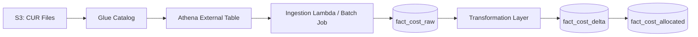

# CUR Ingestion

## Overview

This document describes how AWS Cost and Usage Reports (CUR) are ingested into the Commercial-Ops data domain. The objective is to provide a transparent, versioned, and auditable process that extracts billing signals from AWS into normalized tables for cost allocation and tenant reconciliation. The ingestion pipeline uses standard AWS-native components for simplicity and reliability.

Client data and platform telemetry remain separate from cost data. CUR ingestion handles only AWS billing artifacts generated under the operator’s master payer account and related linked accounts used by platform workloads.

## Purpose and Objectives

The CUR ingestion subsystem serves three primary purposes:

1. **Extract and normalize** AWS billing data from S3 into queryable structures.  
2. **Preserve fidelity** with AWS CUR schema for audit and reconciliation.  
3. **Feed** allocation, mapping, and reporting modules in the Commercial-Ops system.

Design goals include:

- Full transparency: every record traceable to AWS CUR source.  
- Incremental ingestion using partition dates.  
- Schema evolution tolerance.  
- Efficient query patterns for reconciliation and reporting.  
- Strict separation between raw and processed layers.

## Source and Delivery Configuration

### S3 Delivery

AWS delivers the CUR to an S3 bucket configured in the payer account. The report is delivered daily and partitioned by month. The recommended configuration:

| Parameter | Recommended Value |
|------------|-------------------|
| Time granularity | Hourly |
| Compression | Parquet |
| Report versioning | Overwrite with new version |
| Include resource IDs | Enabled |
| Include cost allocation tags | Enabled |
| S3 bucket policy | Restricted to ingestion role only |
| Lifecycle rule | Retain for 12 months |

Example S3 path structure:

```
s3://billing-cur-reports/commercial_ops_cur/
  ├── year=2025/
  │   ├── month=09/
  │   │   ├── 0000_00001.parquet
  │   │   ├── 0000_00002.parquet
```

### Glue Catalog and Athena

A Glue crawler maintains schema updates for the CUR location. Athena queries are used for exploration and as the primary ingestion interface.

Example Glue table name: `cur_billing_master`  
Partition keys: `bill_billing_period_start_date`, `bill_billing_period_end_date`

Minimal required IAM permissions for ingestion:

- `s3:GetObject`, `s3:ListBucket` on the CUR S3 path.  
- `glue:GetTable`, `glue:GetPartitions`.  
- `athena:StartQueryExecution`, `athena:GetQueryResults`.  
- `logs:CreateLogStream`, `logs:PutLogEvents` for query execution logs.

## Ingestion Pipeline Architecture



1. **Raw extraction** Athena query reads from Glue external table.  
2. **Normalization** Column names and data types aligned with internal schema.  
3. **Staging** Data written into `fact_cost_raw`.  
4. **Delta computation** Identify new or changed records using CUR file digest.  
5. **Commit** Delta merged into `fact_cost_delta` and version logged.  
6. **Publish** Allocated data available to mapping and reconciliation modules.

## Schema and Table Structures

### fact_cost_raw

| Column | Type | Description |
|---------|------|-------------|
| `identity_line_item_id` | string | Unique CUR line item identifier |
| `bill_billing_period_start_date` | date | Billing period start |
| `bill_billing_period_end_date` | date | Billing period end |
| `line_item_usage_start_date` | timestamp | Usage start |
| `line_item_usage_end_date` | timestamp | Usage end |
| `line_item_resource_id` | string | Resource identifier |
| `product_servicecode` | string | AWS service code |
| `line_item_usage_type` | string | Usage classification |
| `line_item_usage_amount` | double | Quantity |
| `line_item_unblended_cost` | double | Cost before credits |
| `line_item_unblended_rate` | double | Unit rate |
| `resource_tags_user_tenant_id` | string | Tenant tag |
| `resource_tags_user_plan_id` | string | Plan tag |
| `ingested_at` | timestamp | Ingestion timestamp |
| `source_digest` | string | Hash of CUR file for idempotency |

### fact_cost_delta

Stores incremental changes detected between CUR deliveries.

| Column | Type | Description |
|---------|------|-------------|
| `bill_period` | string | Billing period (YYYY-MM) |
| `change_type` | enum[new, update, delete] | Nature of delta |
| `source_digest` | string | Reference to CUR file |
| `record_count` | bigint | Number of records affected |
| `detected_at` | timestamp | Detection time |
| `applied_at` | timestamp | Merge commit time |

### cur_ingestion_log

Logs every batch run with metadata for traceability.

| Column | Type | Description |
|---------|------|-------------|
| `run_id` | string | UUID for ingestion run |
| `period_start` | date | CUR period start |
| `period_end` | date | CUR period end |
| `status` | enum[started, completed, failed] | Execution state |
| `row_count` | bigint | Number of records ingested |
| `duration_sec` | int | Run duration |
| `error_log` | string | Error details if failed |
| `source_digest` | string | CUR digest reference |
| `executed_by` | string | Service or user identifier |

## Incremental and Delta Loading Logic

CUR ingestion runs daily. Each run processes the latest CUR partitions and merges new records.

```sql
-- Detect new CUR partitions
SELECT DISTINCT bill_billing_period_start_date, bill_billing_period_end_date
FROM glue_catalog.cur_billing_master
WHERE bill_billing_period_start_date >= DATE_SUB(current_date, INTERVAL 40 DAY);
```

A hash digest is computed for each file. If the digest matches a previous run, the file is skipped. New or changed files trigger ingestion and merge logic.

Example delta detection pseudocode:

```python
def detect_delta(cur_files, last_digests):
    for file in cur_files:
        digest = md5sum(file)
        if digest not in last_digests:
            yield file
```

Incremental ingestion ensures that reprocessed CUR files (when AWS regenerates them) do not duplicate data.

## Handling Schema Changes

AWS periodically adds or renames fields in CUR. The ingestion pipeline validates Glue schema against internal expected schema and logs differences.

If new columns appear, they are appended as nullable fields. Deprecated columns remain in place until explicitly removed. The ingestion schema version is recorded with each run in `cur_ingestion_log`.

Example schema check output:

```
Detected new column: resource_tags_user_environment
Action: Added as nullable field
Detected removed column: product_instance_family
Action: Deprecated but retained for 30 days
```

## Validation and Freshness Checks

**Freshness:** CUR data typically lags 24–48 hours behind real-time usage. Ingestion freshness is monitored through a dashboard widget showing:

| Indicator | Definition | Threshold |
|-----------|-------------|------------|
| Fresh | Latest CUR partition within 2 days of current date | Green |
| Delayed | 3–4 days lag | Amber |
| Stale | More than 5 days lag | Red |

**Validation:** The system runs integrity checks on each batch:

1. Record count delta within tolerance (±5%).  
2. Billing period boundaries match Glue partitions.  
3. Nulls or negative costs logged for review.  
4. Random sample of 100 records cross-checked via Athena.  

Example validation SQL:

```sql
SELECT COUNT(*) AS missing_tenant_tag
FROM fact_cost_raw
WHERE resource_tags_user_tenant_id IS NULL
  AND bill_billing_period_start_date = :period_start;
```

## Operational Runbook Summary

- Schedule: daily run at 03:00 UTC.  
- Failure handling: automatic retry up to 3 times, then alert.  
- Logs stored in CloudWatch and mirrored to admin database.  
- Manual re-ingestion allowed via admin console by period.  
- Deletion or mutation of closed periods prohibited.  
- Metrics published to Observability module for tracking runtime, volume, and lag.

## Cross References

- **aws-cost-mapping.md** for metric-to-service correlation.  
- **plan-parameters.md** for quota and pricing configuration.  
- **observability.md** for runtime health and alert thresholds.  
- **data-model.md** for database table definitions.
