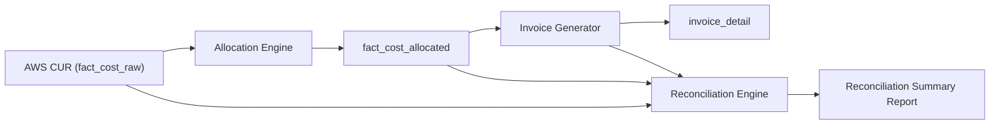

# Reconciliation

## Overview

The reconciliation process ensures financial integrity between AWS billing data, Commercial-Ops internal allocations, and tenant-facing invoices. It validates that all costs billed to tenants correspond to AWS usage, that all AWS usage has either been attributed or allocated, and that there is no double-counting or leakage.

Reconciliation runs after CUR ingestion, allocation, and invoice generation. It provides transparency and audit assurance for operators, tenants, and finance teams.

## Objectives

- Confirm that total AWS CUR costs equal the sum of allocated tenant costs plus operator overhead.  
- Detect mismatches in tagging, allocation, or timing.  
- Quantify variances within defined tolerance limits.  
- Produce audit-ready evidence for each reconciliation cycle.  
- Support invoice validation and accounting system synchronization.

## Data Flow



## Reconciliation Stages

| Stage | Source Tables | Purpose |
|-------|----------------|----------|
| **Stage 1: Tag Coverage Validation** | `fact_cost_raw`, `tag_validation_log` | Ensure every AWS resource has tenant and plan tags. |
| **Stage 2: Cost Allocation Consistency** | `fact_cost_raw`, `fact_cost_allocated` | Validate allocated cost equals raw cost per service and period. |
| **Stage 3: Invoice Match** | `fact_cost_allocated`, `invoice_detail` | Verify that invoiced values match allocated costs. |
| **Stage 4: FX and Timing Adjustments** | `invoice_detail`, accounting exports | Apply rounding and currency conversion validation. |

Each stage produces metrics and exceptions that feed into the final reconciliation summary.

## Variance Thresholds

| Variance Type | Definition | Threshold | Action |
|----------------|-------------|------------|--------|
| Cost Variance | (Allocated – CUR) / CUR | ±1% | Warning |
| Tagging Variance | % of untagged cost | < 0.5% | Info |
| Invoice Variance | (Invoiced – Allocated) / Allocated | ±0.5% | Critical if persistent |
| FX Variance | Exchange rate differences | ±0.25% | Acceptable |
| Timing Variance | CUR vs invoice period mismatch | ≤ 1 day | Auto-adjust |

Variances outside thresholds generate reconciliation exceptions logged in `recon_exceptions`.

## Core Tables

### recon_summary

| Column | Type | Description |
|---------|------|-------------|
| `recon_id` | string | Unique reconciliation batch identifier |
| `period_start` | date | Reconciled month start |
| `period_end` | date | Reconciled month end |
| `aws_total_usd` | numeric(18,6) | Total cost from CUR |
| `allocated_total_usd` | numeric(18,6) | Total cost from allocation |
| `invoiced_total_usd` | numeric(18,6) | Total cost invoiced to tenants |
| `operator_overhead_usd` | numeric(18,6) | Non-billable cost |
| `variance_usd` | numeric(18,6) | Difference between CUR and allocated/invoiced |
| `variance_pct` | double | Percentage variance |
| `status` | string | ok, warning, failed |
| `created_at` | timestamp | Run time |

### recon_exceptions

| Column         | Type      | Description                       |
|----------------|-----------|-----------------------------------|
| `exception_id` | string    | Identifier for exception          |
| `recon_id`     | string    | Reference to reconciliation batch |
| `tenant_id`    | string    | Tenant involved                   |
| `category`     | string    | Tagging, Allocation, Invoice      |
| `description`  | string    | Human-readable message            |
| `variance_pct` | double    | Magnitude of issue                |
| `status`       | string    | open, resolved                    |
| `created_at`   | timestamp | Logged at                         |


## Example SQL – Stage 2 (Allocation Consistency)

```sql
SELECT
  DATE_TRUNC('month', bill_billing_period_start_date) AS period_start,
  product_servicecode AS service,
  SUM(line_item_unblended_cost) AS aws_cost_usd,
  SUM(allocated_cost_usd) AS allocated_cost_usd,
  ROUND(((SUM(allocated_cost_usd) - SUM(line_item_unblended_cost)) / NULLIF(SUM(line_item_unblended_cost), 0)) * 100, 4) AS variance_pct
FROM fact_cost_raw r
LEFT JOIN fact_cost_allocated a
  ON r.product_servicecode = a.service
  AND DATE_TRUNC('month', r.bill_billing_period_start_date) = a.period_start
GROUP BY 1,2;
```

## Example SQL – Stage 3 (Invoice Match)

```sql
SELECT
  a.tenant_id,
  a.period_start,
  SUM(a.allocated_cost_usd) AS allocated_total,
  SUM(i.amount_usd) AS invoiced_total,
  (SUM(i.amount_usd) - SUM(a.allocated_cost_usd)) / SUM(a.allocated_cost_usd) AS variance_pct
FROM fact_cost_allocated a
JOIN invoice_detail i
  ON a.tenant_id = i.tenant_id
  AND a.period_start = i.period_start
GROUP BY 1,2;
```

## Evidence Log

Each reconciliation run generates evidence entries to support audit traceability.

| Evidence Type | Description | Storage |
|----------------|-------------|----------|
| Input Snapshot | CUR and allocation extracts | S3 |
| SQL Evidence | Query text and checksums | Aurora |
| Exception Logs | JSON records of issues | Aurora |
| Summary Report | PDF/HTML report | S3 (retention 24 months) |

### Example Evidence Metadata

```yaml
evidence:
  recon_id: RECON-2025-10
  period: 2025-09
  variance_pct: 0.43
  total_cur_usd: 23044.25
  total_allocated_usd: 22945.10
  total_invoiced_usd: 22945.10
  variance_reason: "Timing variance due to CUR lag"
  generated_at: "2025-10-06T10:00:00Z"
  verified_by: "billing-ops"
```

## Exception Handling

- Exceptions above critical thresholds are flagged to finance and platform leads.  
- The reconciliation dashboard shows variance trends and unresolved exceptions.  
- Manual adjustments (corrections or credit notes) are logged with reference to the reconciliation ID.  
- Re-runs are idempotent; previous results remain frozen for audit consistency.

## Governance and Audit Trail

- Every reconciliation run has a unique `recon_id`.  
- Audit trail includes all SQL scripts, parameters, and environment checksums.  
- Evidence must be retained for at least 24 months.  
- Variance thresholds are defined in `recon_policy.json` and version controlled.  
- Reconciliation success is a prerequisite for monthly invoice finalization.

## Cross References

- **cur-ingestion.md** for CUR raw data ingestion.  
- **allocation-rules.md** for shared-cost logic.  
- **budgets-alerts.md** for preemptive spend control.  
- **invoices-receipts.md** for billing and payment verification.  
- **observability.md** for reconciliation dashboards.
