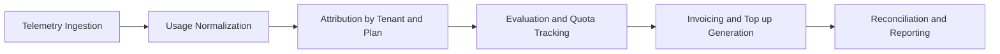
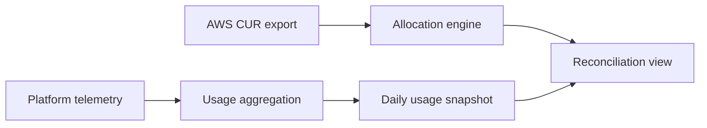

# Commercial Operations

Commercial-Ops defines the financial and operational framework that governs how the platform converts system usage into billable value. It establishes the rules, data models, and control flows required to ensure that tenant specific consumption of compute, storage, and network resources is measured accurately, priced predictably, and reconciled reliably against both internal AWS spend and published subscription plans.

Commercial-Ops acts as the interface between technical execution and financial accountability. It guarantees that each byte transferred, gigabyte stored, or compute hour executed can be attributed to a tenant, traced to an AWS cost anchor, and reflected transparently in the tenant’s plan usage and invoices. This alignment prevents cost drift, supports capacity planning, and enables consistent margins without manual reconciliation.

The module consists of independent yet interlocked subsystems, each responsible for a specific stage of the cost to cash cycle: data ingestion and normalization, metric computation, plan evaluation, quota enforcement, billing generation, and validation through AWS Cost and Usage Reports. Together, these subsystems form the commercial control plane for the platform.

## Objectives

Commercial-Ops ensures that all financial activity derived from platform usage follows three fundamental objectives.

**Determinism**  
Every billable metric is computed from reproducible, timestamped data that can be re evaluated at any time without drift.

**Auditability**  
All derived metrics, cost allocations, and billing actions are version controlled and traceable through immutable logs and database records.

**Fairness**  
Each tenant’s usage is evaluated against clearly defined plan limits, with consistent quota logic and transparent escalation or top up paths.

## Scope

| Phase          | Description                                                                        | Core subsystems                   |
|----------------|------------------------------------------------------------------------------------|-----------------------------------|
| Measurement    | Capture and normalize tenant usage from data, compute, and network domains.        | Data Services, Compute Networking |
| Attribution    | Link every usage record to a tenant and plan using enforced AWS tags.              | AWS Cost Integration              |
| Evaluation     | Compare aggregated usage against plan limits and trigger quota events and actions. | Plan Pricing                      |
| Validation     | Cross check internal metrics with AWS billing data such as CUR and Budgets.        | AWS Cost Integration              |
| Billing        | Generate invoices, receipts, and top up records from frozen monthly snapshots.     | Plan Pricing                      |
| Reconciliation | Review margin variance, allocation drift, and cost anomalies.                      | Observability, Runbook            |

## Out of Scope

Commercial-Ops does not handle payment processing or gateway integration. 
Commercial-Ops does not handle non usage based revenue such as consulting or implementation services. 
Commercial-Ops does not handle manual journal entries or ERP posting. 
Commercial-Ops produces validated, tenant level usage and invoice data that downstream finance systems can consume.

## Core Responsibilities

**Usage measurement**  
Defines how tenant activity is captured and standardized. The platform guarantees UTC timestamps, normalized units, and reproducible aggregation.

**Cost attribution**  
All AWS resources carry the tags `tenant_id`, `plan_id`, and `service_component`. Shared resources such as NAT gateways follow documented allocation policies with versioned rules.

**Quota evaluation**  
Evaluates tenant usage against plan metrics, triggers threshold events at 80 percent, 95 percent, and 100 percent, and records quota logs for observability and automation.

**Financial reconciliation**  
Aligns internal usage data, AWS CUR, and plan metadata for validation and anomaly detection. Closed billing periods are immutable, and corrections use reversal entries.

## Subsystem overview

Commercial-Ops is composed of eleven interdependent subsystems. 
Each subsystem owns a specific responsibility within the commercial lifecycle and exposes explicit data contracts, APIs, and audit points. 
Together they form a closed loop that translates operational consumption into financial output.

The design principle is strong separation with deterministic joins. 
Every subsystem can operate and evolve independently as long as its interfaces remain stable. 
This allows teams to change data sources or internal logic without breaking cost attribution or reconciliation. 
Plan Pricing and AWS Cost Integration act as the validation pair. 
One sets commercial expectations, the other validates actual spend.

Every subsystem must conform to the shared schema rules defined in the Data Model section. 
Schemas, tables, and APIs are versioned. 
Changes propagate through migrations, never direct edits. 
Subsystem releases follow the Commercial-Ops release checklist to preserve audit traceability.

| Subsystem                        | Purpose                                                                                   | Key artifacts                                        |
|----------------------------------|-------------------------------------------------------------------------------------------|------------------------------------------------------|
| Index                            | Entry point defining objectives, scope, and boundaries.                                   | index.md                                             |
| Plan Pricing                     | Defines metric catalog, plan parameters, cost mapping, and upgrade logic.                 | plan_master, plan_metric_map, topup_catalog          |
| AWS Cost Integration             | Ingests and reconciles AWS CUR and Budgets data and applies allocation rules.             | fact_cost_raw, allocation_rules, fact_cost_allocated |
| Cost Factors: Data Services      | Measures ingestion, total storage, egress, and retention and publishes metrics.           | tenant_data_usage                                    |
| Cost Factors: Compute Networking | Tracks compute hours, networking usage, and add ons and publishes metrics.                | tenant_compute_usage, tenant_network_usage           |
| Data Model                       | Provides DBML and DDL for all Commercial Ops entities with governance.                    | erd.dbml, ddl.sql                                    |
| API                              | Offers programmatic access to plans, usage, and allocations for tenants and admins.       | /usage, /plans, /topups, /allocation                 |
| Observability                    | Supplies dashboards, alerts, and anomaly queues for margin and data quality.              | metrics, alert policies                              |
| Runbook                          | Documents operating procedures for onboarding, monthly close, and incidents.              | runbook procedures                                   |
| Security                         | Governs IAM, RBAC, billing integrity, and evidence retention.                             | security guidelines                                  |
| UI                               | Presents tenant and admin usage dashboards with calls to action for top ups and upgrades. | tenant and admin views                               |

This modular structure allows teams to evolve components independently while maintaining deterministic reconciliation between technical usage and financial output. 
The AWS Cost Integration and Plan Pricing subsystems function as validation and control layers respectively, ensuring that technical consumption matches commercial expectations.

## Key entities and relationships

**Tenant**: Represents a logically isolated customer environment. It owns its data, configuration, and resource allocations within the shared platform. Each tenant record includes a unique tenant id, an active plan id, lifecycle states, and tag mappings for traceability in AWS billing and allocation tables.

**Plan**: Defines the commercial configuration that governs entitlements, quotas, and pricing. Plans are version controlled and immutable after publication. A plan includes metadata, mapped metrics, and add on definitions and is referenced by invoices and usage evaluations by exact version.

**Seats**: Represent licensed user slots that define how many users can access platform features under a tenant plan. Seat allocation is defined per plan and managed through the tenant user registry and plan seat map. Seats are commercial constructs and can be reassigned or expanded through paid add ons. Over utilization triggers additional seat charges or plan upgrades.

**Metric**: Represents the atomic unit for quota and cost evaluation. Each metric defines a unit, an aggregation rule, a visibility flag, and a domain classification. Metrics are stored in the metric catalog with semantic definitions and default units. Examples include data ingestion in gigabytes, storage peak in gigabytes with snapshots included, egress gigabytes with a published quota, and runner hours.

**Usage snapshot**: Captures aggregated metric values for a tenant within a billing period. Snapshots are immutable once finalized and are the source for invoicing and reconciliation. Daily snapshots support trend analysis and monthly snapshots are frozen for billing. Corrections are recorded as reversal entries.

**Invoice and receipt**: Consolidate subscription fees, usage based charges, top ups, and taxes into immutable financial documents. Receipts capture confirmed payments and reconcile against open invoices. Adjustments are handled through credit or debit notes rather than mutating existing records.

## Lifecycle Flow

Measurement begins with telemetry emitted by data, compute, and network components. 
Usage is normalized into consistent units and aggregated daily. 
Attribution assigns each record to a tenant through tags or allocation rules. 
Evaluation compares usage with plan thresholds and generates quota events and actions. 
Invoicing converts frozen snapshots into financial records with references to the active plan version. 
Reconciliation validates usage and cost alignment with AWS CUR before closing the billing period.

Each lifecycle stage is timestamped, replayable, and auditable. 
The system tolerates ingestion delays and late arriving AWS charges and documents any corrections with reversal entries.

## Data sources and integrations

Commercial-Ops consumes two asynchronous data streams. 
The first is platform telemetry, which measures activity at the moment it occurs. 
The second is AWS financial data, which records what AWS ultimately charges for that activity. 
Both streams are authoritative in their respective contexts. Telemetry is operational truth. 
CUR is billing truth.

Telemetry flows continuously through ingestion services and is aggregated hourly into usage tables. 
It powers tenant dashboards, alerts, and quota checks in near real time. 
AWS billing data, in contrast, arrives once or twice a day and can include minor retroactive adjustments. 
Its purpose is not to drive daily visibility but to verify that tagging, allocation, and spend attribution remain correct. 
Commercial-Ops reconciles the two at billing close and flags any variance beyond tolerance and stores results as immutable audit records.

**Tagging contract** All provisioned AWS resources must carry the tags `tenant_id`, `plan_id`, and `service_component`. Shared or non taggable costs follow allocation policies maintained as versioned rule sets.

**Data quality and integrity controls** Enforce unit normalization, timestamp alignment, allocation rule versioning, late arrival handling with watermarks and reversals, variance thresholds, and immutability of frozen periods.

**Integration interfaces** Inbound interfaces include service emitters to a messaging layer for usage ingestion and CUR exports to S3 with Glue and Athena. Outbound interfaces include dashboards backed by the daily snapshot, tenant and admin APIs, finance exports of monthly usage and invoices, and observability alerts and anomaly events.

**Anti patterns and remedies** Using CUR for daily quotas is incorrect and must be replaced with telemetry feeds. Mutating closed snapshots to match CUR is incorrect and must be replaced with reversal entries. Allocating shared costs without documented rules is incorrect and must be replaced with versioned allocation rules. Treating tagging as best effort is incorrect and must be enforced at provision time with periodic drift checks.

## Design Principles

Commercial-Ops follows a small set of operating principles designed to keep cost accounting deterministic and explainable.

**Determinism** Given the same telemetry, allocation rules, and plan definitions, the system always produces identical financial output.

**Immutability** Once a snapshot or invoice is issued, it is never rewritten. Any correction is logged as a reversal entry with full lineage.

**Separation of concerns** Operational metering, pricing, and financial validation never mix code paths or databases.

**Transparency with control** Tenants see current usage and quota positions while internal allocation logic remains operator controlled.

**Tolerance of source lag** AWS data delays do not disrupt tenant dashboards or quota monitoring.

**Auditability** Every metric, allocation, and cost figure can be traced to its origin. Evidence retention is mandatory.

**Least privilege** Access to create, publish, or modify commercial data requires defined RBAC policies.

## Audience and dependencies

Product and pricing teams define plan tiers, seats, and top up SKUs. Finance and revenue operations validate margin and reconcile invoices. Platform engineering instruments telemetry, enforces tags, and operates ingestion and evaluation pipelines. Security and compliance verify billing integrity and access controls. Support and operations follow runbooks for overage handling, NAT spikes, and tag drift.

Upstream dependencies include platform telemetry, AWS billing data with activated cost allocation tags, identity systems for seats, and the data platform for storage. Downstream consumers include tenant and admin UI, invoice generation, finance exports, and observability dashboards and alerts.

## Versioning and change management

**Plans and metrics**: Plans are immutable once published and updates create a new version. Metric definition changes create a new metric code and the old metric is deprecated without rewriting historical data.

**Allocation rules**: Allocation rule changes are forward effective. Historical reallocations use reversal entries with references to superseded rules.

**Schema evolution**: Table changes follow backward compatible migrations and DBML is the authoritative schema source with DDL generated from DBML.

**Release checklist**: Verify tag coverage at or above 99 percent on staging. Confirm reconciliation variance within tolerance. Render synthetic tenant invoices. Update runbooks and alerts.

## Cross references and next steps

This index defines the scope, design, and guarantees of Commercial-Ops. Submodules expand these areas and should be implemented in an order that maintains data and control dependencies.

**Plan Pricing** Define the metric catalog, plan parameters, cost mapping, and top up and upgrade logic.
**AWS Cost Integration** Configure CUR ingestion, tagging and allocation, budgets, and troubleshooting.
**Data Services** Formalize ingestion, total storage with snapshots included, egress with a published quota, retention policy, and mapping from AWS usage types.
**Compute Networking** Define runners and networking usage, add ons, and joins to CUR.
**Data Model** Provide DBML and DDL for entities including seats and usage snapshots.
**API** Provide tenant and admin endpoints and schemas for usage, plans, and allocations.
**Observability** Provide metrics, dashboards, anomaly detection, and alert routing.
**Runbook** Provide onboarding, monthly close procedures, overage handling, and incident response.
**Security** Provide IAM and RBAC controls, billing integrity, and network posture.
**UI** Provide tenant and admin views with meters, calls to action, and latency expectations.
