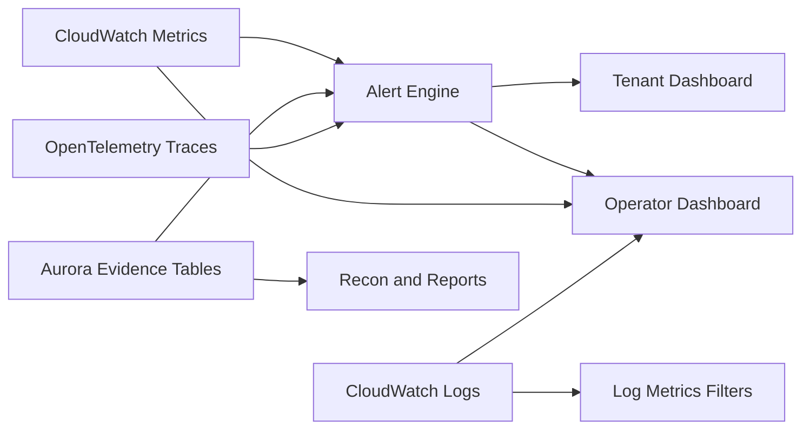

# Observability

## Overview

This document defines the observability model for Commercial-Ops. It describes the signals that verify platform health, financial correctness, and tenant experience. Observability is implemented with AWS-native telemetry (CloudWatch, CloudWatch Logs, CloudWatch Metrics, X-Ray where applicable), OpenTelemetry traces where supported, and Aurora SQL evidence for financial events. Dashboards and alerts expose the health of ingestion, allocation, budgeting, invoicing, and reconciliation. Currency defaults to USD. Canonical entities are tenant and plan.

Observability spans four layers:
- Control plane: provisioning, tagging, policy, configuration
- Data plane: runners, data ingestion and storage, egress
- Cost plane: CUR ingestion, allocation, budgets, reconciliation
- Billing plane: invoices, payments, receipts, exceptions

## Objectives

- Provide reliable early warnings for financial variance and capacity breaches
- Present tenant-facing usage gauges with daily freshness and trend direction
- Offer operator diagnostics that link alerts to evidence queries
- Maintain auditable, versioned alert policies and SLOs

## Architecture



Signals are ingested using OpenTelemetry SDKs where possible. Financial events are mirrored in Aurora tables to preserve auditability. Alert policies are stored alongside code in a versioned repository and synced to the platform on deploy.

## Metric Taxonomy

| Domain | Metric | Unit | Source | Description |
|--------|--------|------|--------|-------------|
| Data services | `data_ingestion_gb` | GB | `usage_snapshot_daily` | Accepted data volume per day |
| Data services | `storage_gb_peak` | GB | `usage_snapshot_daily` | Monthly peak logical storage including snapshots |
| Data services | `egress_gb` | GB | `usage_snapshot_daily` + VPC flow logs | Internet and cross-region transfer |
| Compute | `runner_hours` | Hour | runner telemetry | Accrued runner time per tenant |
| Network | `nat_gb_processed` | GB | flow logs | NAT Gateway processed volume |
| Network | `privatelink_gb_processed` | GB | flow logs | PrivateLink processed volume |
| Cost plane | `cur_freshness_days` | Day | `cur_ingestion_log` | Days since last CUR partition |
| Cost plane | `allocation_variance_pct` | % | compare pool vs allocated | Delta between pooled cost and allocations |
| Billing plane | `invoice_emission_lag_hours` | Hour | invoice tables | Delay from period close to invoice issue |
| Billing plane | `recon_variance_pct` | % | recon tables | End-to-end financial variance for month |
| Governance | `tag_coverage_pct` | % | tag validation | Share of resources with required tags |

## SLIs and SLOs

| SLI | SLO | Rationale | Breach Action |
|-----|-----|-----------|---------------|
| CUR freshness | ≤ 2 days lag | Daily dashboards rely on near-current data | Open P2 incident, rerun ingestion, notify finance |
| Allocation variance | ≤ 0.5% by service per month | Allocation must closely match pooled cost | Block invoice finalization, run investigation |
| Tag coverage | 100% required tags | Deterministic attribution | Quarantine untagged resources, raise ticket |
| Invoice lag | ≤ 72 hours after period close | Predictable billing operations | Escalate to billing-ops |
| Budget refresh | Daily by 04:00 UTC | Tenant alerts and caps | Rerun refresh job, validate SNS |
| Dashboard freshness | Snapshot within 24 hours | Tenant trust | Show freshness banner and reduced precision |

## Dashboards

- Tenant dashboard: utilization gauges for egress, storage peak, runner hours, seats; freshness banner; upgrade recommendations
- Operator dashboard: CUR freshness, allocation by category, tagging coverage, budget lag, reconciliation status, exception backlog
- Finance dashboard: invoice issuance progress, payments collected, open receivables, variance trend

### Gauge example

```json
{
  "widget": "gauge",
  "metric": "egress_gb",
  "tenant_id": "TEN-00123",
  "value": 410.2,
  "cap": 500.0,
  "thresholds": [0.8, 0.95, 1.0],
  "period": "2025-09"
}
```

## Alert Policies

Alert policies are declarative and versioned. Each rule maps a metric to thresholds and actions. Alerts are de-duplicated and rate-limited.

### Example policy YAML

```yaml
policy_version: v1.2
rules:
  - id: cur-freshness
    metric: cur_freshness_days
    scope: platform
    thresholds:
      warning: 2
      critical: 4
    operator_actions:
      - rerun_cur_ingestion
      - check_glue_partitions
    notify: [slack:billing-ops, email:finops@example.com]
  - id: allocation-variance
    metric: allocation_variance_pct
    scope: monthly
    thresholds:
      warning: 0.5
      critical: 1.0
    on_breach:
      - block_invoice_finalization
      - trigger_reconciliation_run
```

### CloudWatch metric filters

Create derived metrics from logs for error rate alarms.

```bash
aws logs put-metric-filter   --log-group-name /aws/lambda/commercial-ops-cur-ingestion   --filter-name cur-ingestion-errors   --filter-pattern '"ERROR" - "Retrying"'   --metric-transformations     metricName=CurIngestionErrorCount,metricNamespace=CommercialOps,metricValue=1
```

### Prometheus style metrics (optional)

```text
commercial_ops_cur_freshness_days 1.8
commercial_ops_allocation_variance_pct{service="AmazonNATGateway"} 0.21
commercial_ops_tag_coverage_pct 99.7
commercial_ops_invoice_emission_lag_hours 36
```

## Logs and Traces

Logs are structured JSON for machine parsing. Traces capture request context and job lineage. Log retention is 90 days online and 365 days archived.

### Log schema example

```json
{
  "ts": "2025-10-06T03:00:05Z",
  "service": "cur-ingestion",
  "run_id": "run-2025-10-06-01",
  "period": "2025-09",
  "status": "completed",
  "row_count": 1245563,
  "source_digests": ["a1b2c3", "d4e5f6"],
  "latency_ms": 58212
}
```

### Trace attributes

- tenant_id
- plan_code
- component: runner, nat, plink, budget, invoice, recon
- run_id
- evidence_link

## Evidence and Link-outs

Every alert includes at least one evidence link that opens a reproducible SQL or AWS console view. Evidence links point to stored queries with frozen parameters and a checksum. Evidence is retained for at least 24 months.

## Freshness Signals

### CUR freshness

```sql
SELECT DATE_PART('day', NOW() - MAX(line_item_usage_end_date)) AS cur_freshness_days
FROM fact_cost_raw;
```

### Dashboard freshness

```sql
SELECT tenant_id,
       MAX(usage_date) AS last_snapshot_date,
       DATE_PART('day', NOW() - MAX(usage_date)) AS age_days
FROM usage_snapshot_daily
GROUP BY tenant_id;
```

## Allocation Consistency

Detect variance by service and month.

```sql
WITH pool AS (
  SELECT DATE_TRUNC('month', bill_billing_period_start_date) AS period,
         product_servicecode AS service,
         SUM(line_item_unblended_cost) AS pool_usd
  FROM fact_cost_raw
  GROUP BY 1,2
),
alloc AS (
  SELECT period_start AS period, service, SUM(allocated_cost_usd) AS alloc_usd
  FROM fact_cost_allocated
  GROUP BY 1,2
)
SELECT p.period, p.service,
       p.pool_usd, COALESCE(a.alloc_usd,0) AS alloc_usd,
       ROUND( (COALESCE(a.alloc_usd,0) - p.pool_usd) * 100.0 / NULLIF(p.pool_usd,0), 4) AS variance_pct
FROM pool p
LEFT JOIN alloc a ON a.period = p.period AND a.service = p.service
ORDER BY p.period DESC, variance_pct DESC;
```

## Budget and Alert Health

```sql
SELECT budget_id,
       status,
       last_refreshed_at,
       CASE
         WHEN NOW() - last_refreshed_at > INTERVAL '1 day' THEN 'stale'
         ELSE 'fresh'
       END AS freshness
FROM budget_master
ORDER BY last_refreshed_at ASC;
```

## Reconciliation Status

```sql
SELECT period_start, period_end, variance_pct, status
FROM recon_summary
ORDER BY period_start DESC;
```

## Tag Coverage

```sql
SELECT
  100.0 * SUM(CASE WHEN resource_tags_user_tenant_id IS NOT NULL
                    AND resource_tags_user_plan_id IS NOT NULL THEN 1 ELSE 0 END)::numeric
        / NULLIF(COUNT(*),0) AS tag_coverage_pct
FROM fact_cost_raw
WHERE bill_billing_period_start_date BETWEEN :start AND :end;
```

## Runbook Hooks

Each critical alert has a named runbook step set. Hooks reference the troubleshooting doc and automate common remediations.

| Alert ID | Runbook | Automation |
|----------|---------|------------|
| `cur-freshness` | aws-cost-integration/troubleshooting.md#cur-ingestion-issues | Lambda invoke re-run, Glue crawler start |
| `allocation-variance` | aws-cost-integration/troubleshooting.md#allocation-failures | Allocation job replay with pinned rule version |
| `budget-stale` | aws-cost-integration/troubleshooting.md#budgets-and-alerts-issues | Budget refresh Lambda invoke |
| `recon-failed` | aws-cost-integration/troubleshooting.md#reconciliation-variances | Recon run and evidence bundle |
| `tag-coverage-drop` | aws-cost-integration/troubleshooting.md#tagging-and-coverage-issues | Provisioning tag validation job |

## Security and Access

- Read-only roles for tenants. Tenants see only their own usage and alerts.
- Operator roles separate financial evidence access from infrastructure controls.
- Alert payloads exclude sensitive identifiers beyond tenant_id and plan_code.
- Audit events are written for alert state transitions and acknowledgments.

## Deployment and Versioning

Alert policies and dashboard JSON are stored in a repository under `observability/`. Version numbers are embedded in dashboards and alerts. Deployments validate referential integrity against metric sources and evidence links.

## Cross References

- data-model.md for table contracts and query fields
- aws-cost-integration/cur-ingestion.md for freshness and ingestion status
- aws-cost-integration/allocation-rules.md for variance interpretation
- aws-cost-integration/reconciliation.md for monthly close gates
- plan-pricing/dashboard-design.md for tenant gauge semantics
- aws-cost-integration/troubleshooting.md for runbook steps
