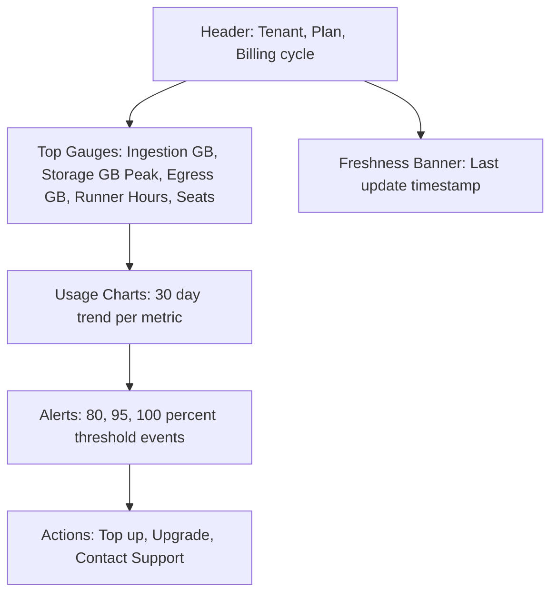
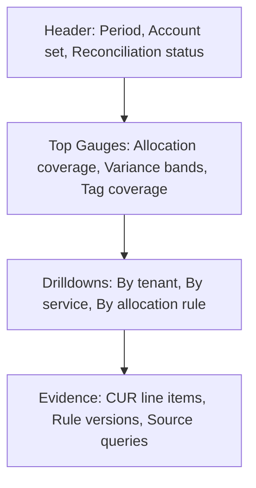

# Dashboard Design

## Overview

This document specifies the tenant and admin dashboards for Commercial-Ops. The goal is to present clear, actionable usage information that maps directly to plan parameters and metrics while avoiding AWS specific names. The UI publishes only tenant visible totals. Detailed AWS cost components remain operator facing in admin views. The dashboard design follows the evaluation model that uses daily snapshots for freshness and monthly freezes for billing.

## Design Goals

**Clarity first** Tenants see a small set of meters that match plan language.  
**Action oriented** The UI always presents a next step such as top up or upgrade.  
**Predictable** Gauges and counters match the evaluation thresholds of 80, 95, and 100 percent.  
**Low surprise** Egress quota is published in each plan and storage includes snapshots in the displayed total.  
**Live enough** Daily snapshots drive charts and the page shows a freshness banner when telemetry is delayed.

## Tenant Dashboard

The tenant dashboard visualizes current cycle utilization for key metrics and provides calls to action. Client facing names mask AWS services. Runners appear as Light, Pro, or Enterprise tiers. The page shows totals, not per service prices.



### Header

| Field | Description |
|-------|-------------|
| Tenant name | Canonical tenant identifier |
| Plan name | Commercial plan version such as CFO Standard v1 |
| Billing cycle | Current cycle start and end dates in UTC |
| Last update | Telemetry snapshot time with an optional delay badge |

### Top gauges

The top area displays four to six primary meters with percentage rings and absolute values. Only totals are shown.

| Gauge | Source metric | Visibility | Notes |
|-------|---------------|------------|-------|
| Ingestion | `data_ingestion_gb` | Tenant | Sum of data accepted by platform |
| Storage | `storage_gb_peak` | Tenant | Peak total including snapshots |
| Egress | `egress_gb` | Tenant | Shows against published quota |
| Runner hours | `runner_hours` | Tenant | Combined hours across Light, Pro, Enterprise |
| Seats | `active_users` vs `base_seats` | Tenant | Maximum active users in cycle |

### Threshold events and banners

The dashboard shows event banners when utilization crosses thresholds. Events are generated by the evaluation engine using daily snapshots.

| Threshold | Banner text | Action |
|----------|-------------|--------|
| 80 percent | You are approaching your plan limit | Encourage review and optimization |
| 95 percent | You are close to your plan limit | Present top up and upgrade options |
| 100 percent | You have reached your plan limit | Require top up or show upgrade recommendation |

### Actions

Actions appear as buttons with clear outcomes. The UI never exposes AWS service names. The actions integrate with the purchase and policy modules.

| Action | Purpose |
|--------|---------|
| Buy top up | Purchase additional capacity for current cycle |
| Upgrade plan | Move to a higher tier with larger caps |
| Contact support | Open a ticket with context and evidence links |

### Charts

Each primary metric includes a 30 day trend chart sourced from daily snapshots. Charts show usage values and projected trajectory to end of cycle. The projection uses a simple linear trend on the last seven days unless disabled by policy.

## Admin Dashboard

The admin view extends the tenant view with allocation evidence, reconciliation status, and anomaly details. The admin dashboard is operator facing and may reference AWS terms as needed.



### Allocation and reconciliation

| Widget | Description |
|--------|-------------|
| Allocation coverage | Percentage of cost lines mapped to tenants |
| Variance bands | Counts of metrics within tolerance and outside tolerance |
| Tag coverage | Percentage of resources with required tags in period |
| Reconciliation status | Locked, Open, or Attention required |

### Drilldowns

Admin users can open drilldowns that reveal allocation rules and CUR evidence. Drilldowns link to scheduled Athena or Aurora queries with the exact parameters of the current period. Evidence links are immutable and stored alongside invoice artifacts.

## Data Freshness and Health

The UI displays a freshness banner when telemetry snapshot age exceeds the target. The banner is informational only. The plan evaluation continues using the latest available data.

| Indicator | Condition | Messaging |
|----------|-----------|-----------|
| Fresh | Snapshot age under 60 minutes | Data is up to date |
| Delayed | Snapshot age 60 to 180 minutes | Data may be delayed |
| Stale | Snapshot age over 180 minutes | Data is temporarily stale |

System health widgets for operator use include metric refresh latency, reconciliation delay, and tag coverage. These are not shown to tenants.

## Interaction States

**Empty state** Show explanatory copy and a resend telemetry action when a new tenant has no data.  
**Error state** Present a descriptive message and a retry action if charts or gauges fail to load.  
**Permission state** Hide admin widgets from tenant users and mask allocation details.

## Accessibility and Internationalization

**Accessibility** Charts include accessible labels and data tables. Color is not the only cue for state. All buttons support keyboard focus and activation.  
**Localization** Currency displays in USD by default. Dates and numbers follow locale settings where available, otherwise ISO formatting.

## Data Contracts

The dashboard reads from stable data contracts that mirror the evaluation engine. Contracts are versioned and backward compatible. The tenant UI never reads directly from CUR.

```yaml
contract: tenant_usage_summary_v1
fields:
  - tenant_id: string
  - plan_code: string
  - period_start: date
  - period_end: date
  - metric_code: string
  - value: number
  - cap_value: number
  - utilization: number
  - quota_event: enum[EVENT_QUOTA_80, EVENT_QUOTA_95, EVENT_QUOTA_100, null]
  - last_updated_at: timestamp
```

```yaml
contract: admin_reconciliation_summary_v1
fields:
  - period: month
  - allocation_coverage_pct: number
  - variance_within_tolerance_count: integer
  - variance_outside_tolerance_count: integer
  - tag_coverage_pct: number
  - status: enum[OPEN, LOCKED, ATTENTION_REQUIRED]
  - evidence_links: array[string]
```

## Security and Privacy

Tenant dashboards show only tenant metrics and plan information. Admin dashboards require elevated roles. Evidence links contain no customer data beyond tenant identifiers and are stored in an operator controlled namespace. No raw AWS pricing is surfaced to tenants.

## Performance and Caching

The page uses edge caching for static assets and a short lived cache for summary API responses. Charts request only the visible window. The UI avoids live queries on CUR and uses daily snapshots for all tenant facing views.

## Cross References

- **plan-parameters.md** for meter definitions and thresholds.  
- **topup-upgrade-policy.md** for purchase and movement flows.  
- **metrics-definition.md** for metric sources and aggregation rules.  
- **aws-cost-mapping.md** for reconciliation details.  
- **api.md** for response schemas and versioning.
