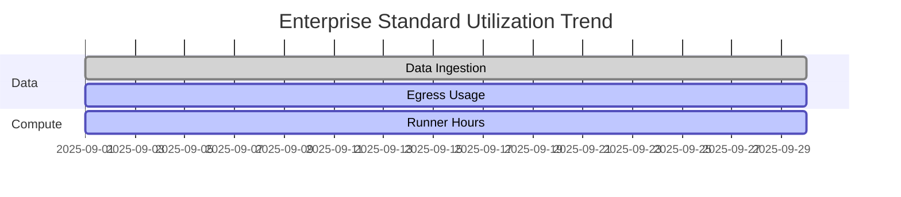

# Example Plans

## Overview

This document provides illustrative examples of tenant plans used in Commercial-Ops. These examples are intended solely for demonstration and testing. They do not represent official rate cards or contractual terms. Values and thresholds are indicative of realistic system behavior and integration between metrics, evaluation logic, and dashboard representation.

Each plan defines limits for data services, compute, networking, and seats. The examples follow the standard metric definitions and evaluation rules. Currency is expressed in USD. Tenant and plan are canonical entities.

The examples show how the evaluation engine computes utilization, generates quota events, and determines upgrade recommendations. They also illustrate the linkage between platform telemetry, AWS cost mapping, and plan parameters.

## Enterprise Lite Example

### Context

Enterprise Lite is designed for smaller tenants with modest data ingestion and limited compute needs. It provides the essential capabilities of the platform while maintaining cost predictability. It supports one primary runner tier and includes default quotas for storage and egress.

### Plan Definition

```yaml
plan_code: ENT-Lite-v1
currency: USD
billing_cycle: monthly
base_seats: 5
metric_entitlements:
  data_ingestion_gb:
    cap_gb: 200
    thresholds: [0.8, 0.95, 1.0]
  storage_gb_peak:
    cap_gb: 500
    thresholds: [0.8, 0.95, 1.0]
  egress_gb:
    cap_gb: 100
    thresholds: [0.8, 0.95, 1.0]
    publish_total_only: true
  runner_hours:
    cap_hours: 50
    thresholds: [0.8, 0.95, 1.0]
  active_users:
    base_seats: 5
addons:
  runner_pack:
    unit: hour
    size: 25
    sku_code: TOPUP_RUNNER_25H
effective_from: 2025-01-01
```

### Example Utilization

| Metric | Cap | Usage | Utilization | Event |
|--------|-----|--------|--------------|-------|
| Data ingestion | 200 GB | 160 GB | 80% | EVENT_QUOTA_80 |
| Storage peak | 500 GB | 460 GB | 92% | EVENT_QUOTA_95 |
| Egress | 100 GB | 102 GB | 102% | EVENT_QUOTA_100 |
| Runner hours | 50 H | 48 H | 96% | EVENT_QUOTA_95 |
| Seats | 5 | 5 | 100% | EVENT_QUOTA_100 |

The evaluation engine issues warnings at 80% and 95%, and at 100% enforces top-up or upgrade policy. The tenant dashboard shows red gauges for egress and seats with top-up CTAs.

### Behavior Notes

- The Lite plan locks egress and runner limits to prevent cost overruns.  
- Snapshot usage counts toward `storage_gb_peak`.  
- Seat expansion requires a top-up purchase.  
- The dashboard freshness banner reflects daily usage snapshots.

## Enterprise Standard Example

### Context

Enterprise Standard fits mid-sized tenants with multiple active users and moderate compute requirements. It enables a mix of runner tiers and allows greater flexibility in networking and egress.

### Plan Definition

```yaml
plan_code: ENT-Standard-v1
currency: USD
billing_cycle: monthly
base_seats: 10
metric_entitlements:
  data_ingestion_gb:
    cap_gb: 500
    thresholds: [0.8, 0.95, 1.0]
  storage_gb_peak:
    cap_gb: 2000
    thresholds: [0.8, 0.95, 1.0]
  egress_gb:
    cap_gb: 500
    thresholds: [0.8, 0.95, 1.0]
  runner_hours:
    cap_hours: 200
    thresholds: [0.8, 0.95, 1.0]
  nat_gb_processed:
    cap_gb_opt: 1000
    thresholds: [0.8, 0.95, 1.0]
  active_users:
    base_seats: 10
addons:
  runner_pack:
    unit: hour
    size: 50
    sku_code: TOPUP_RUNNER_50H
  egress_pack:
    unit: gb
    size: 200
    sku_code: TOPUP_EGRESS_200GB
effective_from: 2025-01-01
```

### Example Utilization

| Metric | Cap | Usage | Utilization | Event |
|--------|-----|--------|--------------|-------|
| Data ingestion | 500 GB | 480 GB | 96% | EVENT_QUOTA_95 |
| Storage peak | 2000 GB | 1600 GB | 80% | EVENT_QUOTA_80 |
| Egress | 500 GB | 510 GB | 102% | EVENT_QUOTA_100 |
| Runner hours | 200 H | 185 H | 92% | EVENT_QUOTA_95 |
| NAT processed | 1000 GB | 870 GB | 87% | EVENT_QUOTA_80 |

The tenant receives both soft and hard warnings. The system recommends a top-up for egress and runner hours. If repeated for two months, an upgrade recommendation is generated.

### Visualization



### Behavior Notes

- NAT and PrivateLink traffic are part of shared allocation pools.  
- Runner hours apply across tiers with internal weighting.  
- The dashboard shows forecast trajectories for approaching limits.  
- Seat overage triggers a purchase prompt with immediate effect.

## Enterprise Premium Example

### Context

Enterprise Premium supports high scale tenants with continuous workloads, high concurrency, and extended data retention. It includes advanced allocation features and wider tolerance windows for analytics processing.

### Plan Definition

```yaml
plan_code: ENT-Premium-v1
currency: USD
billing_cycle: monthly
base_seats: 20
metric_entitlements:
  data_ingestion_gb:
    cap_gb: 2000
    thresholds: [0.8, 0.95, 1.0]
  storage_gb_peak:
    cap_gb: 10000
    thresholds: [0.8, 0.95, 1.0]
  egress_gb:
    cap_gb: 2000
    thresholds: [0.8, 0.95, 1.0]
  runner_hours:
    cap_hours: 1000
    thresholds: [0.8, 0.95, 1.0]
  privatelink_gb_processed:
    cap_gb_opt: 5000
    thresholds: [0.8, 0.95, 1.0]
  active_users:
    base_seats: 20
addons:
  runner_pack:
    unit: hour
    size: 100
    sku_code: TOPUP_RUNNER_100H
  storage_pack:
    unit: gb
    size: 1000
    sku_code: TOPUP_STORAGE_1000GB
effective_from: 2025-01-01
```

### Example Utilization

| Metric | Cap | Usage | Utilization | Event |
|--------|-----|--------|--------------|-------|
| Data ingestion | 2000 GB | 1900 GB | 95% | EVENT_QUOTA_95 |
| Storage peak | 10000 GB | 9700 GB | 97% | EVENT_QUOTA_95 |
| Egress | 2000 GB | 2100 GB | 105% | EVENT_QUOTA_100 |
| Runner hours | 1000 H | 920 H | 92% | EVENT_QUOTA_95 |
| PrivateLink processed | 5000 GB | 4800 GB | 96% | EVENT_QUOTA_95 |

### Upgrade Scenario Simulation

If egress exceeds cap and storage reaches 100%, the evaluation engine recommends an immediate upgrade or top-up. An immediate upgrade to the next version (Premium+ if available) would reset caps and trigger proration logic.

```yaml
upgrade_recommendation:
  tenant_id: TEN-00412
  current_plan: ENT-Premium-v1
  recommended_plan: ENT-Premium-v2
  reason: sustained_overuse
  metrics_triggered: [egress_gb, storage_gb_peak]
  effective: immediate
  proration: 350.00
```

### Behavior Notes

- Premium plans allow concurrent runner sessions and extended job timeouts.  
- Shared services such as NAT and PrivateLink are billed using weighted allocation.  
- Variance thresholds are broader to account for analytics workload volatility.  
- Admin dashboards show reconciliation variance and cost attribution evidence.

## Comparison Summary

| Attribute | Lite | Standard | Premium |
|-----------|------|-----------|----------|
| Base seats | 5 | 10 | 20 |
| Data ingestion cap | 200 GB | 500 GB | 2000 GB |
| Storage cap | 500 GB | 2000 GB | 10000 GB |
| Runner hours | 50 | 200 | 1000 |
| Egress cap | 100 GB | 500 GB | 2000 GB |
| NAT/PrivateLink | Shared | Shared | Weighted allocation |
| Add-on flexibility | Basic | Moderate | Full |
| Upgrade trigger | Manual | Recommended | Automatic |

## Key Observations

- The platform maintains consistent behavior across all plans.  
- Metrics follow identical definitions and aggregation logic.  
- Thresholds drive user experience consistency.  
- AWS CUR mappings validate backend cost attribution but are hidden from tenants.  
- Plans are versioned and auditable, ensuring reproducibility and transparency.

## Cross References

- **plan-parameters.md** for entitlement definitions.  
- **topup-upgrade-policy.md** for purchase and upgrade logic.  
- **dashboard-design.md** for gauge and trend visualization.  
- **metrics-definition.md** for canonical metric meanings.  
- **aws-cost-mapping.md** for backend cost validation.
