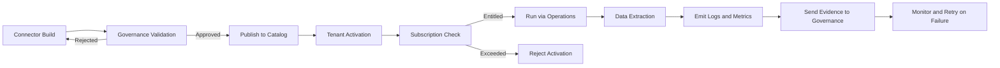

# Data Acquisition Overview

Data Acquisition is the entry point of the platform. It connects to external systems, retrieves data, and prepares it for governed processing. The service manages the full connector lifecycle, from configuration and activation to incremental runs, schema drift handling, and graceful decommissioning. It ensures that every data movement into the platform adheres to contracts, policies, and entitlements.

Data Acquisition is not an isolated ingestion engine. It operates as part of the governed runtime. Each extraction is validated by Governance, checked for entitlement by Subscription, and executed through Operations. This ensures that every dataset entering the platform is compliant, authorized, and traceable.

## Conceptual Overview

Data Acquisition provides connectors that standardize how external data sources are integrated into the platform. Each connector encapsulates logic for authentication, schema discovery, data extraction, and incremental change capture. Standard connectors support common interfaces such as files, databases, and APIs. Enterprise connectors integrate with complex systems like SAP, Salesforce, and NetSuite, using native protocols and metadata discovery.

Every connector run passes through validation and enforcement gates. Governance ensures that the connector’s schema and contract are approved. Subscription ensures that the tenant has available connector slots and data volume entitlements. Operations orchestrates the run, monitors its health, and records evidence for auditing.

## Why Data Acquisition Exists

Connecting enterprise systems directly to analytical environments often leads to inconsistencies, duplication, and compliance risks. The Data Acquisition service provides a uniform ingestion mechanism that enforces platform-wide contracts and policies. This eliminates one-off integrations and ensures that all incoming data meets the same standards of quality and lineage.

By consolidating ingestion into a managed service, the platform gains control over throughput, retry behavior, and observability. It also reduces onboarding friction for new data sources by offering reusable connectors and configuration templates.

## How Data Acquisition Works

Each connector follows a consistent lifecycle:

1. **Build.** The connector definition is developed and registered with Governance. Schema, metadata, and connection parameters are validated before publication.
2. **Publish.** The connector is approved and made available to tenants based on plan entitlements and supported systems.
3. **Activate.** Tenants configure connection details such as credentials and schedules. Activation requires validation against Subscription and Governance.
4. **Run.** Scheduled or on-demand extractions are executed through Operations. Logs, metrics, and evidence are captured.
5. **Monitor and Retry.** Failed or incomplete runs are retried automatically based on policy. Alerts and health checks are raised for persistent issues.
6. **Decommission.** Connectors can be disabled or retired when no longer in use, ensuring clean offboarding and contract closure.

## Relationship with Other Modules

- Governance validates connector definitions, schema compatibility, and data contracts before publication.  
- Subscription enforces connector entitlements, concurrent run limits, and data volume quotas.  
- Operations executes connector runs, manages retries, and emits evidence to Governance.  
- Customer and Admin applications surface connector health, history, and configurations.

This separation of responsibility ensures that connectors remain secure, auditable, and compliant while supporting high-volume and high-frequency data movement.

## Connector Categories

### Standard Connectors

Standard connectors handle widely used data sources and file formats such as:
- File-based: CSV, JSON, XML, Parquet, Excel, SFTP
- Database: ODBC, JDBC, PostgreSQL, MySQL, SQL Server, Oracle
- API: REST, GraphQL, Webhooks
- Streaming: Kafka, Kinesis, WebSocket

### Enterprise Connectors

Enterprise connectors handle systems with domain-specific semantics and richer metadata:
- SAP: RFC, OData, CDS, CPI
- Salesforce: REST, Bulk, Streaming APIs
- NetSuite: REST, SuiteTalk
- Workday, ServiceNow, Microsoft Dynamics, and others

Enterprise connectors also include domain adapters that interpret business context such as fiscal periods, company codes, or cost centers.

## Connector Lifecycle

Every stage emits structured events that keep the connector state visible across the platform. Evidence from runs becomes part of the lineage and audit trail.

## Interfaces

### APIs

- POST /acquisition/connectors — register new connector definition  
- GET /acquisition/connectors — list connectors by tenant or source type  
- POST /acquisition/connectors/{id}/activate — activate connector for tenant  
- POST /acquisition/runs — trigger data extraction  
- GET /acquisition/runs/{id} — retrieve run details and logs  
- DELETE /acquisition/connectors/{id} — decommission connector

### Events

- acquisition.connector.created  
- acquisition.connector.published  
- acquisition.connector.activated  
- acquisition.run.started  
- acquisition.run.completed  
- acquisition.run.failed  
- acquisition.connector.decommissioned

### State Collections

- connectors (id, source_type, version, schema_ref, status, published_at)  
- tenants_connectors (tenant_id, connector_id, status, activated_at, last_run)  
- runs (run_id, connector_id, tenant_id, start_time, end_time, status, rows_processed)  
- metrics (run_id, record_count, duration, bytes_transferred)  
- alerts (run_id, severity, message, timestamp, resolved)

## Observability and Service Levels

| SLO | Target | Notes |
|---|---|---|
| Connector run success rate | 99.5 percent | includes retries within policy window |
| Incremental run latency | p95 less than 10 minutes | from trigger to completion |
| Schema drift detection delay | less than 3 minutes | after incompatible change |
| Evidence emission delay | less than 5 minutes | after successful run |
| Connector activation propagation | less than 2 minutes | to catalog and enforcement engines |

Metrics include:

- acquisition_runs_total  
- acquisition_runs_failed_total  
- acquisition_rows_processed_total  
- acquisition_bytes_transferred_total  
- acquisition_schema_drift_total

Logs include connection metadata, query plans, retry history, and data volume summaries. Observability dashboards provide connector health, throughput trends, and failure analysis.

## Security and Compliance

Data Acquisition handles sensitive credentials and access to external systems. All credentials are stored in a secure secrets manager and accessed only during runtime. Data in motion uses encrypted channels. Logs and evidence include metadata only, never raw records. Residency, retention, and privacy policies from Governance are enforced for all connector outputs.

## Failure Handling

- If a connector run fails, automatic retries occur based on policy and error classification.  
- If schema drift is detected, the connector pauses until Governance validates the new schema.  
- If Subscription limits are exceeded, the activation or run is blocked until entitlements are refreshed.  
- If connection credentials expire, the connector is marked unhealthy and notifications are sent.  
- If evidence emission fails, Operations retries asynchronously until confirmation.

These mechanisms maintain reliability while ensuring every data movement remains governed and auditable.

## Dependencies and Consumers

Data Acquisition depends on Governance for schema and contract validation, Subscription for entitlements and connector limits, Operations for runtime execution and monitoring, and Secrets Management for credential handling. Consumers include data store modules, transformation services, and reporting pipelines that use standardized ingested data.

## Example Scenario

A tenant activates the SAP OData connector to extract invoice data. Governance validates the contract and schema definitions. Subscription confirms that the tenant’s plan includes SAP connectors and sufficient data volume entitlement. Operations schedules the extraction and monitors execution. The connector streams records to the platform’s RAW store, emitting logs, metrics, and evidence events. If schema drift occurs due to a new field in SAP, Governance triggers validation, and the connector pauses until approval. The tenant receives notifications through the operations dashboard and can view all run history and audit evidence.

---

Data Acquisition ensures that every inbound data flow is compliant, entitled, and reliable. It transforms external integrations into governed entry points, keeping the platform consistent, observable, and secure across all tenants and systems.
