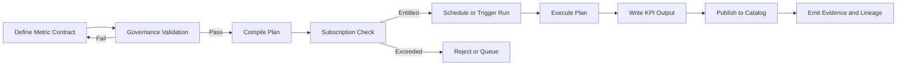

# Data Intelligence Overview

Data Intelligence converts governed data into reusable analytical assets and decision support. It provides the services that define metrics, compute KPI Packs, generate analytical datasets, and publish insights to downstream tools. Data Intelligence relies on Governance for contracts and policies, uses Data Store as its foundation, honors Subscription limits, and runs through Operations for reliable execution.

Data Intelligence focuses on the business meaning of data. It turns Golden Data Points into metrics with clear definitions, time logic, and dimensional structure. It also exposes programmatic interfaces so that applications and analysts can query, simulate, and explain metric results with confidence.

## Conceptual Overview

Data Intelligence organizes analytics around metric contracts. A metric contract describes how a KPI is computed, what GDP sources it uses, and which filters, time windows, and dimensions apply. When a metric is defined, the service validates its dependencies, compiles an execution plan, and registers the metric so that it can be computed on schedule or on demand.

Metric definitions promote consistency across teams. When users request revenue, cash flow, or churn, they rely on standard definitions that are versioned and auditable. This reduces disagreement and accelerates decision making.

## Why Data Intelligence Exists

Organizations often duplicate business logic in dashboards, SQL files, and ad hoc models. The result is conflicting results, unclear lineage, and brittle pipelines. Data Intelligence centralizes metric logic so that it is authored once, validated once, and reused everywhere. The platform gains faster iteration, reliable comparisons, and a clean path to automation and AI activation.

## How Data Intelligence Works

The service defines and runs metric plans through four steps.

1. **Definition.** Authors create metric contracts that reference GDP datasets and describe filters, aggregations, and dimensionality.
2. **Validation.** The service checks policy compliance and dependency readiness through Governance and confirms entitlements through Subscription.
3. **Compilation.** Contracts are compiled into executable plans that can run on the chosen compute engine. Plans include pushdown, incremental windows, and partition strategies.
4. **Execution and Publication.** Operations executes plans on schedule or on demand. Results are stored in the KPI layer and exposed through APIs and data products.

The system records evidence for each definition and run so that every metric value can be explained.

## Relationship with Other Modules

- Governance stores metric contracts and validates policy compliance.  
- Data Store supplies GDP inputs and receives KPI outputs.  
- Subscription enforces limits for compute, concurrency, and retention associated with metric runs.  
- Operations schedules, monitors, and records execution.  
- Customer applications and external tools consume published KPIs and datasets.

This model ensures that analytics is consistent, governed, and reproducible across tenants.

## Services

### Metric Registry

The Metric Registry stores metric contracts, versions, and status. Each entry references GDP sources, filters, aggregations, dimensional structure, and time logic. The registry publishes events when metrics are created, updated, or deprecated.

### Plan Compiler

The Plan Compiler turns metric contracts into runnable plans. It resolves dependencies, selects execution strategies, and optimizes for incremental processing. It emits plan metadata that Operations uses to schedule and track runs.

### Runner

The Runner executes compiled plans in the target compute environment. It supports batch and near real time execution modes. Results are written to the KPI store and linked to evidence records.

### Catalog Publisher

The Catalog Publisher registers published metrics and datasets so that downstream tools can discover and query them. It maintains semantic tags, ownership, and documentation links for consumer visibility.

## Metric Lifecycle

Each stage is observable and produces events. Evidence links a metric version to its inputs and to the plan used to produce it.

## Interfaces

### APIs

- POST /intelligence/metrics — create metric contract  
- GET /intelligence/metrics — list metrics and versions  
- POST /intelligence/compile — compile a contract to a plan  
- POST /intelligence/runs — trigger plan execution  
- GET /intelligence/runs/{id} — read run details and outputs  
- POST /intelligence/publish — publish datasets and register catalog entries

### Events

- intelligence.metric.created  
- intelligence.metric.updated  
- intelligence.plan.compiled  
- intelligence.run.started  
- intelligence.run.completed  
- intelligence.run.failed  
- intelligence.dataset.published

### State Collections

- metrics (id, version, owner, status, contract_ref, created_at)  
- plans (id, metric_id, engine, strategy, compiled_at, valid_until)  
- runs (id, plan_id, started_at, finished_at, status, cost, rows_processed)  
- datasets (id, metric_id, version, location, published_at, lineage_ref)

## Semantic Modeling

Data Intelligence provides a lightweight semantic layer so that metrics are defined once and applied consistently. The layer standardizes dimension names, hierarchies, and time logic such as fiscal calendars and rolling windows. Semantic tags link metrics to business concepts such as product, region, or customer segment.

## Observability and Service Levels

| SLO | Target | Notes |
|---|---|---|
| Plan compilation latency | p95 less than 1 second | small and medium contracts |
| Run success rate | 99.5 percent | includes retry policy |
| Publication delay | less than 5 minutes | from run completion |
| Catalog propagation | less than 2 minutes | to consumer discovery |
| Explain query latency | p95 less than 2 seconds | fetch lineage and evidence |

Metrics include:

- intelligence_runs_total  
- intelligence_runs_failed_total  
- intelligence_compilations_total  
- intelligence_publish_total  
- intelligence_explain_queries_total

Logs capture contract diffs, plan selection decisions, and run outcomes. Dashboards show metric freshness, publication histories, and failure clusters.

## Security and Compliance

Metric contracts and plans contain metadata, not raw data. Access control integrates with platform identity and role-based permissions. Published outputs inherit residency and retention rules from Governance and Subscription. Evidence records include signer references for key decisions.

## Failure Handling

- If compilation fails, the system records the error and blocks execution until fixed.  
- If a run fails, Operations retries within policy and raises tickets for persistent issues.  
- If publication fails, outputs are staged and retried.  
- If a contract change is incompatible, Governance requires revalidation before the next run.

These controls preserve correctness and prevent inconsistent metric states.

## Dependencies and Consumers

Dependencies include Governance for policy and contracts, Data Store for inputs and outputs, Subscription for runtime limits, and Operations for execution. Consumers include internal applications, BI tools, and APIs that query KPI datasets and metric endpoints.

## Example Scenario

A finance analyst defines a gross margin metric that references GDP tables for revenue and cost of goods. Governance validates the contract and policies for privacy and residency. The Plan Compiler generates an incremental plan that computes margin by product and region. Subscription confirms compute and concurrency entitlements. Operations schedules the job. Results are written to the KPI store and published to the catalog. A dashboard queries the registered dataset and shows margin trends. An explain request displays lineage and evidence for the latest run.

---

Data Intelligence turns governed data into standardized, explainable metrics and datasets. It enables consistent analytics at scale and reduces drift between teams and tools.
