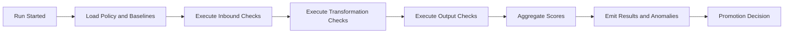

# Data Quality Overview

Data Quality ensures that data entering and moving through the platform meets defined standards for correctness, completeness, consistency, and timeliness. It provides validation services, anomaly detection, and quality scoring that apply across RAW, GDP, and KPI layers. Data Quality operates as a cross-cutting control that protects trust in metrics and analytical outcomes.

Data Quality does not replace Governance or Operations. Governance defines policies and contracts that describe quality expectations. Operations executes workloads and collects telemetry. Data Quality evaluates data against those expectations, records results, and triggers corrective actions when thresholds are not met.

## Conceptual Overview

Quality controls are applied at three stages. Inbound checks verify that extraction results meet basic expectations such as schema compliance and row counts. Transformation checks validate conformance to business rules in GDP creation. Output checks verify KPI accuracy, freshness, and completeness before publication. Each check produces a quality signal, which is aggregated into a score that determines whether data can be promoted.

The quality system produces consistent outputs for observability and audit. Scores, rule results, and anomalies are attached to datasets and runs. Promotion gates in Governance can query these results to accept or reject state transitions.

## Why Data Quality Exists

Without centralized quality controls, validation becomes ad-hoc and inconsistent. Failures show up in dashboards or models after the fact. A dedicated Data Quality service creates a single, repeatable method for defining and enforcing expectations. It reduces rework, speeds up issue detection, and enables clear communication between data producers and consumers.

## How Data Quality Works

The service applies three categories of controls:

1. **Declarative rules.** Rules defined in contracts or policies, for example uniqueness, referential integrity, value ranges, or distribution checks.
2. **Statistical baselines.** Profiles derived from historical behavior, for example seasonality or expected distribution shifts.
3. **Operational checks.** Freshness, volume, latency, and error rates measured during runs.

Each control emits a pass or fail result with details. Results are aggregated into a dataset quality score and stored with run metadata. Thresholds determine whether Operations can proceed or whether Governance blocks promotion.

## Relationship with Other Modules

- Governance stores policy definitions for quality rules and promotion thresholds.  
- Operations invokes quality checks during runs and records results.  
- Subscription governs volume and performance limits that can influence quality thresholds.  
- Data Store attaches quality results to datasets in RAW, GDP, and KPI layers.  
- Data Acquisition provides inbound statistics that seed quality profiles.

This model ensures that quality is enforced consistently without duplicating logic in pipelines.

## Quality Controls

### Inbound Controls

Inbound controls validate extraction results before RAW acceptance. These controls include schema conformity, mandatory field presence, basic type checks, and record count validation compared to source hints. Failures produce actionable messages and block ingestion until resolved.

### Transformation Controls

Transformation controls apply to GDP creation. They include referential integrity between entities, deduplication, balancing rules for accounting tables, and constraint checks defined in contracts. These controls ensure that GDPs are reliable building blocks for analytics.

### Output Controls

Output controls apply to KPI publication. They include freshness checks, completeness coverage, variance checks versus prior periods, and reconciliation against trusted totals where available. Output controls protect business reports and executive dashboards from silent errors.

## Quality Lifecycle

Quality checks run as part of the execution plan. Results are aggregated and emitted as events and persisted for audit. Promotion gates query the final score and rule failures before allowing state transitions.

## Interfaces

### APIs

- POST /quality/checks/run — execute quality checks for a run or dataset  
- GET /quality/results/{run_id} — read detailed results and scores  
- POST /quality/baselines/train — update statistical baselines  
- GET /quality/baselines/{dataset_id} — retrieve current baselines  
- POST /quality/rules/validate — validate rule set syntax and references

### Events

- quality.run.started  
- quality.result.emitted  
- quality.anomaly.detected  
- quality.baseline.updated  
- quality.rule.violation

### State Collections

- quality_results (run_id, dataset_id, rule_id, outcome, score, details, timestamp)  
- quality_scores (dataset_id, layer, current_score, threshold, updated_at)  
- baselines (dataset_id, profile_type, parameters, updated_at)  
- anomalies (dataset_id, metric, deviation, severity, timestamp)  
- rules (id, dataset_id, layer, expression, threshold, owner)

## Scoring Model

Quality scores are computed from rule outcomes and baseline deviations. Each rule has a weight and a threshold. Severe rule violations reduce the score more than minor deviations. The platform can define default weights per layer, with stricter thresholds at KPI than at RAW. Scores and weights are stored in the rules and results tables for transparency.

## Observability and Service Levels

| SLO | Target | Notes |
|---|---|---|
| Quality evaluation latency | p95 less than 500 milliseconds per rule group | parallel evaluation per dataset |
| Baseline training freshness | within 24 hours | rolling update window |
| Result availability | less than 2 minutes | from run completion |
| Anomaly alert delay | less than 1 minute | from detection |

Metrics include:

- quality_checks_total  
- quality_violations_total  
- quality_anomalies_total  
- quality_scores_below_threshold_total

Dashboards visualize pass rates, recurring rule failures, and anomaly trends per dataset and layer.

## Security and Compliance

Quality services operate on metadata and aggregated signals. Raw data is accessed through secure readers with time-bound credentials when checks require sampling. Policies from Governance define which fields are eligible for profiling and which must be excluded. All results include tenant and dataset identifiers for audit. Access is controlled through service roles with least privilege.

## Failure Handling

- If rule evaluation fails for a dataset, the run is marked with a partial failure and the rule is retried.  
- If baseline data is unavailable, default thresholds apply and the system raises a warning.  
- If result emission fails, results are buffered and retried until confirmed.  
- If anomaly volume spikes, rate limits apply to notification channels.

These measures ensure quality signals remain reliable even during degraded conditions.

## Dependencies and Consumers

Dependencies include Governance for policy storage, Operations for run control, Subscription for quota context, and Data Store for attaching results. Consumers include promotion gates, monitoring dashboards, and customer applications that surface data quality to end users.

## Example Scenario

A tenant ingests order data into RAW. Inbound checks verify schema conformity and expected row counts. During transformation, referential integrity and deduplication rules validate GDP tables. Before KPI publication, freshness and variance checks run against prior periods. The aggregated score meets thresholds, so promotion proceeds. Later, a drop in completeness triggers an anomaly alert, and Operations opens a ticket for investigation.

---

Data Quality provides a uniform way to define and enforce expectations across the platform. It turns policies into measurable signals that drive reliable promotions and trustworthy analytics.
