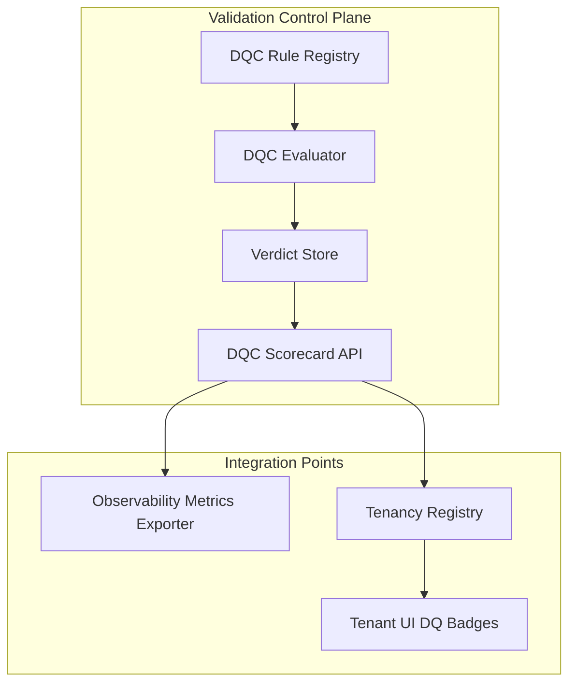

# Data Quality Control (DQC) Overview

**Audience:** Data platform engineers, data product owners, and operations teams  
**Status:** Working draft  
**Purpose:** Define the architecture, behavior, and governance model for the Data Quality Control (DQC) module. DQC enforces data integrity, completeness, and consistency across all data layers and integrates directly with Data Observability and Tenancy modules. It establishes deterministic gates between ingestion and promotion stages and provides audit-grade scorecards for every dataset and tenant.

## Position In Platform

DQC operates immediately after Data Observability. Observability detects system-level or signal-level anomalies such as latency, volume drift, and error spikes. DQC enforces dataset-level correctness and contractual integrity before any data promotion.

```mermaid
flowchart LR
    A[Raw Data] --> B[Bronze Layer]
    B --> C[Observability Metrics]
    C --> D[DQC Validation]
    D --> E[Silver Layer]
    E --> F[DQC Promotion Gate]
    F --> G[Gold Layer]
    G --> H[Golden Data Points (GDP)]
    H --> I[KPI Packs]
    I --> J[Feature Pipelines]
```

- Observability measures freshness, delay, and anomalies.  
- DQC validates schema, thresholds, referential links, and quality rules.  
- Promotion to higher layers requires passing DQC validation.  
- Tenancy consumes DQC verdicts to compute per-tenant trust scores.  

## Architecture Overview



- The Rule Registry stores versioned rule packs in YAML or JSON.  
- The Evaluator executes rules against data at the table or partition level.  
- The Verdict Store records results, lineage, and metrics.  
- The Scorecard API exposes pass, fail, and quality percentage per dataset.  
- Integration hooks send metrics to Observability and trust badges to Tenancy UI.

## Validation Workflow

1. Dataset triggers DQC evaluation on load or promotion.  
2. Evaluator fetches active rule pack for dataset and stage.  
3. Rules are applied in deterministic sequence.  
4. Verdicts are logged to store with run metadata.  
5. Promotion proceeds only if all critical rules pass or approved waivers exist.  

**Example validation payload**
```json
{
  "dataset": "finance_invoice",
  "stage": "silver",
  "run_id": "run_20251009_1230",
  "ruleset_id": "finance_v3",
  "records_evaluated": 125000,
  "results": {
    "passed": 123456,
    "failed": 1544,
    "critical_failures": 2,
    "warnings": 48
  },
  "score": 98.76,
  "status": "PASS_WITH_WARNINGS"
}
```

## Rule Packs

Rule packs define expectations per dataset and stage. Each rule has a type, expression, severity, and action.

**Example YAML rule pack**
```yaml
version: 3
dataset: finance_invoice
stage: silver
rules:
  - name: completeness_invoice_id
    type: completeness
    field: invoice_id
    threshold: 0.995
    severity: critical
  - name: uniqueness_invoice_id
    type: uniqueness
    field: invoice_id
    severity: critical
  - name: range_invoice_amount
    type: range
    field: invoice_amount
    min: 0
    max: 10000000
    severity: warning
  - name: referential_customer_id
    type: foreign_key
    field: customer_id
    reference: customer_master.customer_id
    severity: critical
  - name: timeliness_load_delay
    type: freshness
    max_delay_minutes: 30
    severity: warning
```

## Evaluation Engine

- Evaluator runs on Glue or Fargate jobs triggered by workflow orchestrator.  
- Supports SQL-based and Python expression evaluation.  
- Parallel evaluation across partitions.  
- Each rule emits a boolean outcome and a metric.  
- Results are aggregated into a dataset-level verdict.  
- Partial failures are quarantined for remediation.

**Example verdict record**
```json
{
  "dataset": "finance_invoice",
  "stage": "silver",
  "rule": "referential_customer_id",
  "passed": false,
  "violations": 245,
  "sample_records": ["INV12345","INV67890"],
  "timestamp": "2025-10-09T12:40:00Z"
}
```

## Integration With Observability

- DQC emits quantitative metrics such as dq_pass_rate, dq_critical_failures, and dq_score.  
- Observability ingests these metrics to visualize dataset health.  
- Alerts are generated if DQC score drops below SLO thresholds.  
- Observability dashboards link directly to DQC verdicts for drilldown.  

## Integration With Tenancy

- DQC verdicts roll up to tenant-level trust indicators.  
- Each tenant receives an aggregate DQ score derived from datasets tagged with their tenant_id.  
- The score is displayed in the Tenancy UI under “Data Trust.”  
- Tenancy APIs can query DQC Scorecard API to embed DQ badges in dashboards.  

**Example trust indicator payload**
```json
{
  "tenant_id": "t_0456",
  "datasets": 12,
  "avg_score": 97.8,
  "critical_failures": 0,
  "last_run": "2025-10-09T12:00:00Z",
  "badge": "TRUSTED"
}
```

## Waivers And Exceptions

Certain datasets may temporarily bypass specific rules. Waivers are explicitly recorded and time-bound.

```json
{
  "dataset": "finance_invoice",
  "rule": "range_invoice_amount",
  "approved_by": "data_owner_1",
  "reason": "migration anomalies",
  "expires_on": "2025-10-31T00:00:00Z"
}
```

- Waivers must specify approver, reason, and expiry date.  
- Expired waivers trigger alerts for renewal or enforcement.  
- All waivers are auditable through DQC APIs.  

## Scorecards

Scorecards provide aggregated DQ metrics over time.

- Computed daily or per run.  
- Exposed via REST API and dashboard views.  
- Retained for trend analysis and compliance evidence.  
- Linked to dataset lineage and Observability logs.

**Example scorecard response**
```json
{
  "dataset": "finance_invoice",
  "stage": "gold",
  "runs": [
    {"date": "2025-10-05", "score": 99.2},
    {"date": "2025-10-06", "score": 98.9},
    {"date": "2025-10-07", "score": 99.0}
  ],
  "trend": "stable"
}
```

## APIs

| Method | Endpoint | Description |
|---------|-----------|-------------|
| POST | /dqc/v1/validate | Triggers validation for a dataset and stage |
| GET | /dqc/v1/verdicts/{dataset}/{stage} | Retrieves latest validation results |
| GET | /dqc/v1/scorecards/{dataset} | Returns dataset DQ scores and trends |
| POST | /dqc/v1/waivers | Creates waiver for rule exception |
| GET | /dqc/v1/waivers/{dataset} | Lists waivers for dataset |

All APIs include correlation IDs, timestamps, and digital signatures for audit.

## Governance And Audit

- Every rule, verdict, and waiver is logged with full lineage and correlation IDs.  
- DQC configuration changes require admin approval and version tracking.  
- Rule packs are versioned and stored in configuration repository.  
- All DQC metrics are exported to audit storage with retention policy.  

## Failure Handling And Recovery

- Failed evaluations automatically retried with exponential backoff.  
- Partial data quarantined in separate schema for reprocessing.  
- Critical DQC job failures alert SRE and block dependent promotions.  
- Evaluator resilience verified through chaos tests and dry runs.  

## Future Enhancements

- Data contract enforcement at producer endpoint level.  
- Real-time streaming validations.  
- Adaptive threshold tuning using historical quality distributions.  
- Cross-tenant DQ benchmarking and compliance dashboards.  
- Predictive DQ scoring integrated with Predictions module.

## Summary

DQC establishes deterministic and auditable data quality enforcement across all data layers. It bridges Observability, Tenancy, and Data Platform pipelines by validating data correctness before promotions, maintaining trust in Golden Data Points, and quantifying data reliability through scorecards and tenant-level trust indicators. The model ensures each dataset meets defined standards before powering KPIs and predictive insights.