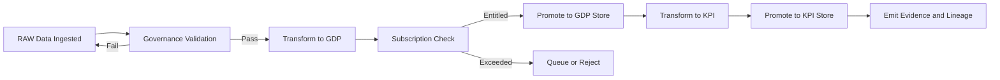

# Data Store Overview

Data Store is the persistence backbone of the platform. It maintains all structured data as it progresses through the pipeline—from raw ingestion to validated Golden Data Points (GDP) and finalized Key Performance Indicators (KPI). The store ensures durability, version integrity, and traceability across every stage of the data lifecycle.

Each store layer serves a distinct purpose. The RAW layer holds unprocessed data from source systems. The GDP layer captures standardized, governed, and reusable business entities. The KPI layer produces ready-to-consume analytical datasets and metrics. Together, these layers enable reliable data transformation without losing lineage or auditability.

## Conceptual Overview

The Data Store family provides isolated, version-controlled environments for data persistence. Each layer enforces schema and policy rules defined in Governance and operates within entitlements managed by Subscription. Operations modules interact with the store to run transformations, promote data between layers, and emit evidence of each promotion.

The store is designed for multi-tenant isolation. Each tenant has independent logical stores within the same infrastructure, ensuring data security, predictable performance, and independent lifecycle management.

## Why Data Store Exists

Enterprises often suffer from fragmented storage and undefined lineage across environments. The Data Store solves this by enforcing structured data progression under consistent governance. It ensures that all data follows the same quality, retention, and audit rules. It provides a stable foundation for analytics, decision intelligence, and AI-driven services.

The store separates raw collection from business semantics. This separation prevents schema drift, reduces duplication, and enables repeatable transformations. It also provides controlled promotion paths that guarantee every KPI originates from verifiable GDPs and approved contracts.

## How Data Store Works

The Data Store organizes data into three controlled layers:

1. **RAW Store** — Receives data directly from Acquisition modules. It preserves source fidelity and includes minimal transformations such as standardization and basic quality checks. RAW data is immutable and time-partitioned.
2. **GDP Store** — Contains standardized business entities and Golden Data Points derived from RAW data. Transformations applied here align with Governance-approved contracts. GDP datasets form the foundation for multi-domain analysis.
3. **KPI Store** — Hosts analytical datasets and metrics derived from GDP data. These represent business indicators and dashboards used by the Executive Intelligence Suite. KPI data is validated for accuracy, freshness, and completeness.

Promotion between layers occurs only after validation and evidence emission. Each promotion request triggers schema and policy checks in Governance, entitlement validation in Subscription, and operational orchestration in Operations.

## Relationship with Other Modules

- **Governance** provides contracts, schema rules, and evidence management for every dataset and promotion.  
- **Subscription** defines data volume quotas, retention periods, and performance tiers per tenant.  
- **Operations** executes promotions, runs data transformations, and records outcomes.  
- **Data Acquisition** feeds the RAW store through validated connectors.  
- **Data Intelligence and Consumption** query GDP and KPI layers for metrics, analytics, and reporting.

This integration ensures that storage is not just a passive repository but an active part of the governed data lifecycle.

## Store Layers

### RAW Store

The RAW store acts as the immutable record of inbound data. It holds data as received, with minimal normalization. Each dataset is partitioned by source, ingestion time, and version. Metadata includes source ID, extraction batch, and schema reference.

### GDP Store

The GDP store holds cleansed, standardized, and contract-aligned data. Each table represents a business entity such as customer, invoice, or product. GDP tables follow schemas defined in Governance and versioned through the Schema Registry. They form the trusted foundation for KPI computation.

### KPI Store

The KPI store contains derived datasets and analytical aggregates. These datasets are optimized for reporting, machine learning, and executive dashboards. KPI datasets are versioned, traceable to their GDP sources, and backed by evidence of policy compliance.

## Promotion Lifecycle

Each promotion event produces evidence recorded in Governance. Promotion is atomic and reversible, ensuring data integrity and full traceability across versions.

## Interfaces

### APIs

- GET /store/layers — list available store layers  
- GET /store/{layer}/datasets — list datasets by layer and tenant  
- POST /store/promote — trigger promotion between layers  
- GET /store/datasets/{id} — retrieve dataset metadata  
- GET /store/evidence/{id} — retrieve evidence and lineage information  
- DELETE /store/datasets/{id} — archive dataset following retention policy

### Events

- store.raw.ingested  
- store.gdp.promoted  
- store.kpi.promoted  
- store.promotion.failed  
- store.dataset.archived  
- store.schema.drift.detected

### State Collections

- datasets (id, name, layer, version, schema_ref, created_at, status)  
- promotions (id, from_layer, to_layer, dataset_id, evidence_ref, status, timestamp)  
- lineage (id, parent_id, child_id, relationship_type)  
- quotas (tenant_id, layer, used_bytes, limit_bytes, reset_date)

## Observability and Service Levels

| SLO | Target | Notes |
|---|---|---|
| Data durability | 99.999 percent | multi-region replication |
| Promotion success rate | 99.7 percent | includes retries and validations |
| Schema validation latency | p95 less than 300 milliseconds | per contract check |
| Evidence emission delay | less than 5 minutes | after promotion |
| Data retention enforcement | within 24 hours | post expiry window |

Metrics include:

- store_promotions_total  
- store_promotions_failed_total  
- store_datasets_total  
- store_quota_exceeded_total  
- store_schema_drift_total

Logs capture schema validation results, promotion attempts, and quota evaluations. Observability dashboards display dataset growth, promotion history, and lineage completeness.

## Security and Compliance

Each tenant’s data resides in a logically isolated database. Encryption at rest and in transit is mandatory. Retention and residency rules come from Governance policies and Subscription tiers. Access control uses signed service identities and fine-grained permissions. Promotion and archival actions generate immutable evidence entries in Governance.

## Failure Handling

- If validation fails, the promotion is rejected, and an evidence record is generated with failure details.  
- If a quota limit is exceeded, Subscription prevents the promotion until usage resets or the plan upgrades.  
- If a schema drift is detected, the dataset is paused for Governance review.  
- If promotion fails mid-process, Operations rolls back to the last verified version.  
- If evidence emission fails, the promotion is marked pending audit until resolved.

These mechanisms prevent data corruption and ensure audit consistency across layers.

## Dependencies and Consumers

Dependencies include Governance for validation, Subscription for quotas and retention rules, and Operations for orchestration. Consumers include transformation services, reporting modules, and Data Intelligence layers that query GDP and KPI datasets.

## Example Scenario

A tenant ingests transaction data from Salesforce into the RAW store. Governance validates the schema and contract. A scheduled job transforms the data into GDP tables representing invoices and payments. Subscription confirms that the tenant’s plan allows the storage size and retention period. Operations executes the promotion, records evidence, and publishes lineage links. When the finance module generates KPI metrics for revenue and cash flow, it reads from these GDP tables. Every step remains auditable through evidence and lineage references.

---

Data Store provides the foundation for all data movement and analytics. It transforms raw input into governed business assets and verifiable metrics, making the platform consistent, traceable, and enterprise-ready.
