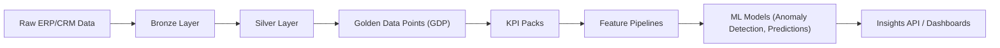
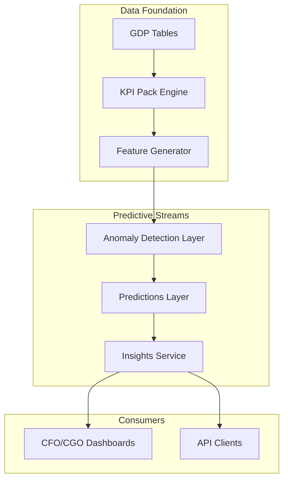
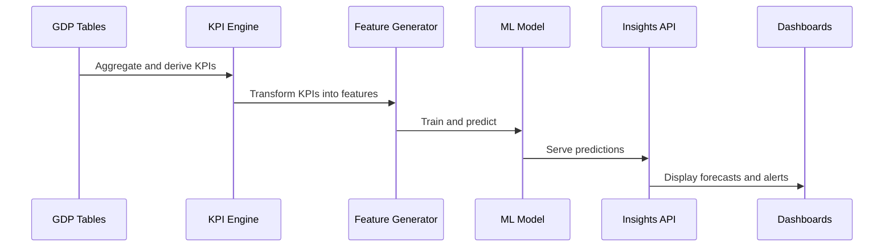

# Predictive Streams Overview

**Audience:** Platform architects, data engineers, and product stakeholders  
**Status:** Working draft  
**Purpose:** Define the end-to-end predictive intelligence architecture that spans Anomaly Detection, Predictions, and upcoming ML-based extensions. The document establishes how predictive insights evolve from Golden Data Points (GDP) through KPI derivations into machine learning (ML) feature pipelines that support reactive and proactive intelligence.

## Scope

The Predictive Streams layer extends the data intelligence platform beyond reporting and monitoring. It adds a predictive feedback loop built on standardized semantics. Each predictive stream operates on governed datasets and consistent metadata contracts derived from GDP tables.

## Conceptual Lineage

- **Golden Data Points (GDP)** define canonical facts such as invoice_amount_net, material_cost, and days_to_collect.  
- **KPI Packs** derive business metrics consumed by operational dashboards and analytics.  
- **Feature Pipelines** transform KPIs into numerical, categorical, and time-series features suitable for ML models.  
- Predictive layers consume features from the Feature Pipelines, maintaining lineage back to GDP for audit and explainability.

## Predictive Intelligence Architecture

- **Anomaly Detection** identifies deviations in GDP and KPI behavior.  
- **Predictions** uses historical signals to forecast trends such as revenue, churn, usage, and raw material cost.  
- **Insights Service** provides APIs and dashboards for surfacing predictive outputs to CxO Packs.

## Anomaly Detection Layer

Anomaly Detection operates as a reactive intelligence service. It consumes GDP and KPI data from Silver and Gold layers to identify statistically significant deviations. Key traits include:
- Real-time or batch detection using Isolation Forest, DBSCAN, and temporal z-score models.
- Context-aware anomaly classification (seasonal, behavioral, operational).
- Event publishing into observability and alerting channels.
- Integration with policy enforcement for alert suppression and false-positive handling.

## Predictions Layer

The Predictions layer is proactive. It projects future states using time-series, regression, and ensemble models. Models use engineered features derived from GDP and KPI Packs.

### Example Forecast Domains

- Revenue, margin, and liquidity forecasts (CFO Pack).  
- Sales conversion and pipeline velocity (CGO Pack).  
- Raw material cost forecasting and sourcing risk prediction (COO Pack).  
- Usage and quota saturation forecasts for tenancy operations.

### GDP to Feature Mapping

| GDP Table | GDP Column | Derived KPI | Feature Example | Target Variable |
|------------|-------------|--------------|-----------------|-----------------|
| GDP_FINANCE | invoice_amount_net | DSO, cash_inflow | rolling_avg_dso | forecast_cash_inflow |
| GDP_MATERIAL | material_cost | cost_variance | pct_change_cost_index | predict_material_cost |
| GDP_SALES | opportunity_value | conversion_rate | lead_to_close_ratio | forecast_revenue |
| GDP_USAGE | api_calls, storage_gb | quota_utilization | growth_trend_storage | predict_quota_limit |

### Data Flow

### Model Governance

- Model registry tracks lineage from GDP to features and model version.  
- Explainability data is logged for each inference with SHAP or LIME metrics.  
- Drift metrics are monitored for retraining thresholds.  
- Prediction outputs include confidence intervals and attribution metadata.

## Integration With CxO Packs

Predictive outputs are integrated into CxO Packs through standardized APIs and datasets:

| CxO Pack | Predictive Stream | Example KPI Impact |
|-----------|-------------------|--------------------|
| CFO Pack | Revenue and Cash Flow Forecasting | Improves liquidity management and working capital planning |
| CGO Pack | Sales and Conversion Forecasting | Optimizes pipeline and campaign allocation |
| COO Pack | Raw Material Cost Forecasting | Enables procurement strategy and supplier negotiations |
| Tenancy Ops | Usage and Quota Forecasting | Improves capacity planning and cost control |

## Governance And Observability

Predictive streams follow the same observability and audit standards as Tenancy core services.

- **Metrics:** model_latency_ms, drift_detected_total, feature_freshness_seconds.  
- **Logs:** model_version, feature_hash, confidence_score.  
- **Audits:** stored with model ID, GDP lineage ID, and prediction outcome.  
- **Policies:** ensure predictive actions do not trigger automated tenant state changes without human approval.

## Future Extensions

- Cross-tenant meta-learning for aggregated pattern discovery.  
- Prediction feedback loops to auto-tune quotas and anomaly thresholds.  
- Integration with AI Activation layer for narrative generation.  
- Model federation across isolated tenant environments with differential privacy.

## Summary

Predictive Streams unify the data-to-insight continuum. They transform Golden Data Points into actionable intelligence through KPI derivations, feature pipelines, and governed ML models. The architecture ensures explainability, traceability, and alignment with Tenancy, enabling CxO-level predictive decision support without compromising tenant isolation or compliance.