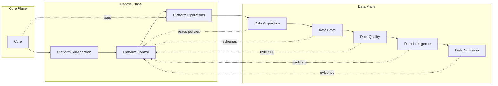
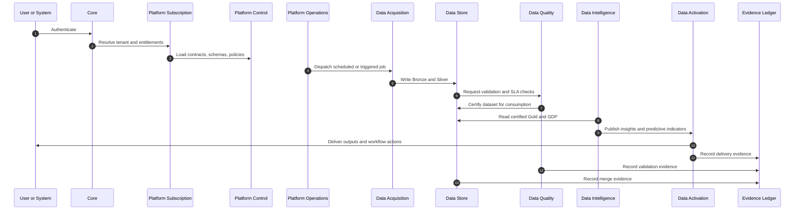

# Architecture Map

This page complements the Modules Framework with visual maps of how families interact across Core, Control, and Data planes. The diagrams are text based so they can live in version control and evolve with the platform.

## System Block Diagram

## Runtime Sequence

## Producer Consumer Matrix

| Producer | Consumer | What moves |
|----------|----------|------------|
| Platform Subscription | Platform Control | Tenant and entitlement context |
| Platform Control | Platform Operations | Policies, schemas, contract metadata |
| Platform Operations | Data Acquisition | Schedules and execution context |
| Data Acquisition | Data Store | Landed and conformed data with lineage |
| Data Store | Data Quality | Datasets and dataset metadata |
| Data Quality | Data Intelligence | Certified datasets and quality status |
| Data Intelligence | Data Activation | Insights, anomalies, forecasts |
| All families | Evidence Ledger | Evidence records with operation ids and hashes |

## Reading the Map

The block diagram shows the three planes and the main dependency direction. Cross cutting edges represent registry reads and evidence writes. The sequence diagram shows a typical job path from authentication to delivery with evidence recorded at each step. Together these views provide a consistent reference for onboarding and design reviews.
