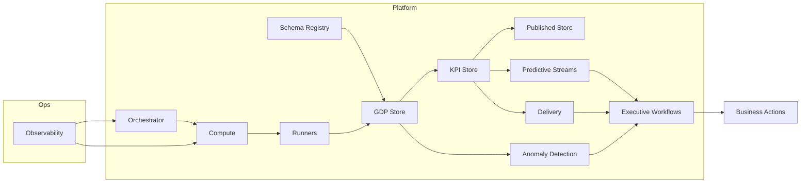

# Modules Framework

This document explains how modules across the DataJetty platform are organized into functional service groups. 

## Platform Control Services

These services define how tenants operate, how data contracts are managed, and how configuration is controlled. 
They ensure all workloads follow consistent rules across environments.

* [Schema Registry](modules/schema-registry/index.md) manages schema definitions, taxonomy, versioning, and validation. It enforces structure before data moves into pipelines.
* [Master Data](modules/master/index.md) maintains reference datasets that stabilize key entities such as customers, vendors, or plants.
* [Tenancy](modules/tenancy/tenancy-overview.md) defines boundaries, provisioning, and isolation of customer environments.
* [Subscription and Commercial Operations](modules/commercial-ops/index.md) handle plan definitions, entitlements, usage tracking, and pricing signals.
* Configuration and Feature Flags control runtime settings and staged rollouts.

These services govern what is allowed to run and how each tenant interacts with the platform.

## Orchestration and Compute Services

**Purpose**
These services manage workload execution. They ensure jobs are orchestrated, executed, retried, and monitored predictably.

**Included modules**

* [Orchestrator](modules/runtime/orchestrator/index.md) plans tasks, defines schedules, and manages retries and dependencies.
* [Compute Fabric](modules/runtime/compute-fabric/index.md) executes workloads, manages scaling, and allocates resources.
* [Streaming Bus](modules/runtime/streaming-bus/index.md) carries events, change data, and asynchronous notifications.
* [Runners](modules/runners/index.md) provide runtime profiles such as serverless, container, managed ETL, or dedicated compute.
* [Metering](modules/runtime/metering/index.md) records execution metrics for cost and usage visibility.

**Intent**
These services deliver predictable, observable, and cost-aware execution.

## Data Stores and Semantic Layer

**Purpose**
These services preserve data integrity and meaning as it flows from raw ingestion to published outputs. They provide the core data foundation for business analytics.

**Included modules**

* [Raw Store](modules/storage/raw-store/index.md) captures ingested data before validation.
* [GDP Store](modules/storage/gdp-store/index.md) contains curated golden data points that represent verified business facts.
* [KPI Store](modules/storage/kpi-store/index.md) holds calculated business metrics derived from GDP.
* [Published Store](modules/storage/published-store/index.md) provides datasets ready for consumption through APIs and exports.
* [GDP Calendar](modules/storage/gdp-calendar/index.md) manages period boundaries, close logic, and time-based alignment.

**Intent**
These services maintain semantic consistency and form the reference layer for downstream analytics.

## Data Processing and Quality Services

**Purpose**
These services handle transformation, validation, and reliability of data. They ensure that every dataset can be verified, recovered, and trusted.

**Included modules**

* [Raw to GDP Transform](pipelines/04-gdp-transform.md) normalizes and conforms raw data to GDP structure.
* [KPI Materialization](pipelines/05-kpi-materialization.md) computes metrics and creates dimensional models.
* [Data Quality and Validation](pipelines/07-data-quality-and-validation.md) enforce schema consistency and detect errors.
* [Lineage and Evidence](pipelines/08-lineage-and-evidence.md) record the transformation path and maintain audit trails.
* [Recovery, Replay and DLQ](pipelines/10-recovery-replay-and-dlq.md) provide mechanisms for reprocessing and dead-letter queue handling.

**Intent**
These services provide end-to-end traceability and help preserve data reliability.

## Business Intelligence and Predictive Services

**Purpose**
These services deliver intelligence on business data. They identify anomalies, predict outcomes, and generate signals for decision support.

**Included modules**

* [Anomaly Detection Engine](modules/anomaly-detection/overview.md) runs analytics and machine learning models on GDP or KPI data to highlight deviations.
* [Predictive Streams](modules/forecast/predictive-streams-overview.md) generate forward-looking metrics such as forecasts or risk scores.

**Intent**
These services translate data into insights that can be consumed directly by business users.

## Delivery and Workflow Services

**Purpose**
These services connect processed data to end users and integrate insights into their daily workflows.

**Included modules**

* [Delivery](modules/delivery/index.md) manages exports, webhooks, dashboards, and APIs.
* Executive Workflows define and execute business actions. The [Action Catalog](modules/action/action-catalog/index.md) describes available actions, the [Action Engine](modules/action/action-engine/index.md) validates and runs them, and [Action Delivery](modules/action/action-delivery/index.md) handles receipts and records.

**Intent**
These services operationalize insights and close the feedback loop with end users.

## Operations, Security, and Compliance Services

**Purpose**
These services sustain operational reliability, enforce security, and manage costs. They provide the foundation for trust and scalability.

**Included modules**

* [Observability](infrastructure/monitoring-slos.md) tracks metrics, logs, and traces for performance visibility.
* [Security Baselines](infrastructure/security-baselines.md) define access policies, secret handling, and network rules.
* [Incident and Runbooks](engineering/runbooks/index.md) guide recovery and troubleshooting.
* [Continuous Integration and Deployment](infrastructure/ci-cd.md) manage code, schema, and configuration releases.
* [Deployment Topologies](infrastructure/deployment-topologies.md) define environment setup and tenant isolation.
* [Cost Controls](user-stories/05b-housekeeping-cost-controls.md) manage metering, budgets, and resource optimization.

**Intent**
These services ensure every module runs securely, efficiently, and within defined service levels.

## Interaction Model

**Summary**
Data contracts define structure, pipelines perform transformation, storage maintains truth, analytical services add intelligence, delivery connects insights to users, and operational layers maintain reliability and control.
