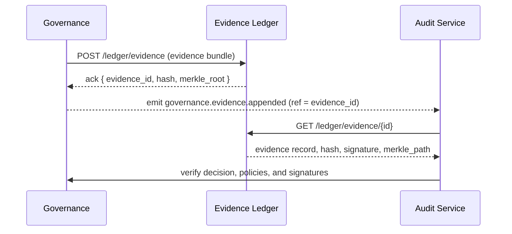

# Governance ↔ Evidence Ledger Integration

This note explains how Governance writes and replays evidence within the Evidence Ledger. It defines the interface, storage model, and verification process that guarantee auditability and immutability.

## Purpose

- Provide a tamper-proof audit trail of all promotion and policy decisions.  
- Enable deterministic replay of past governance states.  
- Maintain cryptographic integrity for every evidence record and its related bundles.

## Roles and Boundaries

- **Governance**: Authoritative service that creates and signs evidence bundles.  
- **Evidence Ledger**: Append-only store that persists evidence events and provides verification APIs.  
- **Audit Services**: Consumers that query and validate evidence chains for compliance or dispute resolution.

Governance owns the decision logic. The ledger owns durability, immutability, and proof generation.

## Ledger Write and Replay Flow



## Evidence Bundle Schema

```json
{
  "evidence_id": "ev-2025-10-14-11-12-00-001",
  "subject_ref": "dataset:gdp.sales.orders.v3",
  "decision_ref": "dec-2025-10-14-1100",
  "snapshot_id": "snap-0a2b",
  "snapshot_hash": "merkle:e6b41b",
  "quality_score": 97.5,
  "rule_pack_version": "dqp-core@2.1.0",
  "policy_versions": ["schema@4.3.1", "privacy@2.0.0"],
  "signers": ["policy-engine", "approver-admin"],
  "inputs": ["hash:abc123", "hash:def456"],
  "timestamp": "2025-10-14T11:12:00Z",
  "decision": "allow",
  "hash": "sha256:e9bf32...",
  "merkle_path": ["sha256:aa1...", "sha256:bb2..."]
}
```

Each record is immutable once written. The `hash` field is a deterministic digest of the serialized bundle. The `merkle_path` links the record to its batch root.

## Storage, Hashing, and Verification Rules

- Evidence records are batched by time window and tenant.  
- Each batch forms a Merkle tree; the root hash is persisted separately.  
- Governance and Ledger both compute the hash and verify equality before accepting the write.  
- The ledger rejects duplicates or mismatched hashes.  
- Verification proofs can be reconstructed using stored paths and roots.

## Replay and Audit Process

1. Auditor retrieves the evidence_id or range.  
2. Ledger returns the serialized record, hash, and merkle_path.  
3. Auditor recomputes the hash and validates signatures and root inclusion.  
4. Governance cross-checks that referenced policies, rule packs, and snapshots still exist.  
5. Audit tools reconstruct promotion chains for a given dataset or KPI.

Replays are deterministic: the same evidence_id and snapshot_hash must yield the same Merkle proof.

## Failure and Recovery

- If ledger write fails, Governance retries with the same evidence_id (idempotent).  
- If verification mismatch occurs, the record is quarantined and an alert is raised.  
- Ledger failures do not delete prior data; they pause new writes until consistency is restored.  
- Recovery includes rehashing batches and recalculating Merkle roots.

## Security and Compliance

- Evidence Ledger is append-only, encrypted at rest, and signed per batch.  
- Access is restricted to Governance and authorized auditors.  
- Hash algorithms are versioned and rotated periodically.  
- Retention aligns with jurisdictional data governance policies.  
- Each record includes signer certificates and audit chain references.

## API Summary

| Method | Endpoint | Description |
|---|---|---|
| POST | /ledger/evidence | Appends an evidence bundle and returns ID, hash, and merkle_root |
| GET | /ledger/evidence/{id} | Reads a single record with hash and proof |
| GET | /ledger/evidence?range= | Returns records in a time or ID range |
| GET | /ledger/proof/{root} | Returns Merkle root and inclusion proof |
| GET | /ledger/verify/{id} | Validates a record hash against stored root |

The Evidence Ledger guarantees that every decision stored under Governance can be verified independently and reproduced at any time.
