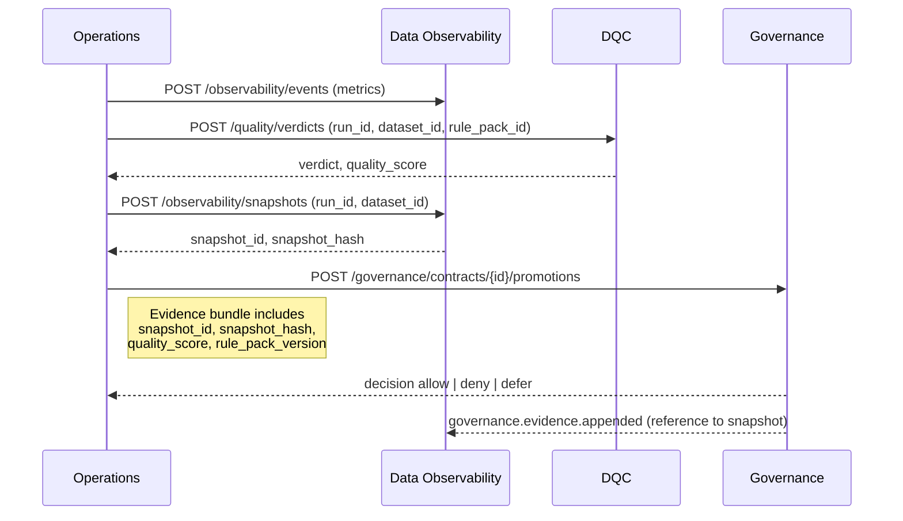

# Governance ↔ Data Quality Integration

This note describes how Governance, Data Observability, and DQC cooperate during promotions. It formalizes the control-plane handshake and the evidence fields required to authorize RAW to GDP and GDP to KPI transitions.

## Purpose

- Ensure every promotion decision references the exact quality signals used at decision time.  
- Guarantee that rule evaluations and thresholds are auditable and reproducible.  
- Keep responsibilities clear: Observability emits signals and snapshots, DQC computes scores and verdicts, Governance authorizes promotions and records evidence.

## Roles

- **Observability** publishes metric events and creates immutable snapshots for a run and dataset.  
- **DQC** evaluates rule packs for the same run, computes a composite `quality_score`, and returns a verdict.  
- **Governance** validates the evidence bundle, enforces required fields, and records the signed decision.

## Handshake

## Evidence Requirements

Promotion evidence must include:

- `snapshot_id` and `snapshot_hash` from Observability.  
- `quality_score` and `rule_pack_version` from DQC.  
- `policy_versions` that were in effect at decision time.  
- `inputs` hashes, `signers`, `timestamp`, and `decision` fields per the Evidence Model.

Promotions without these fields are rejected.

## API Contracts

- Observability  
  - `POST /observability/snapshots` → returns `{ snapshot_id, hash }`  
  - `GET /observability/snapshots/{id}` → immutable snapshot for audit  
- DQC  
  - `POST /quality/verdicts` → returns `{ verdict, quality_score, failures[], waiver_refs[] }`  
- Governance  
  - `POST /governance/contracts/{id}/promotions` → validates evidence and records decision

## Error Handling

- If Observability snapshot is missing or hash mismatches, Governance rejects the promotion.  
- If DQC verdict is missing or below threshold, Governance denies or defers.  
- If any dependency is degraded, Operations retries; the platform fails closed for promotions.

## Security

- Evidence is append only and signed.  
- Snapshots and verdicts are immutable and addressable by ID.  
- Access is service-to-service using short-lived credentials.

## Operational Notes

- Waivers must be explicit, time-bound, and included in the evidence as references.  
- Replays reproduce promotions by fetching the original snapshot and the rule pack version used.  
- Dashboards show promotion outcomes alongside the snapshot and score for transparency.
