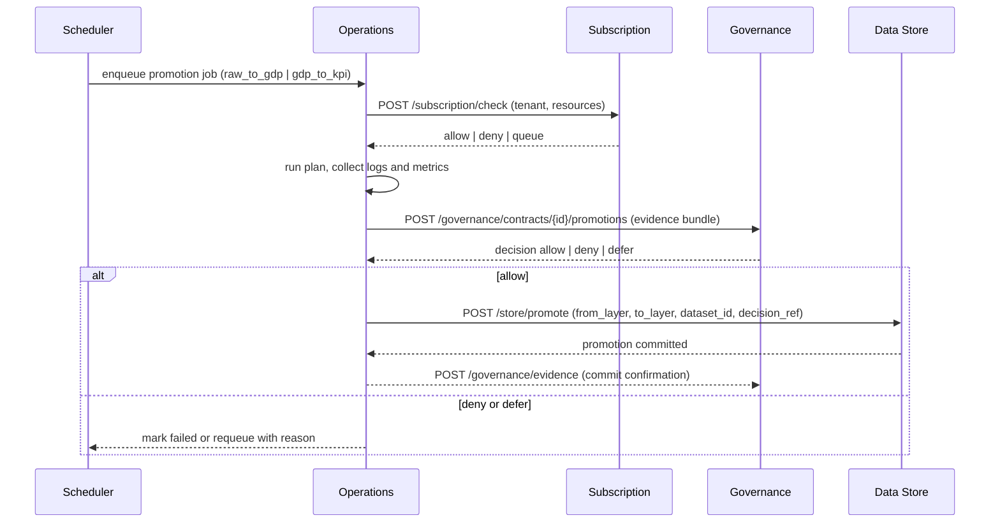

# Governance ↔ Runtime Integration

This note explains how Governance decisions integrate with the runtime plane. It focuses on orchestration, evidence writing, and data store promotion semantics.

## Purpose

- Ensure promotions are triggered only when policy and quality conditions are satisfied.  
- Guarantee evidence is written atomically with runtime completion.  
- Keep promotion semantics consistent across RAW, GDP, and KPI layers.

## Roles

- **Operations** orchestrates jobs, collects logs and metrics, and writes evidence.  
- **Governance** validates promotion requests and records signed decisions.  
- **Subscription** enforces runtime limits and quotas before execution.  
- **Data Store** performs the actual layer transition and writes promotion metadata.

## Sequence

## Promotion Semantics

- Promotion is **single-writer** per dataset per layer and **idempotent** per `run_id`.  
- Data Store applies the promotion only after a valid Governance decision is received.  
- Promotion metadata includes `decision_ref` that points to the evidence record.

## Required Fields

Operations must supply the following in the Governance evidence bundle:

- `run_id`, `subject_ref`, `promotion_type`  
- `snapshot_id`, `snapshot_hash` (from Observability)  
- `quality_score`, `rule_pack_version` (from DQC)  
- `policy_versions`, `inputs`, `signers`, `timestamp`

## API Boundaries

- **Operations → Governance**: `POST /governance/contracts/{id}/promotions` to request a decision.  
- **Operations → Data Store**: `POST /store/promote` to execute a layer change with a `decision_ref`.  
- **Data Store → Governance**: emits `store.gdp.promoted` or `store.kpi.promoted` with the `decision_ref` for cross-plane traceability.

## Failure Handling

- If Subscription denies, the scheduler requeues when allowance is expected to refresh.  
- If Governance returns **defer**, Operations retries after corrective actions (quality, schema, or policy updates).  
- If Data Store fails mid-promotion, rollback restores the last verified version and the job is marked **pending audit**.  
- Evidence append must succeed; otherwise the run remains **incomplete** and cannot be published.

## Telemetry

- Operations emits `operations.job.completed` or `operations.job.failed`.  
- Data Store emits `store.promotion.failed` on rollback.  
- Governance emits `governance.contract.promoted` with a reference to the evidence event.  
- All events carry `tenant_id`, `dataset_id`, `layer`, and `run_id` for correlation.

## Security

- All calls use service identities and short-lived tokens.  
- Promotion execution requires a Governance decision reference created within the allowed time window.  
- Evidence and promotion state are immutable and auditable.
