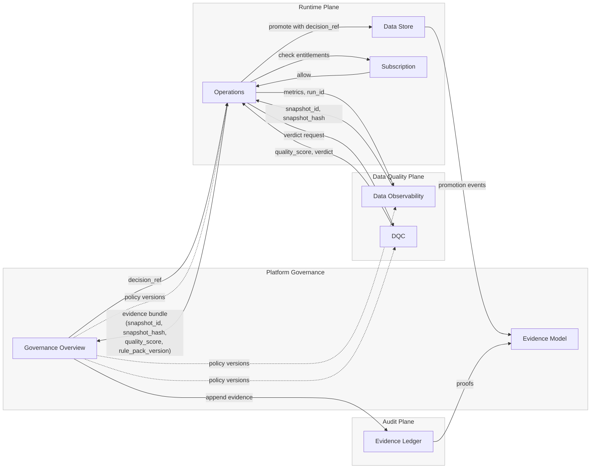

# Governance Integrations

The **Governance Integrations** layer defines how Platform Governance interacts with operational planes — primarily **Runtime**, **Data Quality**, and the **Evidence Ledger**.  
It serves as the connective layer between policy intent, quality assurance, and execution enforcement.

Each integration formalizes how governance evidence, quality signals, and runtime actions are exchanged, validated, and recorded.  
Together, these integrations ensure that all downstream activity aligns with approved governance decisions and traceable evidence chains.

### Purpose

- Establish bidirectional control between governance and operational services.  
- Synchronize data quality validation, policy enforcement, and evidence capture.  
- Maintain consistent handshakes between control and execution planes.  
- Guarantee immutable traceability across datasets, jobs, and decisions.

### Scope

Governance Integrations cover:

| Integration                     | Function                                                                     | Primary Artifacts            |
|---------------------------------|------------------------------------------------------------------------------|------------------------------|
| **Runtime Integration**         | Enforces governance decisions at execution time through the Runtime plane.   | decision_ref, enforcement_id |
| **Quality Integration**         | Validates and exchanges data quality evidence (snapshots, scores, verdicts). | snapshot_id, quality_score   |
| **Evidence Ledger Integration** | Writes and verifies immutable proofs of governance actions and decisions.    | evidence_hash, ledger_ref    |

### Relationship to Platform Governance

These integrations act as execution enablers for Governance Policies.  
Policies define the “what” — Integrations ensure the “how” is consistently applied across runtime, data, and compliance systems.

Governance Integrations do not evaluate or author policies.  
They focus on enforcing consistency, synchronizing evidence, and maintaining operational integrity across distributed modules.

## Topology

### Integration Artifacts

Each integration defines:

- **Contracts** — request and response schemas for control plane interactions.  
- **Evidence** — verifiable records shared with Governance (snapshots, scores, hashes).  
- **Signatures** — cryptographic validation of payload authenticity.  
- **Events** — asynchronous notifications of decision or evidence state changes.

### Component Files

[Runtime Integration](governance-runtime-integration.md)  
Explains how governance decisions are consumed and enforced by the runtime plane.

[Quality Integration](governance-quality-integration.md)  
Defines how data quality verdicts and scores are exchanged between Quality and Governance services.

[Evidence Ledger Integration](governance-evidence-ledger-integration.md)  
Details how governance evidence and proofs are written, verified, and replayed through the ledger.

### Outcome

Together, these integrations enable the platform to enforce governance **as a living contract**, not a static configuration.  
Every dataset, job, and evidence record becomes traceable back to a governance decision, ensuring platform-wide compliance and accountability.

