# Governance Overview

Governance defines how the platform manages truth, trust, and traceability across all data and analytical layers. It is the foundation that determines what data can enter the platform, how that data is shaped, and how decisions are recorded for audit and accountability. Every dataset, contract, and KPI passes through governance checks before it becomes part of the operational or analytical ecosystem.

Governance operates as a persistent plane of authority. It does not process data directly. Instead, it provides a consistent set of contracts, policies, and evidence services that other modules reference when they read, write, or promote data. By separating governance from runtime execution, the platform maintains both speed and reliability without compromising compliance or trust.

## Conceptual Overview

When a tenant or module proposes new data, a schema change, or a KPI definition, governance evaluates the request against active policies. It validates structure, checks for lineage and privacy obligations, and determines whether the new artifact can be promoted to an active state. Each decision generates evidence that becomes part of an immutable record. This record allows every data product to be explained, audited, and reversed if necessary.

Governance therefore acts as the contract layer between business intent and technical execution. It ensures that the platform produces Golden Data Points and KPIs that are consistent, traceable, and compliant with organizational policy.

## How Governance Works

Governance services operate through three principles:

1. **Declarative contracts.** All datasets and KPIs are defined through machine-readable contracts that describe structure, dependencies, and obligations.
2. **Policy enforcement.** Policies capture rules for schema, privacy, residency, and service-level behavior. Enforcement occurs automatically when contracts are published or data is promoted.
3. **Evidence and lineage.** Every governance decision is recorded as evidence and connected to the lineage of datasets and KPIs.

The platform enforces these principles in a predictable lifecycle. A contract begins in draft, is validated and approved, then becomes an active contract that allows data to flow. Each transition is governed by policies and recorded as evidence.

## Relationship with Other Modules

Governance does not execute pipelines or collect data. Instead, it acts as a source of truth for the services that do. Operations modules use governance to validate actions and record run results. Data Acquisition modules read governance contracts to determine what to extract and how to structure data. Subscription and enforcement modules use governance state to ensure limits and entitlements are applied consistently.

This clear separation allows every service to operate independently while following the same definitions of trust and compliance.

## Governance Services

### Catalog Master

The Catalog Master maintains the canonical inventory of regions, namespaces, data domains, and dataset identifiers. Other modules rely on this catalog to reference platform entities consistently.

### Policy Registry

The Policy Registry stores reusable rules. These include schema compatibility, privacy and residency, service level objectives, lineage constraints, and quality thresholds. Policies are versioned, auditable, and bound to contracts and environments.

### Data Contract Registry

The Data Contract Registry stores authorable contracts for RAW, GDP, and KPI data. Each contract describes structure, dependencies, obligations, and promotion rules. Contracts move from draft to approved to active through governance decisions.

### Schema Registry

The Schema Registry manages schema versions and compatibility classes. It validates proposed changes, records lineage links, and publishes version updates for dependent services to consume.

### Lineage Obligations

Lineage Obligations capture how datasets and KPIs derive from each other and which upstream constraints must continue to apply. Obligations are used during validation, impact analysis, and audit.

### Evidence Ledger

The Evidence Ledger is an append-only store that records each governance decision. Entries include inputs, signers, and cryptographic hashes. The ledger enables reconstruction of promotion decisions and provides durable audit history.

### Calendar Service

- GET /governance/contracts/{id} reads a contract and status  
- POST /governance/contracts/{id}/proposals submits a change proposal  
- POST /governance/contracts/{id}/promotions requests promotion with an evidence bundle  
- POST /governance/policies create or update a policy  
- POST /governance/evidence appends a signed evidence event  
- GET /governance/lineage/{asset_id} retrieves derivation and obligations  
- GET /governance/calendar/{tenant} reads fiscal calendar and date metadata

## Interfaces

### APIs

- GET /governance/contracts/{id} reads a contract and status  
- POST /governance/contracts/{id}/proposals submits a change proposal  
- POST /governance/contracts/{id}/promotions requests promotion with an evidence bundle  
- POST /governance/policies creates or updates a policy  
- POST /governance/evidence appends a signed evidence event  
- GET /governance/lineage/{asset_id} retrieves derivation and obligations  
- GET /governance/calendar/{tenant} reads fiscal calendar and date metadata

### Events

- governance.policy.published  
- governance.contract.promoted  
- governance.evidence.appended  
- governance.schema.versioned  
- governance.lineage.updated

### State Collections

- contracts with types RAW, GDP, KPI and status draft, approved, active, superseded  
- policies with type, version, scope, and binding  
- schemas with compatibility classes and published versions  
- evidence_events with actor, decision, input hashes, signatures, and hash  
- lineage_edges with parent, child, and obligations

## Lifecycle and Promotion Flow

```mermaid
flowchart LR
  A[Draft Contract] --> B[Policy Validation]
  B -->|pass| C[Approval]
  B -->|fail| A
  C --> D[Schema Versioning]
  D --> E[Publish Contract]
  E --> F["Promotion RAW→GDP"]
  F -->|Evidence Bundle| G[Decision Promote]
  G --> H[GDP Active]
  H --> I["Promotion GDP→KPI"]
  I -->|Evidence Bundle| J[Decision Promote]
  J --> K[KPI Active]
```



Each transition requires an evidence bundle that includes validation results, lineage information, and logs from recent runs. Governance records these bundles and emits decision events. Promotions are allowed only when all policy checks pass and evidence is stored.

## Evidence Model

| Field       | Description                                                    |
|-------------|----------------------------------------------------------------|
| evidence_id | unique identifier for a decision                               |
| subject_ref | contract or asset being evaluated                              |
| inputs      | hashes of schemas, metrics, and artifacts used in the decision |
| decision    | allow, deny, or defer with reason                              |
| signers     | services or approvers responsible for the decision             |
| timestamp   | time the decision was finalized                                |
| hash        | merkle root for the evidence bundle                            |
| links       | references to related lineage or policy records                |

## Promotion Evidence Contract

Promotion requests for RAW to GDP and for GDP to KPI must include a complete evidence bundle. The bundle links to quality signals and rule evaluations used at decision time.

```json
{
  "promotion_type": "raw_to_gdp",
  "subject_ref": "dataset:gdp.sales.orders.v3",
  "run_id": "r-2025-10-14-1100",
  "snapshot_id": "snap-0a2b",
  "snapshot_hash": "merkle:e6b41b",
  "quality_score": 97.5,
  "rule_pack_version": "dqp-core@2.1.0",
  "policy_versions": ["schema@4.3.1", "privacy@2.0.0", "residency@1.4.0"],
  "signers": ["policy-engine", "approver-admin"],
  "inputs": ["hash:abc123", "hash:def456"],
  "timestamp": "2025-10-14T11:12:00Z",
  "decision": "allow",
  "reason": "all checks passed"
}
```

Rules

- snapshot_id and snapshot_hash are required. These are created by the Observability service and represent the metric snapshot used during the decision.  
- quality_score is required. It is produced by DQC for the same run_id and subject_ref and reflects rule outcomes and weights.  
- rule_pack_version references the exact rule pack used to compute the score.  
- policy_versions capture the policy set in effect at decision time.  
- evidence is append only and must be signed by the decision service and any human approvers.  
- promotions without these fields are rejected with a policy violation.

## Policy Taxonomy

Governance policies are organized by function:

- Schema policies ensure compliance with meta-schema rules and enforce backward or forward compatibility.  
- Privacy policies define how sensitive fields are masked, encrypted, or restricted by role.  
- Residency policies define the allowed data regions and retention windows.  
- Service-level policies define expectations for freshness, completeness, and latency.  
- Lineage policies ensure that derived datasets inherit upstream obligations.  
- Quality policies validate referential integrity and data distribution thresholds.

Each policy can be versioned and attached to one or more contracts. When policies change, dependent contracts may need revalidation before the next run.

## Observability and Reliability

Governance exposes metrics and logs so that operators can monitor policy decisions, promotion activity, and audit queries. Metrics are published to the platform monitoring service.

| SLO                           | Target                         | Notes                                |
|-------------------------------|--------------------------------|--------------------------------------|
| Policy evaluation latency     | p95 less than 500 milliseconds | cached reads and signed writes       |
| Promotion decision turnaround | within 24 hours                | includes automation and human review |
| Evidence write availability   | 99.9 percent                   | append only store                    |
| Schema publish propagation    | within 5 minutes               | from governance to other planes      |
| Audit query latency           | p95 less than 2 seconds        | indexed for search                   |

Metrics include:

- governance_decisions_total  
- evidence_appends_total  
- promotion_requests_total  
- policy_violations_total

## Security and Compliance

Governance handles metadata and cryptographic references only. Authentication and authorization use service identities and signed tokens. Promotion decisions are signed and include certificate references. Audit records are written to append only storage and replicated for durability. Residency and retention policies ensure storage in the correct jurisdiction.

## Failure Handling

If the policy engine becomes unavailable, the platform fails closed for promotions but continues to serve cached reads. Evidence write failures trigger retries with idempotent keys. Schema incompatibility or signature errors raise alerts and block promotions until resolved. Operators can view failure history and manual approval queues through operational tools.

## Dependencies and Consumers

Governance depends on identity, certificate, and time services for signing and validation. It also uses object storage for evidence bundles. Downstream consumers include operations, data acquisition, and subscription modules, which rely on governance decisions and state for their workflows.

## Example Use Case

A finance team defines a new KPI for cash flow by combining data from sales and expenses. They submit a GDP contract describing the inputs and calculations. Governance evaluates the schema and lineage, ensures policies for privacy and residency are satisfied, and records a signed decision in the Evidence Ledger. Once approved, the KPI contract becomes active, and the operations service schedules runs that produce auditable results linked to this evidence record.

Governance provides the consistent foundation for trusted data products. It transforms policies and approvals into verifiable decisions that every module in the platform can rely on.
