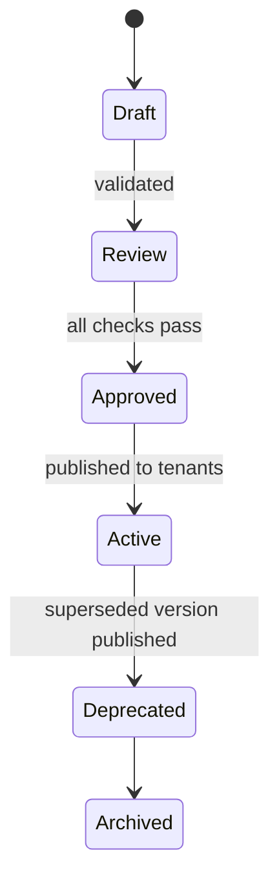

# Policy Authoring and Lifecycle

Policies encode business intent and define how data must behave across the platform. They translate organizational requirements into executable rules that Governance, Quality, and Runtime layers enforce. Policies are declarative, versioned, testable, and portable across tenants.

## Purpose

The Policy Authoring and Lifecycle process ensures policies remain consistent, traceable, and auditable from creation to retirement. It enables controlled evolution of data governance behavior while maintaining compliance and predictability.

## Policy Hierarchy and Scope

| Level | Applies To | Examples |
|--------|-------------|----------|
| Platform | Global behaviors | naming conventions, residency, encryption |
| Tenant | Specific environments | data retention, masking, privacy scope |
| Contract | Dataset or KPI | schema compatibility, quality thresholds |
| Runtime | Execution environment | freshness, job concurrency, latency |

Precedence order: **Contract > Tenant > Platform**. The most specific policy overrides broader ones, while unscoped gaps inherit global defaults.

## Policy Authoring Model

Policies are defined in a declarative YAML-like format with fixed keys and schema validation.

```yaml
policy_id: policy.quality.freshness
version: 4.3.1
scope: contract
conditions:
  metric: freshness_seconds
  operator: lte
  threshold: 3600
action:
  on_violation: defer
  severity: medium
metadata:
  author: system
  created_at: 2025-10-14T11:00:00Z
  labels: ["quality", "timeliness"]
```

Fields

- `policy_id`: globally unique identifier  
- `version`: semantic version; immutable once published  
- `scope`: platform, tenant, contract, or runtime  
- `conditions`: metric or attribute-based predicates  
- `action`: defines enforcement behavior and severity  
- `metadata`: optional contextual tags

## Policy Lifecycle



Transitions are recorded in the Evidence Ledger. Each policy must pass schema validation and static tests before promotion.

## Authoring Interfaces

### APIs

- POST /governance/policies — submit or update a draft  
- GET /governance/policies/{id} — read details and current version  
- POST /governance/policies/{id}/promote — request approval and evidence write

### Validation Service

Validates structure, references, and dependency consistency. Rejects malformed YAML, missing required fields, or circular references.

### Version Resolver

Determines the active policy version for a tenant or contract at evaluation time.

## Testing and Simulation

Policies can be tested using historical or synthetic data.

- `POST /governance/policies/{id}/simulate` — runs simulation for sample runs  
- Returns pass rate, affected datasets, and expected impact metrics  
- Simulation evidence is temporary and not written to ledger

Simulations allow safe iteration before formal promotion.

## Promotion and Rollback

- Promotion requires governance approval and recorded evidence.  
- Rollbacks create a new version referencing the prior active version.  
- No version is deleted or edited post-publication.  
- Metadata maintains lineage between versions and dependencies.

## Policy Deployment

Approved policies are published through events.

- `governance.policy.published` notifies runtime and quality planes.  
- Consumers cache policies locally for up to 5 minutes.  
- Policy invalidation occurs when a newer version is approved or revoked.

## Policy Composition

### Layered Composition

Multiple policies can apply simultaneously. Precedence follows specificity (Contract > Tenant > Platform).

### Derived Policies

Derived policies inherit parent conditions but override thresholds or actions.

### Aggregates

Aggregated policies group related rules as reusable packs (for example, `policy_pack.cfo_compliance`).

## Failure Handling

- Validation failure blocks publication.  
- Conflicting conditions trigger manual review.  
- Missing policies during enforcement cause fail-closed behavior.  
- Policy publish errors retry automatically with exponential backoff.

## Metrics and Auditability

| Metric | Description |
|---------|--------------|
| governance_policies_total | total active policies |
| governance_policy_versions_total | total versions tracked |
| governance_policy_conflicts_total | policy conflicts detected |
| governance_policy_promotions_total | successful promotions |
| governance_policy_reverts_total | rollbacks created |

Each promotion and rollback is logged with author, approver, commit hash, and evidence reference.

## Example

**Scenario:** A dataset must stay fresh and mask sensitive columns.

### Freshness Policy (Contract-Level)
```yaml
policy_id: policy.quality.freshness
scope: contract
conditions:
  metric: freshness_seconds
  operator: lte
  threshold: 3600
action:
  on_violation: defer
  severity: high
```

### Privacy Policy (Tenant-Level)
```yaml
policy_id: policy.privacy.masking
scope: tenant
conditions:
  column_class: pii
action:
  on_violation: block
  severity: critical
```

### Residency Policy (Platform-Level)
```yaml
policy_id: policy.residency.location
scope: platform
conditions:
  region: not_in(["IN", "EU"])
action:
  on_violation: block
  severity: critical
```

**Resolution:**  
The platform merges applicable policies by precedence. Freshness (contract) overrides generic runtime defaults. Privacy (tenant) and residency (platform) both apply; any block halts promotion. Final decision and resulting actions are recorded as evidence.

## Summary

The Policy Authoring and Lifecycle process transforms compliance intent into governed automation. Each policy is versioned, validated, and signed, ensuring consistent behavior across environments, tenants, and time.
