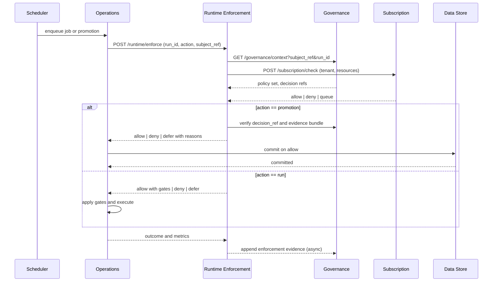

# Runtime Governance Enforcement Layer

The Runtime Governance Enforcement Layer enforces governance decisions during execution. It sits between orchestration and data execution and ensures that every runtime action complies with approved policies, contracts, and promotion decisions.

RGEL does not evaluate authoring policies or write contracts. It consumes Governance decisions and quality signals and blocks, defers, or shapes runtime operations accordingly.

## Purpose and Scope

- Enforce governance decisions at the moment of execution.  
- Verify evidence bundles and decision references before promotions.  
- Inject runtime gates for schema, quality, and residency.  
- Fail closed when policy context is missing or unverifiable.

Out of scope are policy authoring, contract lifecycle, and long term evidence storage. These remain in Governance and the Evidence Ledger.

## Role in Platform Topology

RGEL is invoked by the orchestrator before a job starts and before a promotion commits. It fetches current policy context, verifies decision references, and applies runtime gates. It also emits enforcement events for audit and observability.

## Enforcement Pipeline

## Enforcement Actions

### Admission Control

Admission control rejects or defers jobs that lack required context. Examples include missing `decision_ref` for promotions or absent quality signals for gated runs.

### Runtime Policy Injection

RGEL injects enforced checks into the execution plan. Checks include schema compatibility, quality thresholds, privacy masking, and residency routing. Plans that cannot host gates are denied.

### Decision Verification

Before promotions, RGEL verifies the presence and integrity of the evidence bundle. This includes `snapshot_id`, `snapshot_hash`, `quality_score`, and `rule_pack_version`, as well as policy versions and signatures.

### Live Policy Context

RGEL reads the latest policy context for the subject. If a breaking policy change has been published since plan compilation, the job is deferred until the plan is recompiled or a waiver is present.

## Interfaces

### APIs

- POST /runtime/enforce  
  Accepts run_id, action type, subject_ref, and optional decision_ref. Returns allow, deny, or defer and a list of runtime gates.

- GET /runtime/policy-context/{run_id}  
  Returns the policy set, contract references, and thresholds resolved for the run.

- POST /runtime/evidence  
  Appends enforcement evidence for audit. Includes enforcement_id, decision_ref, outcomes, and hashes.

### Events

- runtime.enforcement.started  
- runtime.enforcement.allowed  
- runtime.enforcement.denied  
- runtime.enforcement.deferred  
- runtime.enforcement.failed

## Evidence Handling

RGEL writes an enforcement record that includes the verified `decision_ref` and a digest of the runtime gates applied. The record is forwarded to Governance for inclusion in the Evidence Ledger. Enforcement records are immutable and idempotent per run_id and action.

## Failure Modes and Safety

- If policy context cannot be retrieved, RGEL denies with reason unavailable_context.  
- If decision verification fails, RGEL denies with reason invalid_decision_ref.  
- If Subscription denies, RGEL returns defer with reason quota_exceeded.  
- If Store rejects a commit after allow, RGEL marks the run pending audit and opens a recovery path.  
- Timeouts result in deny to prevent noncompliant execution.

## Metrics and Observability

- runtime_enforcements_total  
- runtime_enforcements_allowed_total  
- runtime_enforcements_denied_total  
- runtime_decisions_verified_total  
- runtime_policy_context_latency_ms p95  
- runtime_gate_injection_errors_total

Dashboards show allow and deny trends by module, dataset, and tenant. Logs include policy context hashes, decision references, and gate configurations.

## Security

All calls to RGEL use service identities and short lived tokens. Enforcement decisions and evidence writes are signed. RGEL stores metadata only. Sensitive data never leaves execution engines.

## Example

A promotion from GDP to KPI is queued. Operations calls RGEL to enforce. RGEL fetches policy context, validates the decision reference, and confirms the presence of `snapshot_id`, `snapshot_hash`, and `quality_score`. Subscription confirms entitlements. RGEL allows the promotion with gates for residency and privacy. The Store commits the promotion and RGEL appends an enforcement record with hashes to Governance.
