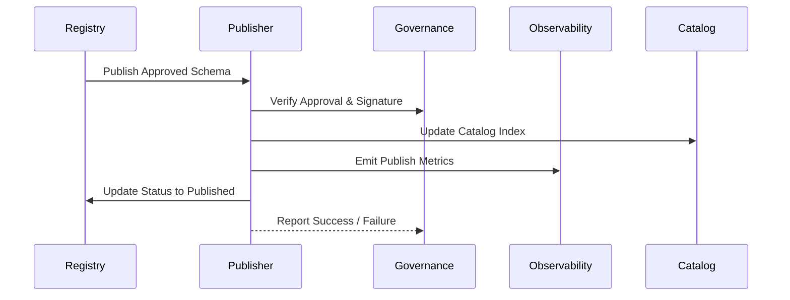

# Schema Lifecycle – Publishing
> Applies to: All Schema Layers • Owner: Platform Engineering • Last updated: 2025-10-07

## Objectives
Provide a controlled, auditable process for promoting validated schemas to published state and replicating them across tenants, catalogs, and observability systems.

## Scope
> **Note:** Extractor Schemas define only the *shape and transport contract* of extraction — covering envelopes, layouts, and CDC markers — not the business or semantic payload structure.

Covers publishing, rollback, replication, signing, and audit logging.  
**Out of Scope:** downstream data ingestion and runtime enforcement (handled by Pipelines).

---

## Core Responsibilities
- Transition schemas from `validated` to `published` status.  
- Sign and checksum published schemas for immutability.  
- Replicate published objects to tenant caches and observability stores.  
- Maintain rollback and version control for all publish operations.  
- Emit standardized audit and metric events for governance and monitoring.

---

## Architecture Overview
The Publisher orchestrates schema promotion, ensuring synchronization across Catalog, Observability, and Governance systems.



**Interactions**
- **Registry:** initiates publish job and maintains schema state.  
- **Governance:** validates signature and approval trail.  
- **Catalog:** indexes published version for discoverability.  
- **Observability:** tracks latency, replication, and success metrics.  

---

## Publishing Workflow
1. **Validation Complete** – Schema successfully passes validation workflow.  
2. **Governance Approval** – Change request approved with digital signature.  
3. **Publisher Triggered** – Promotion job initiated via API or schedule.  
4. **Signing & Checksum** – Content signed with platform private key.  
5. **Replication** – Schema distributed to tenant and observability caches.  
6. **Audit Logging** – Publish record stored with status, checksum, and signature.  
7. **Notification** – Tenants and dependent systems receive event payloads.

---

## Governance Integration
- Governance approval record (`approval.json`) is mandatory for all publishes.  
- Publisher verifies approval hash before proceeding.  
- If approval hash mismatch → operation aborted, status `Rejected`.  
- Published schema and approval metadata stored together in catalog path:  
  `s3://registry/<tenant>/<domain>/<layer>/<subject>/<version>/`

**Example Approval Metadata**
```json
{
  "fqid": "finance.gdp.invoice:v1.3",
  "approved_by": "governance-board",
  "approval_hash": "3fd8a2...",
  "signed_at": "2025-10-07T10:05Z",
  "signature": "RSA-SHA256-1ae9f4"
}
```

---

## Rollback Workflow
If a schema introduces breaking changes or incorrect metadata, rollback allows safe reversion.

| Step | Description | Condition |
|---|---|---|
| 1 | Identify affected FQID | Manual or automated alert |
| 2 | Governance authorizes rollback | Required |
| 3 | Publisher restores previous version from Catalog | Automatically |
| 4 | Registry updates status to `RolledBack` | Logged |
| 5 | Observability records rollback metrics | Automatic |

**Rollback Event Example**
```json
{
  "event": "schema.rollback",
  "fqid": "finance.gdp.invoice:v1.3",
  "rolled_back_to": "v1.2",
  "reason": "Data contract mismatch detected",
  "timestamp": "2025-10-07T10:32Z"
}
```

---

## Configuration
| Parameter | Description | Required | Default |
|---|---|:---:|---|
| `replication_targets` | Destinations for schema replication | ✓ | ["catalog", "observability"] |
| `max_retry` | Retry attempts for failed publish jobs |  | 3 |
| `enable_signature_verification` | Enforce signature validation pre-publish |  | true |
| `notify_tenants` | Send publish event notifications |  | true |

---

## API Operations
| Operation | Method | Endpoint | Description |
|---|---|---|---|
| Publish Schema | POST | `/publish` | Start publish workflow |
| Get Publish Status | GET | `/publish/status/{fqid}` | Retrieve status and timestamps |
| Rollback Schema | POST | `/publish/rollback` | Rollback last published version |
| Audit Records | GET | `/publish/audit/{fqid}` | Retrieve publish audit record |

**Example Publish Payload**
```json
{
  "fqid": "finance.gdp.invoice:v1.3",
  "approved_hash": "3fd8a2...",
  "replication_targets": ["catalog","observability"],
  "initiated_by": "svc.registry",
  "mode": "standard"
}
```

---

## Observability Integration
| Metric | Description | Unit | Target |
|---|---|---|---|
| `publish.success_rate` | Successful publishes / total | % | >99 |
| `publish.avg_latency_ms` | Average publish duration | ms | <120000 |
| `publish.rollback_count` | Rollback events | count/day | 0 |
| `publish.replication_delay_ms` | Replication completion latency | ms | <60000 |

**Alerts**
- **Success rate < 95%** → Investigate approval or replication queue.  
- **Rollback detected** → Governance review.  
- **Latency > 2min** → Publisher performance issue.

---

## Tenant Replication Behavior
- Tenant caches receive published schema asynchronously after approval.  
- Replication events tagged with tenant namespace and timestamp.  
- Platform signs payloads to prevent tampering.  
- Tenants cannot modify published schemas; updates must trigger new version via CR.  
- Observability dashboards display per-tenant replication SLA (P95 ≤ 15min).

---

## Error Handling
| Code | Meaning | Resolution |
|---|---|---|
| 401 | Signature invalid | Re-sign schema |
| 404 | Schema not found | Verify FQID |
| 409 | Already published | Skip operation |
| 422 | Approval metadata mismatch | Regenerate approval record |
| 500 | Internal server error | Retry / escalate |

---

## Limits
| Item | Limit | Notes |
|---|---|---|
| Parallel publish jobs | 10 | Per environment |
| Max schema size | 50 MB | Validated JSON size |
| Audit retention | 2 years | Immutable storage |

---

## Examples
### 1. Successful Publish Event
```json
{
  "event": "schema.published",
  "fqid": "finance.gdp.payment:v1.2",
  "checksum": "sha256:98abf2",
  "status": "success",
  "published_by": "svc.registry",
  "replication_targets": ["catalog", "observability"]
}
```

### 2. Failed Publish Attempt
```json
{
  "event": "schema.publish_failed",
  "fqid": "finance.kpi.dso:v1.1",
  "error_code": "422",
  "message": "Approval metadata mismatch",
  "timestamp": "2025-10-07T11:14Z"
}
```

---

## Versioning & Change Management
- Publisher logic is versioned with Registry releases.  
- All publish/rollback actions logged to `/audit/publish/`.  
- Governance maintains control over all signing keys.  
- Future enhancements (in parked-scope.md): policy-based auto-publishing and tenant-specific replication rules.

---
