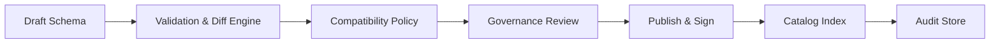
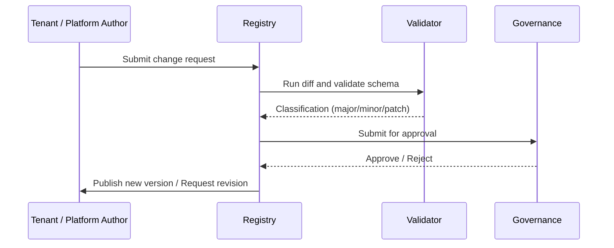

# Schema Lifecycle – Versioning
> Applies to: All Schema Layers • Owner: Platform Engineering • Last updated: 2025-10-07

## Objectives
Establish a consistent, predictable versioning model for all schemas managed in the Registry.  
Versioning ensures controlled evolution, backward compatibility, and transparent audit across the platform and tenant ecosystems.

## Scope
> **Note:** Extractor Schemas define only the *shape and transport contract* of extraction — covering envelopes, layouts, and CDC markers — not the business or semantic payload structure.

Covers semantic versioning, compatibility enforcement, lineage tracking, and deprecation workflows for Extractor, GDP, and KPI schemas.  
**Out of Scope:** runtime data validation and tenant-specific deployment pipelines.

---

## Core Responsibilities
- Maintain a deterministic semantic version model (`v<major>.<minor>[.<patch>]`).
- Enforce compatibility policies (`full | forward | none`).
- Record lineage between versions and dependents.
- Support governance approval for breaking changes.
- Provide rollback and audit capabilities for all published schemas.
- Integrate tenant change-request handling with governance workflow.

---

## Architecture Overview
The versioning engine is a core service within the Schema Registry.  
It validates incoming schema revisions, assigns version numbers, and manages lifecycle transitions.



**Interactions**
- **Registry:** initiates version assignment and maintains the version index.
- **Governance:** reviews version transitions for compliance.
- **Pipelines:** consume lineage deltas for dependency synchronization.
- **Observability:** monitors version publish latency and rollback frequency.

---

## Versioning Model
| Level | Change Type | Example | Compatibility | Governance Approval |
|---|---|---|---|---|
| **Major** | Breaking changes (rename, type narrowing) | `v1.x → v2.0` | None | Required |
| **Minor** | Backward compatible additions | `v1.1 → v1.2` | Full/Forward | Required |
| **Patch** | Non-structural fix (typo, metadata) | `v1.1.1 → v1.1.2` | Full | Optional |

**Policy:**  
- Every new version MUST specify its `previous_version` in the envelope.  
- Published versions are immutable.  
- Deprecation is announced 90 days before retirement unless overridden by governance.  

---

## Lifecycle & Workflow
1. **Change Request** – Tenant or internal developer requests modification (new fields, datatype changes, etc.).  
2. **Draft Registration** – Platform author creates a new draft referencing the previous version.  
3. **Validation & Diff** – Automated diff engine compares payloads, determines version type (major/minor/patch).  
4. **Governance Review** – Review board approves promotion to published status.  
5. **Publishing & Signing** – Schema is frozen, signed, and cataloged.  
6. **Deprecation** – Prior version flagged as deprecated but remains accessible for existing pipelines.



---

## Governance Rules
- Only **Platform Engineering** can publish or sign new versions.  
- **Tenant admins** may submit change requests but cannot publish directly.  
- **Breaking changes** require explicit governance approval and new major version.  
- Governance retains a version history log including author, approver, and timestamp.

**Approval Record Example**
```json
{
  "fqid": "finance.gdp.invoice:v2.0",
  "change_type": "major",
  "approved_by": "governance-board",
  "approval_date": "2025-10-07",
  "reason": "New compliance fields added; non-backward compatible."
}
```

---

## Configuration
| Parameter | Description | Required | Default |
|---|---|:---:|---|
| `compatibility_policy` | full / forward / none | ✓ | full |
| `notice_period_days` | Deprecation period |  | 90 |
| `auto_increment_minor` | Auto-assign minor version for compatible changes |  | true |
| `enforce_checksum` | Require checksum match for promotion |  | true |

---

## API Operations
| Operation | Method | Endpoint | Description |
|---|---|---|---|
| Get Version History | GET | `/versions/{fqid}` | Retrieve version lineage tree |
| Promote Version | POST | `/versions/promote` | Approve and publish schema version |
| Deprecate Version | POST | `/versions/deprecate` | Mark version as deprecated |
| Rollback Version | POST | `/versions/rollback` | Revert to previous version |

**Example**
```json
{
  "fqid": "finance.gdp.invoice:v1.3",
  "previous_version": "v1.2",
  "compatibility_policy": "full",
  "change_type": "minor",
  "approved_by": "governance-board"
}
```

---

## Observability Integration
| Metric | Description | Unit | Target |
|---|---|---|---|
| `version.publish_latency_sec` | Time from approval to catalog availability | sec | ≤300 |
| `version.rollback_count` | Rollbacks in last 24h | count | 0 |
| `version.validation_failures` | Schema diff or validation failures | count/day | 0 |
| `version.deprecated_active` | Active deprecated versions in use | % | <5 |

**Alerts**
- **Publish latency > 5 min** → Investigate pipeline delay.  
- **Rollback > 0** → Governance review trigger.  
- **Deprecated usage > 10%** → Notify tenant integration teams.

---

## Error Handling
| Code | Meaning | Resolution |
|---|---|---|
| 400 | Invalid version format | Correct semantic version |
| 409 | Version already exists | Increment version |
| 422 | Compatibility check failed | Review dependent schemas |
| 500 | Internal failure | Retry or escalate |

---

## Limits
| Item | Limit | Notes |
|---|---|---|
| Max minor versions per major | 50 | Auto-archive beyond limit |
| Max rollback depth | 5 | Limited to prevent chain corruption |
| Deprecation retention window | 1 year | Enforced by cleanup job |

---

## Examples
### 1. Minor Version Update
```json
{
  "fqid": "finance.gdp.payment:v1.2",
  "previous_version": "v1.1",
  "change_type": "minor",
  "changes": [{"add_field": "payment_term_code"}]
}
```

### 2. Major Version Update
```json
{
  "fqid": "finance.gdp.invoice:v2.0",
  "previous_version": "v1.3",
  "change_type": "major",
  "reason": "New compliance structure and datatype change for amount field."
}
```

---

## Versioning & Change Management
- Version promotion events (`version.promoted`, `version.deprecated`, `version.rollback`) are published to audit topics.  
- Governance maintains a version registry ledger for traceability.  
- Tenants consuming deprecated schemas receive notifications through the Onboarding Portal and API responses.  
- Global and tenant-specific schemas both adhere to this lifecycle; tenant-scoped versions carry namespace prefix `tenant.<code>`.

---
