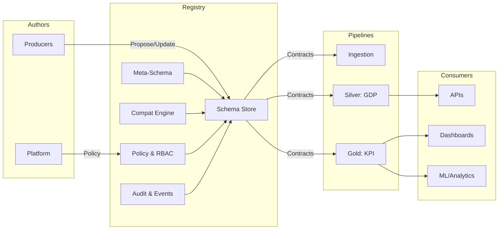

# Overview

**Overview**

The Schema Registry provides a single source of truth for versioned data contracts across ingestion, transformation, serving, and API layers. It standardizes how schemas are authored, validated, versioned, approved, and consumed by pipelines and services.

**Responsibilities**

- Maintain canonical and domain schemas with strict versioning.  
- Validate payloads and tables against approved schemas in CI and at runtime.  
- Enforce compatibility rules and controlled evolution.  
- Record lifecycle transitions with audit logs and approvals.  
- Expose discovery, diff, and lineage through API and UI.  
- Emit metrics and events for observability and incident response.

**Non-Goals**

- Persist application data.  
- Replace data modeling for BI.  
- Provide vendor-specific serialization deep dives outside compatibility enforcement.

**Service Boundaries**

- Inputs include schema proposals, updates, and deprecation requests from producers and platform teams.  
- Outputs include approved schema versions, validation results, compatibility reports, and lifecycle events.  
- Downstream systems include ingestion jobs, transformation pipelines, data quality services, and serving APIs.  
- Upstream controls include governance workflows, policy engines, and RBAC.

**Contract Types**

- Canonical schemas describe shared entities across domains.  
- Domain schemas extend canonical schemas for local needs.  
- GDP schemas define Silver layer contracts for Golden Data Points.  
- KPI schemas define Gold layer contracts for analytical consumption.  
- Envelope contracts define transport and metadata fields for event and file interfaces.

**Versioning and Compatibility**

- Semantic versioning is enforced.  
- Compatibility levels are configured per contract type.  
- Additive changes are default. Breaking changes require exception approval and a migration plan.

**Lifecycle**

- Proposal is submitted as code with meta-schema validation.  
- Review requires assigned approvers and automated checks.  
- Approval produces a versioned release and registry event.  
- Adoption gates pipelines on compatible versions.  
- Deprecation and archival follow a scheduled sunset and audit.

**Interfaces**

- REST API for discovery, versions, diffs, and lifecycle actions.  
- CLI for local authoring, validation, and diff tooling.  
- UI for browsing, approvals, lineage, and integration status.

**Operational Model**

- All changes occur through Git-based workflows with mandatory CI checks.  
- Validation runs in authoring, build, and runtime stages.  
- Metrics, logs, and traces are emitted for each schema event.  
- Runbook procedures define rollback, quarantine, and exception handling.

**High-Level Architecture**

**Deployment and Environments**

- Separate registries per environment with promotion paths from dev to prod.  
- Promotion requires passing validation, approvals, and adoption checks.  
- API endpoints are namespaced per environment.  
- UI displays environment context and promotion status.

**Security**

- Access is controlled by roles for authors, reviewers, approvers, and readers.  
- Sensitive fields can be marked and masked through policy annotations.  
- Audit logs include identity, timestamp, change set, and decision records.

**Observability**

- Core metrics include total schemas, versions per schema, approval latency, validation pass rate, compatibility failure count, drift detections, and quarantine incidents.  
- Events are emitted for proposal, approval, publish, adoption, deprecation, and archival.  
- Logs include validation traces, policy decisions, and API access.

**Runbook Hooks**

- Standard procedures exist for schema rollback, quarantine, exception approvals, and re-adoption.  
- Playbooks reference incident severities and communication steps.  
- Evidence collection includes validation reports, event IDs, and audit references.

**See Also**

- [Pipelines](../../data-acquisition/pipelines/index.md)  
- [Commercial-Ops](../../platform-subscription/subscription/index.md)  
- [Data Quality and Validation](../../data-acquisition/pipelines/07-data-quality-and-validation.md)
