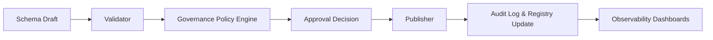
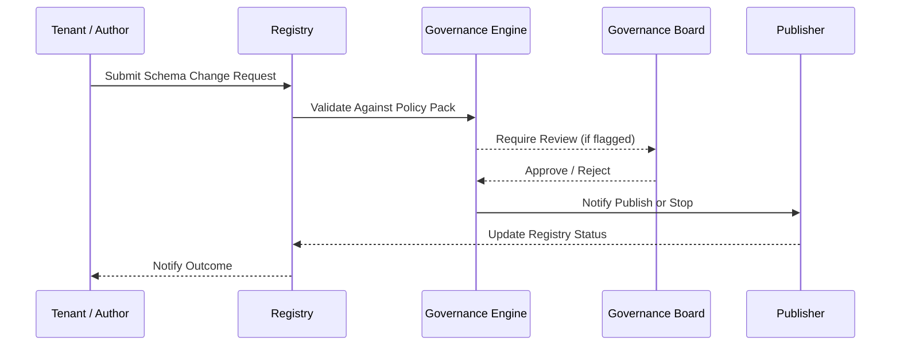

# Schema Registry – Governance
> Applies to: All Schema Layers • Owner: Platform Engineering / Governance Board • Last updated: 2025-10-07

## Objectives
Define the governance framework for schema lifecycle management, ensuring that all schema operations — creation, modification, validation, publishing, and rollback — follow controlled, auditable, and policy-driven processes.

## Scope
> **Note:** Extractor Schemas define only the *shape and transport contract* of extraction — covering envelopes, layouts, and CDC markers — not the business or semantic payload structure.

Covers schema ownership, approval gates, policy management, audit records, and cross-tenant governance structure.  
**Out of Scope:** infrastructure-level IAM and runtime data governance (handled by Security module).

---

## Governance Principles
1. **Central Ownership, Distributed Input** — Platform team maintains final authority, tenants can request changes.  
2. **Policy-Driven Enforcement** — All validations, approvals, and publishes operate via codified policy packs.  
3. **Transparency & Auditability** — Every decision leaves a verifiable audit trail.  
4. **Separation of Duties** — Validation, approval, and publishing handled by distinct services.  
5. **Least Privilege Access** — Tenants cannot alter shared or global schemas directly.  
6. **Accountability** — All schema transitions are signed by approver identity and timestamped.  

---

## Governance Roles
| Role | Responsibility | Authority Level |
|---|---|---|
| **Platform Engineering** | Owns registry, defines global schemas, manages policies | Full |
| **Governance Board** | Approves new versions, breaking changes, and tenant requests | Full (Approval) |
| **Tenant Admin** | Requests schema changes, reviews validation reports | Limited (Request) |
| **Auditor** | Reviews governance logs and exception reports | Read-only |

---

## Governance Architecture


**Key Components**
- **Policy Engine:** evaluates incoming requests against policy packs.  
- **Governance API:** exposes endpoints for approval, rejection, or comment actions.  
- **Audit Service:** immutable storage for every decision event.  
- **Observability:** dashboards for metrics, SLA, and compliance coverage.

---

## Governance Workflow
1. **Change Request Submitted** – Tenant or platform author initiates a modification request.  
2. **Validation Report Generated** – Registry performs full validation and prepares diff summary.  
3. **Policy Evaluation** – Governance policy engine checks the request type and rules.  
4. **Review & Approval** – Governance Board or automated rule approves/rejects.  
5. **Publication Triggered** – Approved schemas proceed to publisher service.  
6. **Audit Record Finalized** – Action logged in immutable store.



---

## Policy Pack Structure
Governance policies are expressed as versioned YAML configuration files stored in `/config/policies/`.

**Example**
```yaml
version: 1.3
policy_pack: schema_governance
rules:
  - id: approval_required_for_major
    condition: change_type == "major"
    action: require_approval
  - id: auto_approve_patch
    condition: change_type == "patch"
    action: auto_approve
  - id: enforce_tenant_namespace
    condition: tenant_schema == true
    action: validate_namespace
  - id: retention_period
    condition: layer in ["extractor", "gdp"]
    action: set_retention_days(365)
```

**Policy Pack Attributes**
| Field | Description | Example |
|---|---|---|
| `version` | Policy pack version | 1.3 |
| `rules` | Set of conditions and actions | JSONPath-based |
| `action` | Approved action to take | auto_approve / require_review |
| `condition` | Logical rule filter | `change_type == "major"` |

---

## Approval Gates
| Gate | Condition | Decision Authority |
|---|---|---|
| **Pre-validation Gate** | Schema must compile and pass syntax | Automated |
| **Compatibility Gate** | No breaking changes unless justified | Governance |
| **Policy Gate** | Rules evaluated from YAML pack | Automated |
| **Review Gate** | Manual approval if flagged | Governance Board |
| **Signature Gate** | Publisher verifies signed approval hash | Automated |

---

## Observability Integration
| Metric | Description | Unit | Target |
|---|---|---|---|
| `governance.approval_latency_sec` | Time between request and decision | sec | <3600 |
| `governance.auto_approval_rate` | Auto-approved minor/patch changes | % | >70 |
| `governance.review_backlog_count` | Pending manual reviews | count | <10 |
| `governance.policy_violation_count` | Violations detected in last 24h | count | 0 |

**Alerts**
- **Latency > 1h** → Governance queue backlog.  
- **Violation > 0** → Escalate to platform compliance.  
- **Backlog > 20** → Increase governance reviewers.

---

## Audit & Traceability
All governance events are stored immutably and linked to schema FQID and approval hash.  
Audit entries include requester, reviewer, policy pack version, and timestamp.

**Example Audit Entry**
```json
{
  "fqid": "finance.gdp.invoice:v2.0",
  "event": "approval",
  "decision": "approved",
  "reviewer": "governance-board",
  "policy_pack": "schema_governance_v1.3",
  "timestamp": "2025-10-07T09:32Z",
  "checksum": "sha256:bd09a3"
}
```

---

## Exception Management
| Type | Description | Handling |
|---|---|---|
| **Emergency Patch** | Fix for critical production issue | Fast-tracked approval with post-review |
| **Policy Override** | Manual governance override | Logged and reviewed monthly |
| **Rollback Exception** | Auto-approved rollback operation | Requires audit sign-off |
| **Tenant Escalation** | Request from tenant for priority fix | Reviewed case-by-case |

---

## Error Handling
| Code | Meaning | Resolution |
|---|---|---|
| 401 | Unauthorized approver | Verify governance credentials |
| 404 | Schema not found | Validate FQID |
| 409 | Approval conflict | Resolve multiple parallel CRs |
| 422 | Policy pack violation | Update schema or seek exemption |
| 500 | Internal service error | Retry or escalate |

---

## Limits
| Item | Limit | Notes |
|---|---|---|
| Max policy rules per pack | 100 | Recommended to modularize beyond limit |
| Max concurrent approvals | 50 | Queue managed via Governance Engine |
| Audit retention | 3 years | Enforced via Glacier lifecycle |

---

## Example Governance Decision Record (GDR)
```json
{
  "id": "GDR-2025-1093",
  "fqid": "finance.kpi.dso:v1.1",
  "decision": "rejected",
  "reason": "Violates field naming policy",
  "policy_rule": "naming_convention_v2",
  "reviewer": "governance-board",
  "timestamp": "2025-10-07T14:42Z"
}
```

---

## Versioning & Change Management
- Governance policy packs versioned independently.  
- Any policy change must go through governance approval itself.  
- Governance engine releases follow the Registry versioning convention.  
- Policy changelogs are part of release notes under `/audit/policy_revisions/`.  

---

## Future Considerations (See parked-scope.md)
- AI-driven auto-approval for low-risk schema updates.  
- Predictive governance scoring using anomaly detection.  
- Integration with tenant sandbox for pre-approval validation runs.  

---
