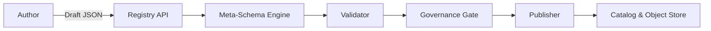
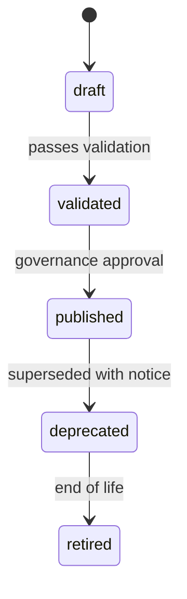

# Schema Registry – Meta‑Schema
> Applies to: Platform Core • Owner: Platform Engineering • Last updated: 2025-10-07

## Purpose
Define the **schema-of-schemas** (Meta‑Schema) used by the Registry to validate, store, and publish every contract.  
The Meta‑Schema standardizes the envelope, identifiers, payload typing, lineage, and governance attributes across all layers (Extractor, GDP, KPI, Derived).

> **Note:** Extractor Schemas define only the *shape and transport contract* of extraction — covering envelopes, layouts, and CDC markers — not the business or semantic payload structure.

---

## Objectives
- Provide a canonical model for **envelope + payload** across layers.  
- Enforce **taxonomy and versioning** (FQID, semantic version rules).  
- Encode **compatibility policy** and **lineage** in the contract itself.  
- Support **immutable publishing**, **signing**, and **auditable** changes.  
- Keep files **self‑contained** for offline validation and reproducibility.

---

## Architecture Overview
The Meta‑Schema is enforced by the Registry’s Meta‑Schema Engine and downstream Validator.


- **Meta‑Schema Engine** validates **structure** (required keys, types).  
- **Validator** applies **semantic** and **compatibility** rules.  
- **Publisher** freezes the object and signs checksums.

---

## Data Model (Envelope)
| Field | Type | Req | Description |
|---|---|:--:|---|
| `fqid` | string | ✓ | Fully Qualified ID: `<domain>.<layer>.<subject>:<version>` |
| `domain` | string | ✓ | Business domain (e.g., `finance`) |
| `layer` | enum | ✓ | `extractor | gdp | kpi | derived` |
| `subject` | string | ✓ | Entity, metric, or artifact name (`snake_case`) |
| `version` | string | ✓ | `v<major>.<minor>[.<patch>]` |
| `status` | enum | ✓ | `draft | validated | published | deprecated | retired` |
| `compatibility_policy` | enum | ✓ | `full | forward | none` |
| `depends_on` | array<string> |  | Upstream FQIDs for lineage |
| `tags` | array<string> |  | Free‑form labels |
| `checksum` | string |  | Content hash assigned at publish |
| `signature` | string |  | Publisher signature blob |
| `owner` | string |  | Owning team/role |
| `description` | string |  | Human description of schema |
| `previous_version` | string |  | Prior `vX.Y[.Z]` for diffing |
| `created_at` | timestamp | ✓ | RFC3339 timestamp |
| `updated_at` | timestamp | ✓ | RFC3339 timestamp |

**Tenant Variant Policy**  
Tenant‑scoped contracts follow the same envelope, with namespace prefix: `tenant.<tenant_code>.<layer>.<subject>:<version>`.

---

## Data Model (Payload Descriptors)
Array of field descriptors that define the record layout (for Extractor: transport fields; for GDP/KPI: semantic fields).

| Field | Type | Req | Description |
|---|---|:--:|---|
| `name` | string | ✓ | `snake_case` field name |
| `type` | string | ✓ | `STRING | INTEGER | BIGINT | DECIMAL(p,s) | BOOLEAN | DATE | TIMESTAMP | JSON | ARRAY<T> | STRUCT<...>` |
| `nullable` | boolean | ✓ | Whether null allowed |
| `default` | any |  | Optional default value |
| `constraints` | object |  | e.g., `{"min":0,"max":9999,"enum":["A","B"],"regex":"^[A-Z]+$"}` |
| `semantics` | object |  | e.g., `{"unit":"days","currency_code":"INR","reference":"finance.gdp.customer"}` |
| `description` | string |  | Human description |

**Fragment Includes**  
Payload MAY include fragments via `$ref`:
```json
{
  "$ref": "common.fragments:money_amount:v1.0",
  "params": {"currency":"INR","precision":"DECIMAL(18,2)"}
}
```

---

## Compatibility Rules (Normative)
| Change | full | forward | none |
|---|:--:|:--:|:--:|
| Add optional field | ✓ | ✓ | ✓ |
| Add required field | ✕ | ✕ | ✓ |
| Rename field | ✕ | ✕ | ✓ |
| Type widen (INT→DECIMAL) | ✓ | ✓ | ✓ |
| Type narrow (DECIMAL→INT) | ✕ | ✕ | ✓ |
| Tighten constraint | ✕ | ✕ | ✓ |
| Loosen constraint | ✓ | ✓ | ✓ |

- **full:** New version accepts all previously valid payloads.  
- **forward:** Prior consumers remain compatible if they ignore new optional fields.  
- **none:** No compatibility promises; use for experimental/derived schemas.

---

## Validation Semantics
- **Structure**: Envelope keys, types, timestamp formats.  
- **Taxonomy**: Valid `domain/layer/subject` per registry config.  
- **Typing**: Allowed atomic and composite types; `snake_case` enforcement.  
- **Constraints**: Evaluated with deterministic engine (enum, regex, min/max).  
- **Lineage**: `depends_on` FQIDs must resolve to active `published` schemas.  
- **Diffing**: Validator classifies `major | minor | patch` based on compatibility table.  
- **Signing**: Publisher signs `checksum` after validation passes.

---

## Lifecycle States

- Transitions are **append‑only** and stored in the audit ledger.  
- `published` objects are immutable; changes require a new version.

---

## Configuration
| Parameter | Description | Req | Default |
|---|---|:--:|---|
| `enforce_snake_case` | Require snake_case names |  | true |
| `max_decimal_precision` | Upper bound for DECIMAL |  | `38,9` |
| `fragment_namespaces` | Allowed `$ref` sources |  | `["common.fragments"]` |
| `policy_default` | Default compatibility policy |  | `full` |
| `layer_allowlist` | Allowed values for `layer` | ✓ | `["extractor","gdp","kpi","derived"]` |
| `tenant_namespace_prefix` | Prefix for tenant schemas |  | `tenant.` |

---

## Observability
| Metric | Description | Unit | Target |
|---|---|---|---|
| `metaschema.validation_latency_ms` | Draft → validated | ms | P95 ≤ 500 |
| `metaschema.diff_failures` | Incompatible diffs | count/day | 0 |
| `metaschema.fragment_resolve_errors` | Failed `$ref` resolutions | count/day | 0 |
| `metaschema.signing_errors` | Signing mismatches | count/day | 0 |

**Events**  
`MetaSchemaValidated`, `SchemaDiffed`, `SchemaPublished`, `SchemaDeprecated`, `SchemaRetired`

---

## Error Catalog
| Code | Condition | Operator Action |
|---|---|---|
| `MS-1001` | Missing `fqid` / invalid namespace | Correct FQID format |
| `MS-1102` | Illegal type or precision | Adjust to allowed types |
| `MS-1204` | Fragment `$ref` not found | Fix namespace or version |
| `MS-1303` | Compatibility violation | Bump major or relax change |
| `MS-1401` | Lineage dependency missing | Publish upstream first |
| `MS-1502` | Signature mismatch | Recompute checksum and re‑sign |

---

## Examples

### 1) Extractor (Transport Contract)
```json
{
  "fqid": "finance.extractor.invoice_header:v1.0",
  "domain": "finance",
  "layer": "extractor",
  "subject": "invoice_header",
  "version": "v1.0",
  "compatibility_policy": "full",
  "status": "draft",
  "payload": [
    {"name":"batch_id","type":"STRING","nullable":false},
    {"name":"sequence_no","type":"INTEGER","nullable":false},
    {"name":"op","type":"STRING","nullable":false,"constraints":{"enum":["I","U","D"]}},
    {"name":"op_ts","type":"TIMESTAMP","nullable":false}
  ]
}
```

### 2) GDP (Semantic Contract)
```json
{
  "fqid": "finance.gdp.invoice:v1.1",
  "domain": "finance",
  "layer": "gdp",
  "subject": "invoice",
  "version": "v1.1",
  "compatibility_policy": "full",
  "status": "draft",
  "payload": [
    {"name":"invoice_id","type":"STRING","nullable":false,"constraints":{"unique":true}},
    {"name":"customer_id","type":"STRING","nullable":false,"semantics":{"reference":"finance.gdp.customer"}},
    {"name":"invoice_date","type":"DATE","nullable":false},
    {"name":"amount_net","type":"DECIMAL(18,2)","nullable":false,"semantics":{"currency_code":"INR"}}
  ]
}
```

### 3) KPI (Consumption Contract)
```json
{
  "fqid": "finance.kpi.dso:v1.0",
  "domain": "finance",
  "layer": "kpi",
  "subject": "dso",
  "version": "v1.0",
  "compatibility_policy": "forward",
  "status": "draft",
  "depends_on": ["finance.gdp.invoice:v1.1","finance.gdp.payment:v1.0"],
  "payload": [
    {"name":"as_of_date","type":"DATE","nullable":false},
    {"name":"dso_days","type":"DECIMAL(9,2)","nullable":false}
  ]
}
```

---

## Best Practices
- Keep payloads **flat where possible**; use fragments for reuse.  
- Prefer **DECIMAL** over float for currency and precision‑sensitive fields.  
- Declare **business keys** in GDP schemas; avoid surrogate keys at contract level.  
- Keep **compatibility policy = full** unless experimenting.  
- Do not override existing fields; use new names or a major version bump.

---

## Versioning & Change Management
- `previous_version` must be set for all non‑initial drafts.  
- Publishing **freezes** the object; any modification requires a **new version**.  
- Deprecation window defaults to **90 days** before retirement of prior major.  
- All changes produce an audit event with content hash and signer identity.

---
