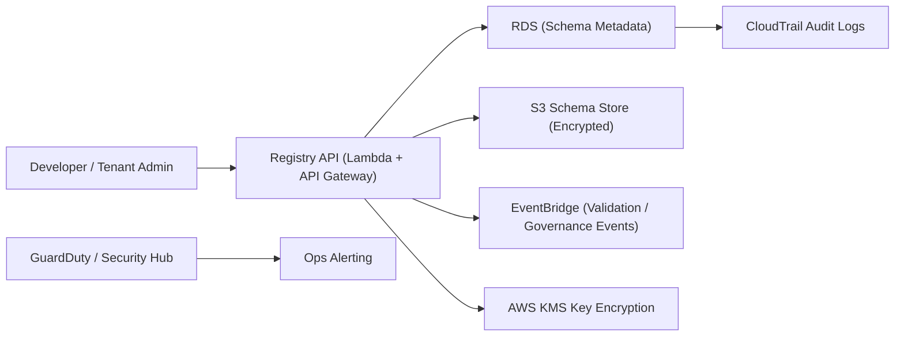
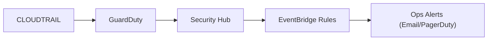

# Schema Registry — Security
> Context: Security & Compliance • Owner: Platform Engineering • Last updated: 2025-10-07

## Purpose
Define and enforce security controls for the **Schema Registry** and its dependent AWS services (Lambda, Glue, S3, RDS, EventBridge).  
Security ensures all schema operations, metadata, and runtime validations remain protected from unauthorized access, tampering, or data leakage while maintaining compliance with organizational and regulatory standards.

---

## Security Objectives
- Enforce **least‑privilege** access for all components.  
- Ensure **encryption in transit and at rest** across all data stores.  
- Maintain **auditable access logs** for every schema event.  
- Enable **multi‑tenant isolation** at namespace level.  
- Detect and respond to **security anomalies** in near real‑time.  

---

## Architecture Overview

Security is enforced at every boundary — API Gateway, Lambda, S3, RDS, and event buses.

---

## Identity & Access Management (IAM)

### IAM Roles & Policies
| Role | Description | Principle of Least Privilege |
|---|---|---|
| **schema-admin** | Full CRUD + governance privileges | Limited to platform admins only |
| **schema-reader** | Read-only schema access for pipelines | Restricted by namespace |
| **schema-validator** | Execute Lambda validation | Can invoke only validator functions |
| **pipeline-runner** | Glue job access | Scoped to specific schema FQIDs |
| **governance-approver** | Approve schema transitions | Can change status only via API |
| **tenant-admin** | Manage tenant‑specific schemas | Confined to tenant.<code>namespace</code> |

IAM policy example:
```json
{
  "Version": "2012-10-17",
  "Statement": [
    {
      "Effect": "Allow",
      "Action": [
        "lambda:InvokeFunction",
        "s3:GetObject",
        "s3:PutObject",
        "rds:DescribeDBInstances"
      ],
      "Resource": [
        "arn:aws:lambda:us-east-1:123456789012:function:schema-validator",
        "arn:aws:s3:::registry/schemas/*",
        "arn:aws:rds:us-east-1:123456789012:db:registry-db"
      ]
    }
  ]
}
```

---

## Encryption & Key Management

| Asset | Encryption Method | Managed By | Notes |
|---|---|---|---|
| RDS (MySQL) | AWS KMS (CMK) | Platform Security | Keys rotated annually |
| S3 Schema Store | AES‑256 + KMS | S3 + KMS | Enforced via bucket policy |
| Lambda Environment | Encrypted environment vars | AWS KMS | Secrets pulled via Secrets Manager |
| EventBridge Payloads | HTTPS TLS 1.2 | AWS Managed | Immutable events |
| API Gateway | HTTPS (TLS 1.2+) | AWS | Mandatory for all routes |

KMS Policy Excerpt:
```json
{
  "Sid": "AllowUseOfTheKey",
  "Effect": "Allow",
  "Principal": {"AWS": "arn:aws:iam::123456789012:role/schema-admin"},
  "Action": ["kms:Encrypt", "kms:Decrypt", "kms:GenerateDataKey"],
  "Resource": "*"
}
```

## Secrets Management
All credentials, API tokens, and DB connection strings are stored in **AWS Secrets Manager**.  
Access restricted to Lambda functions and pipeline runners via IAM role assumption.

Example secret reference in Lambda:
```python
import boto3, json
secret = boto3.client('secretsmanager').get_secret_value(SecretId='registry-db-credentials')
creds = json.loads(secret['SecretString'])
```

**Best Practices:**
- Rotate credentials every 90 days.  
- Deny inline credentials in code or configuration files.  
- Use environment variables only for non‑sensitive runtime flags.

---

## Network & Access Controls
- **VPC Isolation:** All Lambda and RDS resources run inside dedicated VPC subnets.  
- **Security Groups:** Restrict ingress to 443/tcp (API Gateway → Lambda) and 3306/tcp (Lambda → RDS).  
- **PrivateLink:** Used for cross‑account schema access (B2B integrations).  
- **S3 Bucket Policies:** Deny all public access and enforce SSL.  
- **CloudFront Optional:** May expose public read endpoints for documentation only via signed URLs.

Example bucket policy:
```json
{
  "Version": "2012-10-17",
  "Statement": [
    {
      "Sid": "ForceSSLRequestsOnly",
      "Effect": "Deny",
      "Principal": "*",
      "Action": "s3:*",
      "Resource": ["arn:aws:s3:::registry/*"],
      "Condition": {"Bool": {"aws:SecureTransport": "false"}}
    }
  ]
}
```

---

## Monitoring & Detection

| Service | Purpose | Coverage |
|---|---|---|
| **AWS CloudTrail** | API activity logging | All registry, S3, RDS actions |
| **AWS GuardDuty** | Threat detection & anomaly alerting | IAM misuse, suspicious API calls |
| **AWS Security Hub** | Compliance aggregation | CIS / NIST / ISO controls |
| **AWS Config** | Resource drift detection | S3 bucket, RDS, Lambda configurations |
| **CloudWatch Alarms** | Performance and access anomalies | API latency, failed auth, schema drifts |

Security Alerts Flow:


---

## Multi‑Tenant Isolation
Each tenant schema namespace (`tenant.<code>`) is validated and governed independently.  
Isolation controls:
- Namespace‑scoped IAM policies.  
- Separate S3 prefixes (`s3://registry/schemas/tenant-<code>/`).  
- Segregated RDS schema tables.  
- Tenant‑specific CloudWatch dashboards and logs.

**Cross‑tenant visibility is strictly prohibited.**  
Platform operators can only view summary metrics and governance approvals.

---

## Vulnerability & Patch Management
| Area | Tool / Method | Frequency |
|---|---|---|
| Lambda Layers | AWS Inspector / Internal CI | Weekly |
| RDS Engine | AWS Auto‑patch window | Monthly |
| Dependencies | pip‑audit + CodeGuru | CI/CD |
| Registry API | Static Code Scan (Bandit) | Pre‑deploy |
| S3 / EventBridge Policies | AWS Config Rules | Continuous |

---

## Compliance & Governance
- Audit logs retained for **36 months** in CloudTrail + RDS.  
- Schema lifecycle transitions require governance approval.  
- All access reviewed quarterly by Security and Governance.  
- Encryption keys rotated **annually**.  
- Platform compliant with **ISO 27001** and **SOC 2 Type I** readiness baselines.

---

## Incident Response Procedure
**Trigger:** GuardDuty alert, CloudTrail anomaly, or unauthorized access event.  
**Actions:**
1. Review alert in AWS Security Hub.  
2. Identify IAM principal and affected schema FQID.  
3. Disable credentials immediately:
   ```bash
   aws iam update-access-key --access-key-id AKIA... --status Inactive
   ```
4. Export CloudTrail logs for forensics:
   ```bash
   aws cloudtrail lookup-events --lookup-attributes AttributeKey=Username,AttributeValue=user@tenant.com
   ```
5. Contain breach → isolate VPC subnet or Lambda concurrency.  
6. Initiate post‑incident RCA and governance review.  

**Post‑Incident Validation:**
- Verify affected schema versions for tampering.  
- Re‑run validation for integrity.  
- Rotate all associated Secrets Manager entries.  
- File compliance report with governance board.

---

## Governance Notes
- Security ownership split between **Platform Eng** (infrastructure) and **Governance** (process enforcement).  
- IAM roles audited quarterly.  
- Security configuration drift monitored by AWS Config.  
- Any public schema exposure must be approved by Governance.  
- Internal penetration tests conducted bi‑annually.

---

## References
- IAM Policy Templates: `/infra/security/iam/schema_registry_policies.json`  
- KMS Key Policy: `/infra/security/kms/schema_registry_cmk.json`  
- AWS Config Rules: `/infra/security/config/schema_registry_rules.yml`  
- GuardDuty Findings Parser: `/lambda/guardduty_alert_parser.py`  
- CloudTrail Dashboard: `/infra/monitoring/cloudtrail_audit_dashboard.json`

---
