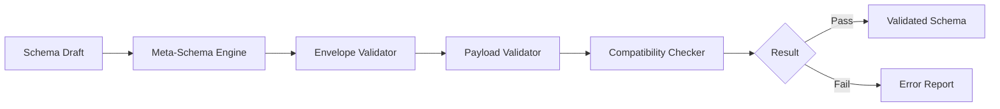

# Schema Registry — Envelope & Payload Validation Rules
> Context: Validation Engine • Owner: Platform Engineering • Last updated: 2025-10-07

## Purpose
Define the **technical validation rules** applied by the Validation Engine to verify every schema’s structure, fields, typing, and constraints before it is marked as `validated`.  
This ensures all schemas are syntactically correct, semantically meaningful, and compatible with prior versions.

---

## Architecture Overview

Validation occurs at schema draft submission and during version bump comparison.

---

## Envelope Validation Rules
| Rule | Description | Enforcement |
|---|---|---|
| FQID format | `<domain>.<layer>.<subject>:<version>` | Regex check |
| Domain / Layer / Subject | Must exist in taxonomy | Lookup |
| Version format | `v<major>.<minor>[.<patch>]` | Regex |
| Status | One of `draft`, `validated`, `published`, `deprecated`, `retired` | Enum |
| Compatibility policy | One of `full`, `forward`, `none` | Enum |
| Timestamps | RFC3339 format | Strict |
| Tenant namespace | Prefix `tenant.` if scoped | Optional namespace check |

---

## Payload Validation Rules
| Rule | Description | Enforcement |
|---|---|---|
| Field names | `snake_case`, alphanumeric, no spaces | Regex |
| Data types | Allowed: `STRING`, `INTEGER`, `DECIMAL(p,s)`, `BOOLEAN`, `DATE`, `TIMESTAMP`, `JSON`, `STRUCT`, `ARRAY` | Type catalog |
| Nullable flag | Required for each field | Boolean |
| Constraints | min/max/enum/regex must match type | Type-aware validator |
| Semantics block | Optional but validated for syntax | Schema check |
| Lineage | FQIDs must resolve to active `published` schemas | Catalog lookup |
| `$ref` fragments | Must resolve from approved namespaces | Fragment registry |

---

## Compatibility Validation
- The engine compares new schema payloads with prior `published` versions.  
- Diff classification determines version bump (major/minor/patch).  
- Breaking change examples: field rename, type narrowing, required → optional flip.

**Diff Matrix Example**
| Change | Classification | Allowed under `full` | Allowed under `forward` |
|---|---|:--:|:--:|
| Add optional field | Minor | ✓ | ✓ |
| Add required field | Major | ✕ | ✕ |
| Rename/remove field | Major | ✕ | ✕ |
| Loosen constraint | Minor | ✓ | ✓ |
| Tighten constraint | Major | ✕ | ✕ |

---

## Observability
| Metric | Description | Unit | Target |
|---|---|---|---|
| `validator.run_count` | Validation executions per day | count | trend |
| `validator.failure_ratio` | Failures / total | % | <1 |
| `validator.latency_ms` | Avg run time per schema | ms | P95 ≤ 500 |
| `validator.diff_detected` | Version diffs flagged | count/day | track |

**Events**  
`SchemaEnvelopeValidated`, `SchemaPayloadValidated`, `SchemaDiffDetected`

---

## Error Catalog
| Code | Condition | Operator Action |
|---|---|---|
| VAL-1001 | Missing `fqid` / malformed namespace | Correct schema header |
| VAL-1102 | Illegal type or constraint | Fix payload descriptor |
| VAL-1203 | `$ref` not found | Correct fragment source |
| VAL-1304 | Incompatible change detected | Bump major version |
| VAL-1401 | Catalog dependency missing | Publish upstream schema first |

---

## Governance Notes
- Validation runs **before governance approval**; failure blocks lifecycle promotion.  
- Governance reviewers receive **error tracebacks** via Validation API.  
- Validation logs are immutable and included in audit exports.  
- Tenant schemas follow same rules under namespaced context.

---

## Example
### Example — GDP Invoice Schema Validation
**Input:** `finance.gdp.invoice:v1.2`  
- 12 fields, all typed.  
- One optional `amount_tax` added → minor version allowed.  
**Result:** ✅ Passed validation (`v1.2` published under full compatibility).

---
