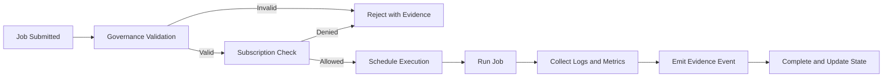

# Platform Operations Overview

Platform Operations is the runtime execution plane of the platform. It runs workloads, manages orchestration, monitors system health, and provides observability for all modules and tenants. Operations ensures that governed data flows and contract-based executions occur within approved and entitled boundaries.

Operations does not define policies or limits. Instead, it consumes decisions from Governance and Subscription and applies them during runtime. Governance validates what can exist, Subscription enforces what is permitted, and Operations ensures that what is permitted runs reliably, predictably, and safely.

## Conceptual Overview

Operations coordinates the movement of data, the execution of transformations, and the publication of metrics. Every job or task that enters the runtime is evaluated against Governance and Subscription before execution. Once allowed, Operations schedules, monitors, and records execution results, emitting evidence and telemetry.

The Operations layer provides resilience, reliability, and visibility. It is responsible for keeping the platform running even when individual components fail. This includes retry handling, notification routing, migration orchestration, and health monitoring.

## Why Operations Exists

A distributed data platform cannot rely on individual services to manage their own execution state or fault handling. Platform Operations provides the unified control plane that manages how jobs are executed, retried, and observed. It prevents resource starvation, coordinates cross-tenant workloads, and gives operators consistent visibility into system behavior.

Without Operations, each module would need its own scheduler, error handler, and observability logic, resulting in duplication and inconsistent reliability. Centralizing these functions allows the platform to scale predictably and maintain consistent service levels.

## How Operations Works

Operations orchestrates workloads through four key stages:

1. **Scheduling.** Jobs are submitted by user actions, connectors, or system triggers. Operations assigns priorities and validates each job with Subscription and Governance before queuing.
2. **Execution.** The orchestrator runs jobs in the designated compute environment. It manages dependencies, retries, and concurrency limits.
3. **Observation.** Metrics, logs, and events are collected during execution. These outputs feed observability pipelines for health dashboards and anomaly detection.
4. **Finalization.** Successful jobs produce evidence events for Governance. Failed jobs trigger notifications, ticketing workflows, and recovery routines.

## Relationship with Other Modules

- Governance provides contracts and policies that define valid datasets, transformations, and KPI definitions. Operations references these during plan compilation and execution.
- Subscription provides entitlements and limits for each tenant. Operations checks these before scheduling and during runtime to prevent overuse.
- Data Acquisition modules submit ingestion jobs that Operations schedules and monitors.
- Customer and Admin applications query Operations for run history, logs, and system status.

This clear separation keeps Governance declarative, Subscription prescriptive, and Operations procedural.

## Core Services

### Orchestration Service

The Orchestration Service manages all pipeline and job executions. It queues, prioritizes, and schedules tasks across compute environments. The orchestrator tracks dependencies between connectors, transformations, and promotions.

### Health Service

The Health Service monitors system and module availability. It collects heartbeat signals from workers, APIs, and connectors. Health data feeds into dashboards and triggers automated recovery actions when thresholds are breached.

### Notification Service

The Notification Service handles alerts, user-facing messages, and system events. It integrates with external channels such as email, webhooks, and incident systems. Alerts are structured and categorized by severity to support automated or manual response.

### Ticketing Service

The Ticketing Service manages operational issues that require attention beyond automated recovery. It creates, assigns, and tracks incidents until resolution. Tickets reference affected tenants, modules, and evidence records.

### Migration Service

The Migration Service handles version upgrades and schema migrations. It coordinates controlled rollouts, tracks migration progress, and integrates with Governance to record evidence for version transitions.

## Execution Lifecycle

Each job passes through validation and entitlement checks before execution. During runtime, Operations collects metrics and logs. Upon completion, it emits evidence to Governance and updates execution state for visibility.

## Interfaces

### APIs

- POST /operations/jobs — submit job request  
- GET /operations/jobs/{id} — retrieve job details and status  
- GET /operations/health — read module health summary  
- POST /operations/notify — send operational event or alert  
- POST /operations/ticket — create incident record  
- GET /operations/tickets/{id} — read ticket details  
- POST /operations/migrate — initiate migration workflow

### Events

- operations.job.submitted  
- operations.job.completed  
- operations.job.failed  
- operations.health.degraded  
- operations.alert.raised  
- operations.ticket.created  
- operations.migration.started  
- operations.migration.completed

### State Collections

- jobs (job_id, tenant_id, type, status, retries, started_at, finished_at)  
- health_status (module, component, status, last_check, latency, error_rate)  
- notifications (id, severity, target, channel, timestamp, resolved)  
- tickets (id, tenant_id, module, issue, status, opened_at, closed_at)  
- migrations (id, version_from, version_to, status, progress, evidence_ref)

## Observability and Service Levels

| SLO | Target | Notes |
|---|---|---|
| Job scheduling latency | p95 less than 200 milliseconds | from submission to queued |
| Job completion accuracy | 99.5 percent | successful execution within SLA |
| Health update interval | every 60 seconds | heartbeat frequency |
| Alert delivery delay | less than 1 minute | after event detection |
| Evidence emission delay | less than 3 minutes | after job completion |

Metrics include:

- operations_jobs_total  
- operations_jobs_failed_total  
- operations_alerts_total  
- operations_tickets_open_total  
- operations_migrations_total

Logs capture scheduling decisions, retries, error stacks, and recovery actions. Observability pipelines index these logs for dashboards and anomaly detection.

## Security and Compliance

Operations enforces strict separation of control and data paths. Job metadata includes tenant identifiers but no raw data. Authentication and authorization use signed tokens between services. Logs and evidence records are stored with integrity verification and retention controls aligned to Governance policies. Health and alert data follow residency and access constraints defined by policy.

## Failure Handling

- If orchestration queues become unavailable, job submissions are deferred and retried.  
- If health checks fail, automated recovery or degradation protocols activate.  
- If evidence emission fails, jobs are marked pending audit until reprocessed.  
- If alert channels fail, fallback routes ensure delivery.  
- If migration tasks stall, the service reverts or pauses to prevent inconsistency.

Operations favors resilience and isolation: a failing subsystem cannot cascade failures to others.

## Dependencies and Consumers

Operations depends on Governance for validation and evidence schemas, Subscription for entitlement data, and system identity for secure communication. Consumers include connectors, transformation engines, analytics services, and platform UIs that visualize run and health data.

## Example Scenario

A tenant triggers a KPI refresh job. Operations validates the KPI contract with Governance and checks entitlements through Subscription. Once cleared, the job is scheduled in the orchestrator. The Health Service monitors compute nodes during execution. Logs and metrics are collected, and on completion, an evidence record is sent back to Governance. If the run fails, a notification and ticket are generated automatically. The tenant sees the job history, logs, and recovery actions in their dashboard.

---

Platform Operations ensures that every governed and entitled action runs with reliability and accountability. It is the execution fabric that turns platform intent into runtime outcomes.
