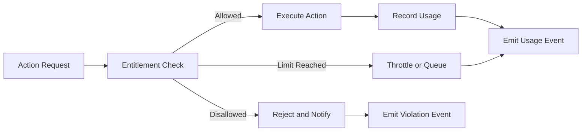

# Platform Subscription Overview

Platform Subscription defines how tenants access and consume the platform. It governs commercial entitlements, feature availability, and technical limits that shape each tenant’s experience. Subscription translates business plans into enforceable operational boundaries, ensuring predictable usage, cost control, and fair resource allocation across all tenants.

Subscription acts as the enforcement bridge between business configuration and runtime execution. It interprets subscription plans, applies entitlements, and integrates with other modules to validate what actions are permitted. Governance determines what is valid, Subscription determines what is permitted, and Operations executes those permissions at runtime.

## Conceptual Overview

Each tenant subscribes to a plan that defines features, limits, and service-level expectations. When a tenant performs an action—such as running a pipeline, publishing a KPI, or connecting a new data source—the Subscription layer checks whether the action falls within entitlements. If limits are exceeded or expired, the system denies or queues the request.

Subscription operates as a metadata service, not a runtime executor. It exposes APIs and events that Operations modules call before performing high-cost or long-running actions. This ensures that resource usage stays within limits and that each tenant receives the level of service associated with their plan.

## Why Subscription Exists

Without a centralized subscription service, enforcement would be fragmented across modules and inconsistent. A single layer ensures predictable behavior when multiple tenants share infrastructure. It also provides a unified record of entitlement and usage that can be audited or reconciled against commercial terms. By coupling business definitions with runtime limits, the platform avoids both overuse and underdelivery.

## How Subscription Works

The Subscription service evaluates each tenant action against three data sets:

1. **Plan Definitions** describe features and resource classes such as number of connectors, maximum data volume, or compute concurrency.
2. **Usage State** records how much of each entitlement has been consumed during the current billing period.
3. **Enforcement Policies** define how overages, expirations, or violations are handled.

The result of this evaluation determines whether an operation is allowed, delayed, or rejected. Each decision is logged and made visible to Operations for observability and escalation.

## Relationship with Other Modules

- Governance defines what a tenant is allowed to create or modify. Subscription determines how often and how much they can use.  
- Operations consumes subscription APIs during job scheduling, execution, and monitoring to ensure usage stays within defined quotas.  
- Data Acquisition checks entitlements before initiating ingestion or connector activation.  
- Customer applications surface plan information, feature availability, and overage notifications to users.

This separation allows Governance to maintain semantic control while Subscription manages operational enforcement and metering.

## Core Services

### Plan Registry

The Plan Registry defines all available subscription plans and their parameters. Each plan includes metadata such as tier, base cost, and included entitlements. Entitlements are defined as measurable units such as data volume, compute minutes, or connector slots. The registry also defines feature flags and access to KPI or solution packs.

### Tenant Registry

The Tenant Registry maintains mappings between tenants and active subscriptions. It records activation dates, renewal cycles, and current plan state. When a tenant upgrades, downgrades, or renews, the registry emits lifecycle events that trigger recalculations in usage and enforcement modules.

### Entitlement Service

The Entitlement Service provides APIs to check whether an operation is allowed. It interprets plan definitions and current usage, returning an allow or deny response with context. Operations and Acquisition modules call these APIs before executing any action that consumes metered resources.

### Usage Meter

The Usage Meter records consumption events such as data ingested, transformations executed, and KPIs published. It aggregates usage metrics per tenant and entitlement category. The meter emits incremental updates to maintain near real-time visibility.

### Enforcement Engine

The Enforcement Engine applies runtime limits and overage handling rules. It can block, throttle, or queue actions based on policy. When a limit is reached, it raises structured violation events for feedback or automation.

## Enforcement Lifecycle

Each request passes through entitlement validation before execution. Results are logged and broadcast as events for observability. Usage and violations feed into reports, dashboards, and billing integration.

## Interfaces

### APIs

- GET /subscription/tenants/{id}/plan — read tenant plan details  
- GET /subscription/plans — list available plans  
- POST /subscription/usage — record usage event  
- POST /subscription/check — validate entitlement before action  
- GET /subscription/usage/{tenant} — retrieve usage summary  
- POST /subscription/enforcement/violation — register policy breach

### Events

- subscription.plan.created  
- subscription.plan.updated  
- subscription.tenant.activated  
- subscription.tenant.renewed  
- subscription.entitlement.exceeded  
- subscription.usage.recorded

### State Collections

- plans (id, tier, description, entitlements, feature flags)  
- tenants (tenant_id, plan_id, activation_date, renewal_date, status)  
- usage (tenant_id, entitlement_type, amount, period, updated_at)  
- violations (tenant_id, rule, severity, timestamp, resolved)

## Observability and Service Levels

| SLO | Target | Notes |
|---|---|---|
| Entitlement check latency | p95 less than 100 milliseconds | synchronous API for runtime validation |
| Usage write availability | 99.9 percent | append-only log |
| Enforcement policy propagation | within 1 minute | cache invalidation window |
| Violation detection delay | less than 5 minutes | after limit reached |
| Plan update propagation | less than 3 minutes | to tenant registry and enforcement engine |

Metrics include:

- subscription_checks_total  
- subscription_denials_total  
- subscription_usage_bytes_total  
- subscription_violations_total

Logs capture entitlement evaluations, usage deltas, and enforcement actions. These records are forwarded to the observability layer for visualization and alerting.

## Security and Compliance

Subscription data is tenant-scoped and contains no raw business data. All access is authenticated and authorized through service credentials. Usage and billing information are encrypted at rest. Enforcement decisions are idempotent and auditable. Integration with Governance ensures that usage respects policy constraints such as residency or privacy.

## Failure Handling

- If the entitlement service is unavailable, Operations retries and applies a default deny mode after timeout.  
- If usage events cannot be written, the system buffers locally until recovery.  
- If plan updates fail to propagate, cached plans remain active until the next synchronization.  
- If enforcement thresholds drift, periodic reconciliation corrects cumulative usage.

These safeguards prevent tenants from exceeding limits due to transient faults.

## Dependencies and Consumers

Dependencies include identity management for authentication, governance for policy references, and event or object storage for usage logs. Consumers include operations, acquisition, and UI components that require plan and entitlement data.

## Example Scenario

A tenant on the Standard plan runs nightly ingestion for five connectors. The plan allows ten connectors and fifty gigabytes of monthly ingestion. When the tenant activates an eleventh connector, the Entitlement Service rejects the request and logs a violation. If ingestion approaches the monthly threshold, the Enforcement Engine queues new runs until the next billing cycle. These actions maintain fairness and prevent contention without manual oversight.

---

Platform Subscription ensures that every tenant operates within clear, enforceable boundaries. It aligns business definitions with technical controls, making the platform predictable, accountable, and economically sustainable.
