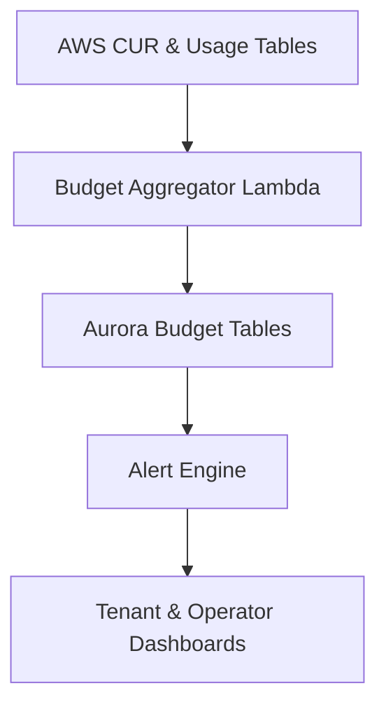

# Budgets and Alerts

## Overview

This document defines how budgets and alerts are implemented in the Commercial-Ops module to provide real-time financial observability for both operators and tenants. Budgets are logical control planes built on top of AWS Budgets, AWS Cost Explorer APIs, and internal usage metrics. Alerts notify the platform and tenants when consumption thresholds are breached or projected to exceed defined limits.

Budgets operate at three levels:

| Level | Scope | Primary Consumer |
|--------|--------|------------------|
| Tenant | Individual tenant plan usage | Tenant dashboard |
| Plan | Aggregate of all tenants under a plan | Product management |
| Platform | Global AWS spend, cross-service | Operator and finance |

## Objectives

- **Continuous visibility** Provide near-real-time usage and spend visibility using AWS CUR + internal metrics.  
- **Predictive alerting** Notify stakeholders before thresholds are breached.  
- **Governance and transparency** Support both tenant-facing and internal operator controls.  
- **Policy compliance** Integrate alerts with platform governance and billing automation.  

## Budget Types

| Budget Type | Description | Metric Source | Example |
|--------------|-------------|----------------|----------|
| **AWS Cost Budget** | Tracks total AWS cost (tagged or untagged) | AWS Budgets API | Total monthly AWS cost per tenant |
| **Platform Metric Budget** | Tracks platform-defined metrics | Aurora / Usage tables | Data storage GB-hour |
| **Composite Budget** | Combines AWS and internal metrics | AWS + Aurora join | Total plan cost projection |
| **Operator Overhead Budget** | Tracks operator-side costs not billed to tenants | AWS CUR filtered | Shared services pool |

Budgets can be defined in USD or other supported currencies but default to USD for consistency.

## Budget Definition

Budgets are stored in the `budget_master` table and refreshed daily.

| Column | Type | Description |
|--------|------|-------------|
| `budget_id` | string | Unique identifier |
| `scope_type` | string | tenant, plan, or platform |
| `metric_type` | string | aws_cost, platform_metric, composite |
| `thresholds_json` | json | Threshold configuration (warning, critical) |
| `period` | string | monthly, quarterly |
| `target_usd` | numeric(18,6) | Target spend or usage |
| `actual_usd` | numeric(18,6) | Current accumulated spend |
| `variance_pct` | double | Derived metric |
| `status` | string | ok, warning, breached |
| `last_refreshed_at` | timestamp | Snapshot time |

### Example: JSON Threshold Configuration

```json
{
  "warning": 0.8,
  "critical": 0.95,
  "alert_channels": ["email", "slack", "sns"]
}
```

## Data Flow



### Workflow Steps

1. Collect AWS CUR and platform usage daily.  
2. Aggregate by tenant and plan.  
3. Compare actual vs. target thresholds.  
4. Persist daily snapshots in Aurora.  
5. Trigger alerts when thresholds cross.  

## Alert Mechanisms

Alerts are configured per budget scope and delivered via multiple channels.

| Alert Channel | Description | Target Audience |
|----------------|-------------|-----------------|
| Email | Primary communication for tenants | Tenant admins |
| SNS | For system-to-system integrations | Operator automation |
| Slack / ChatOps | For internal teams | Platform / billing ops |
| Dashboard Badge | UI-level visual alert | Tenant UI |

### Example: SNS Notification Payload

```json
{
  "budget_id": "BUDG-TEN-0001",
  "tenant_id": "TEN-00123",
  "plan_id": "ENT-Standard-v1",
  "period": "2025-10",
  "threshold_level": "critical",
  "current_value": 1043.33,
  "target_value": 1100.00,
  "variance_pct": 0.95,
  "timestamp": "2025-10-06T12:05:00Z"
}
```

## Budget Refresh Job

The refresh process runs once per day (default 04:00 UTC). The process aggregates CUR data and internal metrics to update each budget.

| Step | Component | Action |
|------|------------|--------|
| 1 | S3 to Athena | Load latest CUR partition |
| 2 | Glue ETL | Prepare aggregated cost views |
| 3 | Aurora Function | Update `budget_master` table |
| 4 | Lambda | Evaluate thresholds and enqueue alerts |
| 5 | SNS / Email / Slack | Notify relevant recipients |

### Example SQL Aggregation

```sql
UPDATE budget_master
SET actual_usd = (
  SELECT SUM(unblended_cost)
  FROM fact_cost_raw
  WHERE resource_tags_user_tenant_id = budget_master.tenant_id
    AND bill_billing_period_start_date >= DATE_TRUNC('month', CURRENT_DATE)
)
WHERE scope_type = 'tenant';
```

## Forecasting and Projection

Budgets include a projection model based on 7-day rolling averages and plan usage patterns. The projection is stored in `budget_projection`.

| Column | Type | Description |
|--------|------|-------------|
| `budget_id` | string | FK to `budget_master` |
| `forecast_usd` | numeric(18,6) | Projected spend for period |
| `confidence_pct` | double | Confidence score |
| `created_at` | timestamp | Time of forecast generation |

Forecasting logic is simple linear extrapolation but can be upgraded to AWS Cost Anomaly Detection integration in future releases.

### Example Forecast SQL

```sql
INSERT INTO budget_projection (budget_id, forecast_usd, confidence_pct, created_at)
SELECT budget_id,
       AVG(actual_usd) + (AVG(actual_usd) * variance_pct) AS forecast_usd,
       0.9 AS confidence_pct,
       NOW()
FROM budget_master
GROUP BY budget_id;
```

## Alert Severity and Escalation

Alerts use a multi-level escalation framework:

| Severity | Trigger | Action |
|-----------|----------|--------|
| Warning | ≥ 80% of budget | Notify tenant admin and dashboard banner |
| Critical | ≥ 95% of budget | Trigger email, Slack, SNS alerts |
| Breach | ≥ 100% of budget | Freeze optional resource expansion, notify operator |

## Cross References

- **cur-ingestion.md** for cost ingestion process.  
- **allocation-rules.md** for cost sharing logic.  
- **observability.md** for alert dashboard integration.  
- **runbook.md** for manual override or escalation response.  
- **security.md** for access control and notification configuration.
