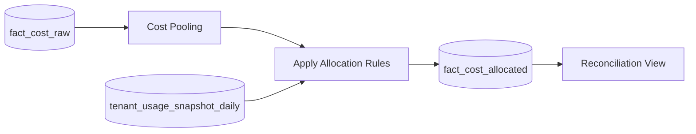

# Allocation Rules

## Overview

This document defines the shared-cost allocation model used by Commercial-Ops to distribute AWS charges that cannot be directly tagged to a single tenant. The objective is to produce deterministic, explainable allocations with full audit evidence. Allocation runs after CUR ingestion and before reconciliation. Tagging remains the primary attribution method; allocation is applied only where tagging is not feasible.

## Purpose and Scope

Allocation rules address costs generated by shared network and control-plane components (for example, NAT Gateway, PrivateLink endpoints, CloudWatch Logs, and cross-account services). Rules are declarative, version controlled, and forward effective. Historical periods are immutable; adjustments are recorded with reversal entries.

**Goals**

- **Determinism** Given the same usage keys and cost inputs, allocations produce identical results.  
- **Explainability** Each allocated dollar carries a rule ID, usage evidence, and source CUR line references.  
- **Cost fairness** Tenants pay according to measurable use of shared components.  
- **Isolation** Operator-only overhead can be ring-fenced and excluded from tenant billing when required.

## Allocation Categories

| Category | CUR Service Examples | Typical Usage Key | Notes |
|----------|----------------------|-------------------|-------|
| NAT Gateway | `AmazonNATGateway` | Processed GB (`nat_gb_processed`) | Allocates gateway processing fees |
| PrivateLink / VPC Endpoints | `AmazonVPC` | Endpoint bytes or hours (`privatelink_gb_processed`, `endpoint_hours`) | Data- or time-based splits |
| CloudWatch | `AmazonCloudWatch` | Weighted composite (`runner_hours`, `data_ingestion_gb`) | Control-plane telemetry costs |
| S3 Request/Listing | `AmazonS3` | Request count or GB | Only for non-tagged request classes |
| KMS | `AWSKeyManagementService` | Request count | Optional if above free tier |
| Misc. Control Plane | Service-dependent | Fixed % or composite key | Explicitly documented exceptions |
| Operator Overhead | Support, shared security | N/A | Ring-fenced to operator; not billed to tenants |

## Allocation Keys

Allocation keys are measurable metrics that reflect how tenants utilize the shared resource. Keys are computed from platform telemetry or derived from tagged usage tables.

| Key | Definition | Unit | Source |
|-----|------------|------|--------|
| `nat_gb_processed` | Total bytes processed by NAT for tenant | GB | `tenant_network_usage` |
| `privatelink_gb_processed` | Bytes processed through PrivateLink endpoints | GB | `tenant_network_usage` |
| `endpoint_hours` | Hours an endpoint is provisioned and in use | Hour | Endpoint inventory |
| `runner_hours` | Total runner execution time | Hour | `tenant_compute_usage` |
| `data_ingestion_gb` | Ingested data volume | GB | `tenant_data_usage` |

## Allocation Formulas

### Proportional Split

For a cost pool `C` in category `X` and a key metric `K`:

```
allocation(tenant_i) = C * K_i / SUM_j(K_j)
```

If the denominator is zero (no key usage), the allocation is skipped and cost remains operator-side for that period or is redistributed according to a fallback rule.

### Weighted Composite

For categories like CloudWatch where both compute and data drive cost:

```
K_i = w1 * normalize(runner_hours_i) + w2 * normalize(data_ingestion_gb_i)
allocation(tenant_i) = C * K_i / SUM_j(K_j)
```

Normalization converts each component to a 0..1 scale per period. Typical weights: `w1 = 0.6`, `w2 = 0.4`. Weights are versioned with the rule.

## Data Flow



1. Pool relevant CUR lines by service and period.  
2. Join tenant usage keys for the same period.  
3. Apply rule formula to produce per-tenant amounts.  
4. Persist `fact_cost_allocated` with source evidence.

## Table Contracts

### allocation_rules

| Column | Type | Description |
|--------|------|-------------|
| `rule_id` | string | Stable identifier (for example `rule_nat_v1`) |
| `category` | string | NAT, PLINK, CW, etc. |
| `formula` | string | `proportional` or `weighted` |
| `weights_json` | json | Optional weights for composite keys |
| `effective_from` | date | Start date |
| `effective_to` | date | Optional end date |
| `owner_team` | string | Rule owner |
| `notes` | string | Human-readable description |

### fact_cost_allocated

| Column | Type | Description |
|--------|------|-------------|
| `tenant_id` | string | Tenant identifier |
| `period_start` | date | Period start in UTC |
| `period_end` | date | Period end in UTC |
| `service` | string | AWS service of pooled cost |
| `category` | string | Allocation category |
| `rule_id` | string | Applied rule |
| `allocated_cost_usd` | numeric(18,6) | Amount |
| `key_metric` | string | Key used (for example `nat_gb_processed`) |
| `key_value` | double | Tenant key value |
| `key_total` | double | Total key across pool |
| `source_line_ids` | array<string> | CUR identity IDs |
| `evidence_links` | array<string> | Athena/Aurora query references |
| `created_at` | timestamp | Insertion timestamp |

## SQL Examples

### NAT Gateway Allocation (Proportional by GB)

```sql
WITH pool AS (
  SELECT
    DATE_TRUNC('month', bill_billing_period_start_date) AS period_start,
    'AmazonNATGateway' AS service,
    SUM(line_item_unblended_cost) AS pool_cost,
    ARRAY_AGG(identity_line_item_id) AS line_ids
  FROM fact_cost_raw
  WHERE product_servicecode = 'AmazonNATGateway'
    AND bill_billing_period_start_date BETWEEN :start AND :end
  GROUP BY 1
),
keys AS (
  SELECT tenant_id,
         DATE_TRUNC('month', usage_date) AS period_start,
         SUM(nat_gb_processed) AS key_value
  FROM tenant_network_usage
  WHERE usage_date BETWEEN :start AND :end
  GROUP BY 1,2
),
total AS (
  SELECT period_start, SUM(key_value) AS key_total
  FROM keys GROUP BY 1
)
INSERT INTO fact_cost_allocated (
  tenant_id, period_start, period_end, service, category, rule_id,
  allocated_cost_usd, key_metric, key_value, key_total, source_line_ids, created_at
)
SELECT
  k.tenant_id,
  k.period_start,
  LAST_DAY(k.period_start) AS period_end,
  p.service,
  'NAT' AS category,
  'rule_nat_v1' AS rule_id,
  p.pool_cost * (k.key_value / NULLIF(t.key_total, 0)) AS allocated_cost_usd,
  'nat_gb_processed' AS key_metric,
  k.key_value,
  t.key_total,
  p.line_ids,
  NOW() AS created_at
FROM keys k
JOIN total t ON t.period_start = k.period_start
JOIN pool p ON p.period_start = k.period_start
WHERE t.key_total > 0;
```

### PrivateLink Allocation (Bytes Processed)

```sql
WITH pool AS (
  SELECT DATE_TRUNC('month', bill_billing_period_start_date) AS period_start,
         'AmazonVPC' AS service,
         SUM(line_item_unblended_cost) AS pool_cost,
         ARRAY_AGG(identity_line_item_id) AS line_ids
  FROM fact_cost_raw
  WHERE product_servicecode = 'AmazonVPC'
    AND line_item_usage_type LIKE '%Endpoint-Bytes%'
    AND bill_billing_period_start_date BETWEEN :start AND :end
  GROUP BY 1
),
keys AS (
  SELECT tenant_id,
         DATE_TRUNC('month', usage_date) AS period_start,
         SUM(privatelink_gb_processed) AS key_value
  FROM tenant_network_usage
  WHERE usage_date BETWEEN :start AND :end
  GROUP BY 1,2
),
total AS (
  SELECT period_start, SUM(key_value) AS key_total
  FROM keys GROUP BY 1
)
INSERT INTO fact_cost_allocated (...)
SELECT
  k.tenant_id,
  k.period_start,
  LAST_DAY(k.period_start),
  'AmazonVPC',
  'PLINK',
  'rule_plink_v1',
  p.pool_cost * (k.key_value / NULLIF(t.key_total,0)),
  'privatelink_gb_processed',
  k.key_value,
  t.key_total,
  p.line_ids,
  NOW()
FROM keys k
JOIN total t ON t.period_start = k.period_start
JOIN pool p ON p.period_start = k.period_start
WHERE t.key_total > 0;
```

### CloudWatch Allocation (Weighted Composite)

```sql
WITH pool AS (
  SELECT DATE_TRUNC('month', bill_billing_period_start_date) AS period_start,
         'AmazonCloudWatch' AS service,
         SUM(line_item_unblended_cost) AS pool_cost
  FROM fact_cost_raw
  WHERE product_servicecode = 'AmazonCloudWatch'
    AND bill_billing_period_start_date BETWEEN :start AND :end
  GROUP BY 1
),
k_raw AS (
  SELECT tenant_id,
         DATE_TRUNC('month', usage_date) AS period_start,
         SUM(runner_hours) AS runner_hours,
         SUM(data_ingestion_gb) AS ingestion_gb
  FROM tenant_usage_keys_monthly      -- view over daily snapshots
  WHERE usage_date BETWEEN :start AND :end
  GROUP BY 1,2
),
norm AS (
  SELECT
    tenant_id, period_start,
    runner_hours / NULLIF(MAX(runner_hours) OVER (PARTITION BY period_start), 0) AS nh,
    ingestion_gb / NULLIF(MAX(ingestion_gb) OVER (PARTITION BY period_start), 0) AS nd
  FROM k_raw
)
INSERT INTO fact_cost_allocated (...)
SELECT
  n.tenant_id,
  n.period_start,
  LAST_DAY(n.period_start),
  'AmazonCloudWatch',
  'CLOUDWATCH',
  'rule_cw_v1',
  p.pool_cost * ((0.6 * n.nh + 0.4 * n.nd) / NULLIF(SUM(0.6 * n.nh + 0.4 * n.nd) OVER (PARTITION BY n.period_start),0)),
  'weighted(runner_hours,data_ingestion_gb)',
  NULL, NULL, NULL, NOW()
FROM norm n
JOIN pool p ON p.period_start = n.period_start;
```

## Governance and Versioning

- Allocation rules are stored in a version-controlled repository and materialized into the `allocation_rules` table.  
- Rule changes are forward effective with `effective_from` dates.  
- Backfills create reversal entries using negative values in `fact_cost_allocated`.  
- Each allocation run records its rule version and evidence query IDs in an ingestion log.  
- A change advisory review (platform + finance) is mandatory for weight changes.

## Audit and Evidence

Every allocation record stores the source CUR line IDs and an evidence link pointing to a reproducible query with frozen parameters. Evidence is immutable and retained for at least 24 months.

Example evidence descriptor:

```yaml
evidence:
  period: 2025-09
  rule_id: rule_nat_v1
  pool_query_id: athena:qry-6f3c1
  keys_query_id: aurora:qry-3a91b
  cur_line_ids_sample: [Li-123, Li-456, Li-789]
```

## Error Handling and Fallbacks

- If the key total is zero, allocation is skipped and cost is retained as operator overhead.  
- If input keys are incomplete, the run is aborted and an alert is raised.  
- If a tenant appears with negative or NaN values, the row is quarantined and excluded.  
- Re-runs are idempotent via run IDs and source-digest checks.

## Cross References

- **tag-strategy.md** for canonical tag keys that drive direct attribution.  
- **cur-ingestion.md** for CUR staging and delta handling.  
- **aws-cost-mapping.md** for service-to-metric correlation.  
- **observability.md** for variance and coverage dashboards.  
- **runbook.md** for operational steps to re-run allocations.
