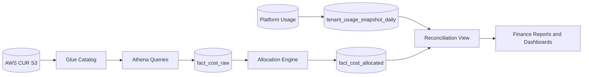

# AWS Cost Mapping

## Overview

This document explains how internal Commercial-Ops metrics map to AWS billing signals. The objective is to correlate tenant visible usage with authoritative spend recorded in AWS Cost and Usage Reports and related services. The mapping produces an auditable trail from platform telemetry to tenant allocation and final invoices.

The platform separates data by purpose. Client business data resides in Aurora. Platform and administrative data reside in an admin database. Billing and Commercial-Ops data may use an economical database engine. The mapping logic is independent of the storage engine as long as it supports SQL joins, partitioning, and time based aggregations.

Client facing resource names mask AWS service names. For example, compute capacity appears as Runner Light, Runner Pro, or Runner Enterprise. Internally the system still joins to EC2, Fargate, or Lambda usage in AWS CUR so that validation remains precise while the UI stays service agnostic.

## Purpose and Design Goals

The mapping layer has the following goals.

- **Consistency** Internal metrics and AWS cost fields must reconcile within documented tolerances.
- **Reproducibility** Given the same inputs and rules, the system produces the same allocations and totals.
- **Explainability** Every tenant allocation shows its AWS origin, tags, and rule version.
- **Isolation** Changes to tagging or allocation rules are versioned and do not rewrite closed periods.
- **Economy** The mapping uses partitioned storage and incremental processing to control cost.

## Data Sources and Ingestion

AWS publishes Cost and Usage Reports to S3. A Glue catalog provides an external schema. Athena is used for ad hoc queries and batch ingestion into the Commercial-Ops data store.

Typical CUR columns referenced by the mapping.

| Column | Purpose |
|--------|---------|
| `bill_billing_period_start_date` | Period boundary for grouping and locking |
| `line_item_usage_start_date` | Usage timestamp used for daily bucket |
| `line_item_resource_id` | AWS resource identifier where available |
| `product_servicecode` | AWS service code such as AmazonEC2 or AmazonS3 |
| `line_item_usage_type` | Usage detail such as DataTransfer-Out-Bytes or BoxUsage |
| `line_item_unblended_cost` | Cost before credits and savings |
| `line_item_unblended_rate` | Unit price for the usage |
| `line_item_usage_amount` | Quantity used in the native unit |
| `resource_tags_user_tenant_id` | Cost allocation tag for tenant |
| `resource_tags_user_plan_id` | Cost allocation tag for plan |
| `resource_tags_user_service_component` | Component attribution used by mapping |

Ingestion steps.

1. Read CUR partitions from S3 using Glue catalog.
2. Normalize and store to `fact_cost_raw` with minimal transformations.
3. Apply allocation rules to produce `fact_cost_allocated` keyed by `tenant_id`.
4. Persist line level evidence and rule references for audit queries.

## Mapping Strategy

Internal metrics and client facing names are mapped to AWS services and usage types. The table below shows common mappings. The UI avoids AWS terms but the reconciliation table exposes them for operators and finance.

| Client Name | Internal Metric | AWS Service | CUR Keys | Notes |
|-------------|------------------|-------------|----------|-------|
| Runner Light | `runner_hours` | AmazonEC2 | `product_servicecode = 'AmazonEC2'`, `line_item_usage_type LIKE 'BoxUsage%'` on instance class family t or m small | Baseline general compute |
| Runner Pro | `runner_hours` | AmazonEC2 | Same as above on c or m medium or large | Higher performance profile |
| Runner Enterprise | `runner_hours` | AmazonEC2 | Same as above on r or c large or xlarge | Memory or CPU optimized |
| Serverless Runner | `lambda_invocations`, `lambda_gb_seconds` | AWSLambda | `product_servicecode = 'AWSLambda'` | Optional serverless workloads |
| Container Runner | `runner_hours` | AmazonECS, AWSFargate | `product_servicecode IN ('AmazonECS','AWSFargate')` | Scheduled containers |
| Data Store | `storage_gb_peak` | AmazonS3 | `product_servicecode = 'AmazonS3'`, `line_item_usage_type LIKE '%TimedStorage%'` | Includes snapshots through internal accounting |
| Data Egress | `egress_gb` | AmazonS3, AWSDataTransfer | `line_item_usage_type LIKE '%-Out-Bytes%'` | Internet or cross region transfer |
| Volume Storage | `volume_gb` | AmazonEBS | `product_servicecode = 'AmazonEC2'`, `line_item_usage_type LIKE 'EBS:%'` | EC2 EBS storage and IO |
| NAT Processing | `nat_gb_processed` | AmazonNATGateway | `product_servicecode = 'AmazonNATGateway'` | Shared component with allocation |
| PrivateLink Processing | `privatelink_gb_processed` | AmazonVPCEndpoint | `line_item_usage_type LIKE '%Endpoint-Bytes%'` | Endpoint processing volume |
| VPC Endpoint | `endpoint_hours` | AmazonVPC | `line_item_usage_type LIKE '%VpcEndpoint-Hours%'` | Hourly endpoint charge |
| Monitoring | `monitoring_events` | AmazonCloudWatch | `product_servicecode = 'AmazonCloudWatch'` | Logs and metrics allocation |
| Data Processing | `glue_dpu_hours` | AWSGlue | `product_servicecode = 'AWSGlue'` | Optional ETL |
| Query Processing | `athena_query_gb_scanned` | AmazonAthena | `product_servicecode = 'AmazonAthena'` | GB scanned based |
| Key Management | `kms_request_count` | AWSKeyManagementService | `product_servicecode = 'AWSKeyManagementService'` | If charged beyond free tier |

Notes.

- Data egress for the tenant visible quota is computed from platform telemetry and validated against transfer usage types in CUR.
- Snapshot storage counts toward `storage_gb_peak` even if AWS bills snapshots separately. The platform accounts for total storage footprint and validates against combined S3 and EBS storage costs.
- Runner tiers are logical groupings of EC2 instance families. The mapping retains family details for audit but the UI shows Light, Pro, or Enterprise.

## Allocation Rules

Some AWS charges cannot be tagged directly or are shared across tenants. These costs are allocated using transparent and versioned rules. Examples include NAT Gateway, PrivateLink endpoints shared by many tenants, CloudWatch logs, and control plane costs.

### Allocation keys

| Category | Key metric | Example |
|----------|------------|---------|
| NAT processing | `nat_gb_processed` | Allocate by share of processed GB per tenant |
| PrivateLink | `privatelink_gb_processed` or `endpoint_hours` | Allocate by data processed or hours |
| CloudWatch | `runner_hours` and `data_ingestion_gb` | Weighted split across compute and data |
| Support and overhead | Fixed percent | Allocate to operator only, not billed to tenants |

### Allocation record

Each applied allocation writes an audit record with fields:

```
allocation_id, rule_id, tenant_id, cost_source_ids[], category, key_metric, key_value,
allocated_cost, effective_from, effective_to, created_at, created_by
```

Allocation rules are forward effective. Historical changes generate reversal entries rather than rewrites.

## Validation and Reconciliation

Validation compares internal metrics to CUR based costs. The system computes variance by metric and service with strict tolerances. Daily checks use incomplete CUR data for trend only while monthly checks use the final CUR set.

| Check | Comparison | Tolerance |
|-------|------------|-----------|
| Storage | `storage_gb_peak` vs S3 and EBS TimedStorage | ± 3 percent |
| Egress | `egress_gb` vs DataTransfer Out Bytes | ± 5 percent |
| Compute | `runner_hours` vs EC2 BoxUsage hours cost trend | qualitative trend |
| NAT | `nat_gb_processed` vs NAT Gateway cost | ± 5 percent |
| PrivateLink | `privatelink_gb_processed` vs endpoint bytes cost | ± 5 percent |

Anomalies open tickets with attached evidence queries and rule references. Periods are locked after reconciliation.

## Schema and Transformation Flow

The database choice for Commercial-Ops can be economical. The schema below describes logical tables and does not assume a specific engine. Aurora can be used where performance benchmarking requires it.



Key tables.

| Table | Purpose |
|-------|---------|
| `fact_cost_raw` | Staging of CUR line items with minimal normalization |
| `allocation_rules` | Versioned rules for shared cost allocation |
| `fact_cost_allocated` | Tenant level allocated cost with evidence references |
| `tenant_usage_snapshot_daily` | Daily usage aggregates by metric |
| `reconciliation_view` | Joined view for variance analysis |

## Example SQL Queries

Aurora compatible SQL snippets are shown below. Adapt to the chosen engine if different.

Example 1. Allocate NAT Gateway cost by processed GB.

```sql
INSERT INTO fact_cost_allocated (
  tenant_id, service, allocated_cost, rule_id, source_line_ids, period_start, period_end
)
SELECT
  u.tenant_id,
  'AmazonNATGateway' AS service,
  SUM(c.line_item_unblended_cost) * (u.nat_gb / NULLIF(t.total_nat_gb,0)) AS allocated_cost,
  'rule_nat_v1' AS rule_id,
  ARRAY_AGG(c.identity_line_item_id) AS source_line_ids,
  DATE_TRUNC('month', c.bill_billing_period_start_date) AS period_start,
  LAST_DAY(c.bill_billing_period_start_date) AS period_end
FROM fact_cost_raw c
JOIN (
  SELECT tenant_id, SUM(nat_gb_processed) AS nat_gb
  FROM tenant_network_usage
  WHERE usage_date BETWEEN :start AND :end
  GROUP BY tenant_id
) u ON 1=1
JOIN (
  SELECT SUM(nat_gb_processed) AS total_nat_gb
  FROM tenant_network_usage
  WHERE usage_date BETWEEN :start AND :end
) t ON 1=1
WHERE c.product_servicecode = 'AmazonNATGateway'
  AND c.bill_billing_period_start_date BETWEEN :start AND :end
GROUP BY u.tenant_id, c.bill_billing_period_start_date;
```

Example 2. Validate storage against S3 TimedStorage usage.

```sql
SELECT
  s.tenant_id,
  MAX(s.storage_gb_peak) AS platform_peak_gb,
  SUM(c.line_item_usage_amount) AS s3_storage_gb_days
FROM tenant_data_usage s
LEFT JOIN fact_cost_raw c
  ON c.product_servicecode = 'AmazonS3'
  AND c.line_item_usage_type LIKE '%TimedStorage%'
  AND c.resource_tags_user_tenant_id = s.tenant_id
  AND DATE(c.line_item_usage_start_date) BETWEEN :start AND :end
WHERE s.metric_code = 'storage_gb_peak'
  AND s.usage_date BETWEEN :start AND :end
GROUP BY s.tenant_id;
```

Example 3. Reconciliation variance by metric and service.

```sql
SELECT
  r.tenant_id,
  r.metric_code,
  r.platform_value,
  r.allocated_cost,
  CASE WHEN r.expected_cost > 0 THEN (r.allocated_cost - r.expected_cost) / r.expected_cost ELSE NULL END AS variance_pct
FROM reconciliation_view r
WHERE r.period = :month;
```

## Governance and Versioning

Mappings and rules are version controlled. The following practices apply.

- Proposals are raised with business and technical justification.
- Reviews include platform, finance, and security representatives.
- Approved changes are recorded with effective dates and owners.
- Backfills use reversal entries and do not rewrite locked periods.
- Evidence queries are checked into the repository with stable IDs.

## Cross References

- **metrics-definition.md** for metric semantics and aggregation rules.
- **plan-parameters.md** for quota and pricing relationships.
- **observability.md** for variance thresholds and alerts.
- **data-model.md** for table schemas used by this mapping.
