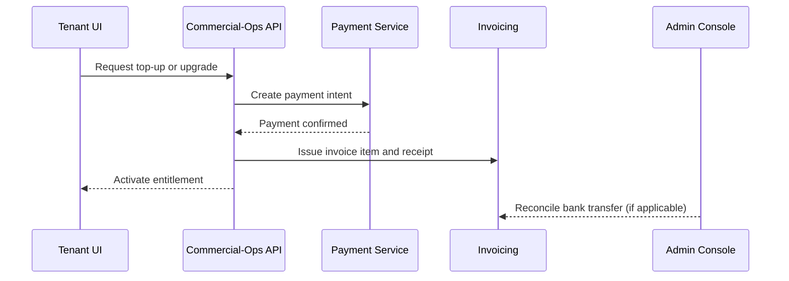

# Top-up and Upgrade Policy

## Overview

This document defines how tenants purchase additional capacity during a billing cycle and how the system recommends or enforces plan upgrades. The goal is to provide predictable, auditable behavior that maps directly to plan parameters and tenant visible meters while preserving operator control over allocation and billing integrity. Currency defaults to USD. Tenant and plan are canonical terms.

Top-ups are short lived entitlements that apply to the current billing cycle unless stated as recurring. Upgrades change the active plan version and carry new entitlements immediately or at the next cycle, depending on policy.

## Policy Objectives

**Continuity first** Tenants must have a safe path to continue work when hitting limits.  
**Predictable cost** Actions clearly state effect on caps and price before confirmation.  
**Reversible by evidence** Mistaken purchases can be reversed using credit notes with immutable audit.  
**Deterministic billing** All actions are computed from frozen daily snapshots and plan metadata.  
**Security and fairness** Guardrails prevent abuse that could impact other tenants or shared components.

## Event Triggers

Top-ups and upgrades are surfaced by explicit tenant action or generated by the evaluation engine when utilization crosses thresholds.

| Trigger | Condition | System behavior |
|--------|-----------|------------------|
| Soft warning | Utilization >= 80 percent | Banner and email notification |
| Hard warning | Utilization >= 95 percent | Banner, email, and CTA for top-up or upgrade |
| Limit reached | Utilization >= 100 percent | Enforce policy: require top-up or present upgrade |
| Seat overage | Active users > base seats | Offer seat top-up or plan upgrade |
| Consistent overuse | Two consecutive cycles over 95 percent | Recommend upgrade at cycle start |

## Top-up Entitlements

Top-ups extend a specific metric entitlement for the rest of the current billing cycle. Each top-up SKU defines size, unit, and applicable metric. Multiple top-ups accumulate.

| SKU code | Applies to metric | Unit | Size | Expiry | Notes |
|---------|-------------------|------|------|--------|-------|
| `TOPUP_INGEST_50GB` | `data_ingestion_gb` | GB | 50 | End of current cycle | Adds to cap immediately |
| `TOPUP_STORAGE_100GB` | `storage_gb_peak` | GB | 100 | End of current cycle | Increases peak allowance for the month |
| `TOPUP_EGRESS_50GB` | `egress_gb` | GB | 50 | End of current cycle | Only total is shown to tenant |
| `TOPUP_RUNNER_25H` | `runner_hours` | Hour | 25 | End of current cycle | Hours shared across tiers |
| `TOPUP_SEATS_5` | `active_users` | Seat | 5 | End of current cycle | Increases seat pool |

Top-ups are additive. Expired top-ups are not carried forward unless defined as recurring SKUs.

## Upgrade Rules

Upgrades move a tenant to a new plan with higher entitlements. Upgrades can be immediate or scheduled. Immediate upgrades apply new caps at the time of purchase and the base subscription price is prorated for the remaining period.

| Rule | Description |
|------|-------------|
| Immediate upgrade | New plan active now, price prorated from upgrade timestamp |
| Scheduled upgrade | New plan takes effect next cycle, price not changed now |
| Auto upgrade | Optional policy to enforce automatic upgrade at 100 percent + N overage |
| Cross-pack upgrade | Allowed when plan families are compatible (for example CFO Standard to CFO Pro) |

Downgrades are scheduled for the next cycle by default. Mid cycle downgrades are not allowed unless the plan explicitly declares this behavior.

## Proration and Finance Effects

**Subscription price** For immediate upgrades the difference between new and old plan prices is charged pro rata for the remaining days. Scheduled upgrades do not change current cycle price.

**Top-ups** Billed at purchase. Top-ups apply only to the current cycle unless marked recurring. Refunds are issued through credit notes when justified by evidence and operator approval.

**Taxes** Applied according to tax profile at the tenant level. Taxes are recalculated on prorated amounts.

**Receipts** Generated upon successful payment or confirmed bank transfer. Receipts reference the invoice or purchase order and the top-up or upgrade action.

## Evaluation Engine Interaction

The policy engine reads frozen daily snapshots and current plan entitlements, then applies top-ups and upgrades to compute effective caps for the remainder of the cycle.

```sql
-- Effective cap computation
WITH ent AS (
  SELECT tenant_id, metric_code, base_cap_value
  FROM plan_metric_map_active
  WHERE period = :period
),
topups AS (
  SELECT tenant_id, metric_code, SUM(topup_value) AS add_cap
  FROM topup_ledger
  WHERE purchase_time BETWEEN :period_start AND :period_end
  GROUP BY tenant_id, metric_code
)
SELECT
  e.tenant_id,
  e.metric_code,
  e.base_cap_value + COALESCE(t.add_cap, 0) AS effective_cap
FROM ent e
LEFT JOIN topups t
  ON t.tenant_id = e.tenant_id AND t.metric_code = e.metric_code;
```

```yaml
# Example upgrade request payload
tenant_id: TEN-00123
current_plan: CFO-Standard-v1
target_plan: CFO-Pro-v1
when: immediate   # or scheduled
payment_method: wallet | card | bank_transfer
acknowledge_proration: true
```

## Purchase Flows

**Card or wallet** Immediate authorization and capture. Top-up or upgrade activates after payment confirmation.  
**Bank transfer** Pending state created with a payment reference. Operator approves and activates upon reconciliation.  
**Credit terms** If enabled, a purchase order is created and the invoice is marked due on the agreed date.



## Guardrails and Abuse Prevention

- Burst buying of top-ups followed by immediate tenant termination is blocked by grace periods and refund rules.  
- NAT and PrivateLink protection caps prevent sudden cross tenant impact.  
- Seat top-ups cannot be used to exceed `max_seats` when specified by the plan.  
- Operator may freeze purchases for a tenant under investigation or non payment.

## Reversals and Credits

If a purchase was made in error or due to a system fault, a credit note can reverse the charge. Credits reference the original invoice and carry a reason code. The system never mutates closed invoices.

```yaml
credit_note:
  tenant_id: TEN-00123
  original_invoice_id: INV-7890
  amount: 120.00
  reason: mistaken_purchase
  approved_by: finance_ops_user
```

## API Contracts

The API exposes clear contracts for purchase, listing, and state transitions. Admin endpoints require elevated roles.

```yaml
# POST /topups/purchase
request:
  tenant_id: string
  metric_code: string
  sku_code: string
  quantity: integer
response:
  topup_id: string
  status: enum[pending, active, failed]
  effective_from: timestamp
  effective_to: timestamp

# POST /plans/upgrade
request:
  tenant_id: string
  target_plan: string
  when: enum[immediate, scheduled]
response:
  upgrade_id: string
  status: enum[pending, active, scheduled, failed]
  proration_amount: number
```

## Ledger and Evidence

All purchases and plan changes are recorded in immutable ledgers with actor, timestamp, and evidence links. Evidence may include payment provider IDs, bank references, and reconciliation queries. Ledgers are retained for audit and dispute resolution.

```yaml
topup_ledger:
  - topup_id: TOP-0001
    tenant_id: TEN-00123
    metric_code: egress_gb
    sku_code: TOPUP_EGRESS_50GB
    value: 50
    purchase_time: 2025-10-02T11:04:00Z
    actor: tenant_user_42
    payment_reference: pay_9ab12

upgrade_ledger:
  - upgrade_id: UPG-0007
    tenant_id: TEN-00123
    from_plan: CFO-Standard-v1
    to_plan: CFO-Pro-v1
    when: immediate
    proration_amount: 120.00
    activated_at: 2025-10-03T08:15:00Z
    actor: tenant_admin_7
```

## Operator Controls

Admin console features include entitlement overrides with justification, temporary freezes, and custom upgrade offers. Operator actions require dual control for high impact changes and are logged with reason codes.

## Cross References

- **plan-parameters.md** for base entitlements and thresholds.  
- **metrics-definition.md** for metric semantics and aggregation.  
- **dashboard-design.md** for user facing CTAs and banners.  
- **aws-cost-mapping.md** for reconciliation and evidence queries.  
- **api.md** for endpoint details and authentication.
