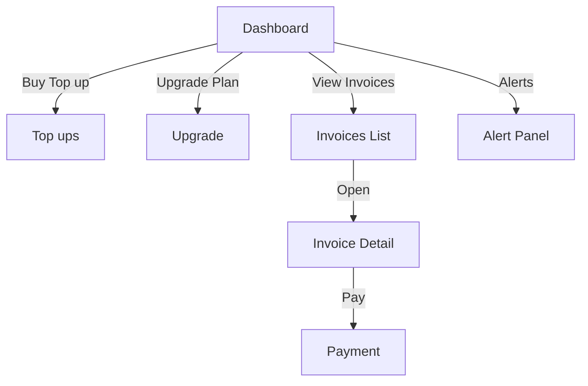

# UI

## Overview

This document specifies the tenant and operator user interfaces for the Commercial-Ops module. It defines navigation, components, states, data bindings, and access controls. The UI is API driven and consumes `/api/v1` endpoints. Canonical terms are tenant and plan. Currency defaults to USD. Tenant dashboards show totals only. Operator views surface AWS service evidence for audit.

## UX Principles

- Clarity over density. Each page focuses on a single task.
- Predictable placement. Gauges and trend cards always appear above tables.
- Freshness is explicit. Every page displays the last update timestamp.
- Errors are actionable. Every error contains a next step and a link to evidence.
- Roles are respected. No cross tenant or cross plan data leaks.

## Navigation

| Path | Audience | Purpose |
|------|----------|---------|
| `/ui/tenant/overview` | Tenant admin and users with read | Usage gauges and monthly context |
| `/ui/tenant/invoices` | Tenant admin | Invoice list and actions |
| `/ui/tenant/payments` | Tenant admin | Payments, bank details, receipts |
| `/ui/tenant/topups` | Tenant admin | Purchase top ups, upgrade plan |
| `/ui/operator/overview` | Operator | Global health and exceptions |
| `/ui/operator/cost` | Operator | CUR, allocation, budgets, reconciliation |
| `/ui/operator/billing` | Operator | Invoices, payments, refunds |
| `/ui/operator/settings` | Operator | Plans, caps, SKU and policy management |

Breadcrumbs show the entity and period for contextual pages. Every detail view deep links to the corresponding API object.

## Tenant Dashboard

Route `/ui/tenant/overview`

### Summary cards

| Card | Data source | Notes |
|------|-------------|------|
| Plan | `GET /api/v1/plans/{plan_code}` and binding | Shows plan name, seats, period |
| Budget | `GET /api/v1/budgets?scope=tenant` | Status ok or warning or breached |
| Freshness | Latest `usage_snapshot_daily` date | Renders “as of” timestamp |

### Gauges

Gauges render only totals. No per service splits are shown to the tenant.

| Metric | Cap source | Value source | Notes |
|--------|------------|--------------|------|
| Egress total (GB) | Plan cap or top up | `GET /api/v1/usage/snapshots?metric_code=egress_gb` | Published monthly quota per plan |
| Storage peak (GB) | Plan cap | `GET /api/v1/usage/snapshots?metric_code=storage_gb_peak` | Snapshots count toward storage_gb_peak |
| Runner hours | Plan cap | `GET /api/v1/usage/snapshots?metric_code=runner_hours` | Includes scheduled and always on |
| Seats usage | Plan seats | `GET /api/v1/tenants/{tenant_id}/seats/usage` | Shows active users vs seats |

Gauge schema:

```json
{
  "metric": "egress_gb",
  "value": 410.2,
  "cap": 500.0,
  "thresholds": [0.8, 0.95, 1.0],
  "period": "2025-09",
  "fresh_as_of": "2025-10-06T02:10:00Z"
}
```

### Alerts banner

Banner aggregates open alerts for the tenant.

```json
{
  "alerts": [
    {"level": "warning", "metric": "egress_gb", "message": "Approaching quota at 82 percent"},
    {"level": "critical", "metric": "runner_hours", "message": "Quota exceeded by 3.2 percent"}
  ]
}
```

Clicking an alert opens a side panel with threshold math, effective cap after top ups, and recommended actions.

### Top up and Upgrade

CTA buttons:

- “Buy top up” opens `/ui/tenant/topups`
- “Upgrade plan” opens a guided flow that previews new caps and proration

## Tenant Invoices

Route `/ui/tenant/invoices`

### List

Columns: Invoice ID, Period, Status, Total USD, Issued at, Actions.

API: `GET /api/v1/invoices?tenant_id=TEN-...`

### Detail

Route `/ui/tenant/invoices/{invoice_id}`

Panels:
- Summary: total, tax, status, issued and paid timestamps
- Lines table for subscription, allocations, and top ups
- Download actions: PDF and CSV
- Payment actions: “Record bank transfer” with provider reference, “Pay online” if a gateway is enabled

### Receipts

After a payment is confirmed, a receipt PDF is available on the invoice detail page. The receipt includes payment_id, method, amount_usd, and timestamp.

## Tenant Payments

Route `/ui/tenant/payments`

- Show payments list with status and provider_ref
- Manual bank transfer: show operator bank details and input for `provider_ref`
- On submit, call `POST /api/v1/payments` and link to invoice detail

## Tenant Top ups

Route `/ui/tenant/topups`

Catalog example:

```json
[
  {"sku_code":"TOPUP_EGRESS_200GB","title":"Egress 200 GB","applies_to":"egress_gb"},
  {"sku_code":"TOPUP_RUNNER_25H","title":"Runner Hours 25 h","applies_to":"runner_hours"}
]
```

On purchase, call `POST /api/v1/topups` and refresh gauges. Show freshness notice until the next daily snapshot confirms the new cap.

## Operator Overview

Route `/ui/operator/overview`

Widgets:
- CUR freshness by account
- Allocation variance heatmap by service
- Tag coverage trend
- Open reconciliation exceptions
- Invoice issuance progress

Each widget links to the corresponding operator page with filters applied.

## Operator Cost

Route `/ui/operator/cost`

Tabs:

| Tab | Dataset | Typical filters |
|-----|---------|------------------|
| CUR | `fact_cost_raw` through an API view | Period, servicecode, usage_type, tenant tag |
| Allocation | `fact_cost_allocated` | Period, category, rule_id, tenant_id |
| Budgets | `budget_master` | Scope type, status |
| Reconciliation | `recon_summary` and `recon_exceptions` | Status, variance range |

Drill-down shows line evidence and run IDs. Evidence links open stored queries with frozen parameters.

## Operator Billing

Route `/ui/operator/billing`

Functions:
- Generate invoices for selected tenants and period
- Review and approve invoices before issuing
- Process payments and refunds
- Export CSV for accounting systems

## Operator Settings

Route `/ui/operator/settings`

Manage tables via API:
- Plans and versions
- Plan metric caps and thresholds
- Alert policies
- SKU catalog for top ups

Changes are versioned and require two-person review outside development environments.

## Freshness Model

- Every page displays the last successful snapshot time pulled from the API.
- If data age exceeds a page-specific limit, a banner is shown. The page remains readable but disables destructive actions.
- Tenant dashboard threshold for freshness is 24 hours. Operator pages tolerate up to 48 hours for historical datasets.

## RBAC

| Page | Scope check |
|------|-------------|
| `/ui/tenant/*` | Token tenant_id must match the route tenant_id |
| `/ui/operator/*` | Operator scope required |
| Invoice downloads | `billing:read` |
| Payments create | `billing:write` |
| Plan changes | `tenant:write` or operator scope |

Authorization is enforced by the API which returns `403` for forbidden requests. The UI surfaces the error message and hides controls the user cannot use.

## States and Errors

| State | Presentation | Next step |
|-------|--------------|-----------|
| Data stale | Yellow banner with age and link to status | Retry after refresh or contact operator |
| Quota breached | Red banner and capped gauge | Offer top up or upgrade |
| Payment pending | Neutral banner | Poll status or allow cancel if reversible |
| Invoice blocked by recon | Warning on invoice list | Link to reconciliation status |
| Missing tags detected | Operator only notice | Open tagging runbook in a new tab |

All errors include a trace_id for audit and support.

## Accessibility

- Keyboard navigation with logical tab order
- Alt text for gauges and icons
- Sufficient color contrast for status states
- Table views expose CSV export for screen readers

## Internationalization

- UI strings are translatable. Numbers and dates render using locale while currency remains USD for Commercial-Ops.
- Timezone display uses the user preference but stores UTC ISO timestamps.

## Telemetry

The UI emits structured events for actions. Events include trace_id, tenant_id, and object identifiers but no PII.

Example event:

```json
{
  "ts": "2025-10-06T06:18:33Z",
  "actor": "tenant_user",
  "action": "invoice_download",
  "tenant_id": "TEN-00123",
  "invoice_id": "INV-202509-TEN00123",
  "trace_id": "ui-01J9R7..."
}
```

## Security

- All pages require HTTPS
- CSRF protection for unsafe methods
- Content Security Policy restricts origins
- Session cookies are HttpOnly and SameSite strict

## Example Component Bindings

### Tenant egress gauge

```http
GET /api/v1/usage/snapshots?tenant_id=TEN-00123&metric_code=egress_gb&from=2025-10-01&to=2025-10-31
```

The latest item provides the value. The cap is resolved from the current plan and any active top ups.

### Invoice list

```http
GET /api/v1/invoices?tenant_id=TEN-00123&from=2025-07-01&to=2025-10-31&page_size=50
```

### Alert list

```http
GET /api/v1/alerts?tenant_id=TEN-00123&state=open
```

## Wireflows



## Cross References

- api.md for endpoints and scopes
- data-model.md for entity contracts
- plan-pricing/dashboard-design.md for gauge semantics
- security.md for controls and compliance
- observability.md for alert sources
- aws-cost-integration/troubleshooting.md for runbook links
