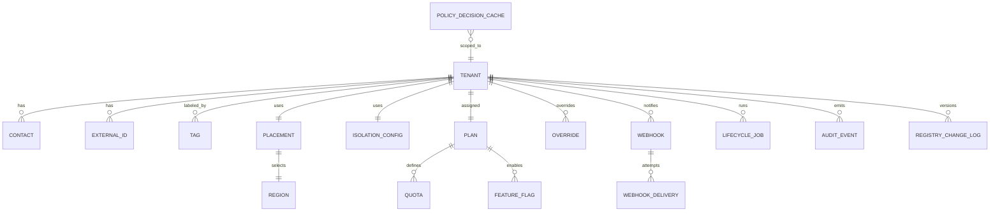

# Tenancy Module Data Model

**Audience:** Data engineers, backend engineers, platform architects  
**Status:** Working draft  
**Purpose:** Define the authoritative logical data model for the Tenancy subsystem. This document describes entities, relationships, ownership, lifecycle fields, indexing strategy, and replication notes. It unifies the Tenancy baseline with Tenant Management data semantics for manifests, residency, plans, quotas, webhooks, and audit. It includes an inline ERD for quick orientation.

## Modeling Goals

The model must be explicit, stable, and easy to evolve. It should support high read throughput for directory style queries, safe writes for lifecycle transitions, and strict auditability. Entities are normalized to the degree necessary for correctness and traceability. Denormalized views can be created for analytics and UI lists.

## Entity Overview

**Tenant** represents the primary identity and isolation boundary.  
**Placement** captures residency decisions and selected regions.  
**IsolationConfig** records data plane and network isolation decisions.  
**Plan** binds commercial plan code to derived quotas and features.  
**Quota** captures effective limits that the controller enforces.  
**FeatureFlag** captures feature toggles derived from plan and overrides.  
**Contact** models tenant contacts for technical, billing, and incident roles.  
**ExternalId** provides join keys to billing and CRM systems.  
**Tag** provides taxonomy driven labels for search and policy.  
**Webhook** defines external subscribers for lifecycle events.  
**WebhookDelivery** records delivery attempts including retries and results.  
**LifecycleJob** represents long running orchestration tasks.  
**AuditEvent** is the immutable record of every meaningful change.  
**RegistryChangeLog** keeps compact diffs for configuration history.  
**Override** captures time bound per tenant overrides for quotas or features.  
**PolicyDecisionCache** stores short lived results of policy evaluation.  
**Region** is a reference table of allowed regions with attributes.  

## ERD



## Ownership And Storage

The registry is the system of record. Postgres is recommended for strong consistency and rich indexing. Partitioning by region and sharding by tenant id supports horizontal scale. WebhookDelivery can be stored in a write optimized table with time based partitioning. AuditEvent is append only and retained according to policy.

## Logical Schemas

### Tenant

**Purpose** identify the tenant and track lifecycle and key associations.

```sql
create table tenant (
  tenant_id               text primary key,
  display_name            text not null,
  state                   text not null check (state in ('Draft','Active','Suspended','Archived','Deleted')),
  profile                 text not null check (profile in ('multiTenant','singleTenant')),
  plan_code               text not null,
  created_at              timestamptz not null default now(),
  updated_at              timestamptz not null default now(),
  etag                    text not null,
  preferred_region        text,
  residency_policy_ref    text,
  encryption_policy_ref   text,
  retention_policy_ref    text
);
create index idx_tenant_display_name on tenant using gin (to_tsvector('simple', display_name));
create index idx_tenant_state on tenant(state);
create index idx_tenant_plan on tenant(plan_code);
```

### Placement

**Purpose** record residency decision, allowed regions, and selected region.

```sql
create table placement (
  tenant_id               text primary key references tenant(tenant_id) on delete cascade,
  allowed_regions         text[] not null,
  selected_region         text not null,
  data_sovereignty_req    boolean not null default false,
  decided_at              timestamptz not null default now()
);
create index idx_placement_region on placement(selected_region);
```

### IsolationConfig

**Purpose** define isolation at database and network layers.

```sql
create table isolation_config (
  tenant_id               text primary key references tenant(tenant_id) on delete cascade,
  strategy                text not null check (strategy in ('schemaPerTenant','dedicatedDatabase')),
  network_mode            text not null check (network_mode in ('sharedVpc','dedicatedVpc')),
  db_pool_ref             text,
  schema_prefix           text,
  db_template_ref         text,
  kms_key_ref             text
);
```

### Plan, Quota, FeatureFlag

**Purpose** bind commercial plan and derived operational limits.

```sql
create table plan (
  plan_code               text primary key,
  feature_catalog_ref     text not null,
  plan_catalog_version    text not null
);

create table quota (
  tenant_id               text references tenant(tenant_id) on delete cascade,
  name                    text not null,
  value                   bigint not null,
  source                  text not null check (source in ('plan','override','policy')),
  primary key (tenant_id, name)
);

create table feature_flag (
  tenant_id               text references tenant(tenant_id) on delete cascade,
  name                    text not null,
  enabled                 boolean not null,
  source                  text not null check (source in ('plan','override')),
  primary key (tenant_id, name)
);
```

### Contacts, External Ids, Tags

```sql
create table contact (
  tenant_id               text references tenant(tenant_id) on delete cascade,
  role                    text not null check (role in ('technical','billing','incident')),
  value                   text not null,
  primary key (tenant_id, role)
);

create table external_id (
  tenant_id               text references tenant(tenant_id) on delete cascade,
  system                  text not null check (system in ('billing','crm','catalog','other')),
  value                   text not null,
  primary key (tenant_id, system)
);

create table tag (
  tenant_id               text references tenant(tenant_id) on delete cascade,
  tag                     text not null,
  primary key (tenant_id, tag)
);
create index idx_tag_tag on tag(tag);
```

### Webhook And Delivery

```sql
create table webhook (
  webhook_id              bigserial primary key,
  tenant_id               text references tenant(tenant_id) on delete cascade,
  name                    text not null,
  url                     text not null,
  signing_key_ref         text,
  events                  text[] not null,
  retry_max               int not null default 12,
  backoff_seconds         int not null default 30,
  jitter                  boolean not null default true,
  created_at              timestamptz not null default now()
);

create table webhook_delivery (
  delivery_id             bigserial primary key,
  webhook_id              bigint references webhook(webhook_id) on delete cascade,
  tenant_id               text not null,
  sequence                bigint not null,
  status_code             int,
  success                 boolean not null default false,
  attempt                 int not null,
  latency_ms              int,
  error_category          text,
  created_at              timestamptz not null default now()
);
create index idx_delivery_tenant_seq on webhook_delivery(tenant_id, sequence);
create index idx_delivery_recent on webhook_delivery(created_at desc);
```

### LifecycleJob

```sql
create table lifecycle_job (
  job_id                  bigserial primary key,
  tenant_id               text references tenant(tenant_id) on delete cascade,
  type                    text not null check (type in ('Activate','Suspend','Resume','Archive','MigrateRegion','MtToSt')),
  state                   text not null check (state in ('running','succeeded','failed','canceled')),
  started_at              timestamptz not null default now(),
  updated_at              timestamptz not null default now(),
  metadata                jsonb not null default '{}'::jsonb
);
create index idx_job_tenant_state on lifecycle_job(tenant_id, state);
```

### AuditEvent And RegistryChangeLog

```sql
create table audit_event (
  audit_id                bigserial primary key,
  tenant_id               text not null,
  actor                   text not null,
  action                  text not null,
  target                  text not null,
  request_id              text,
  correlation_id          text,
  details                 jsonb not null default '{}'::jsonb,
  created_at              timestamptz not null default now()
);
create index idx_audit_tenant_time on audit_event(tenant_id, created_at);

create table registry_change_log (
  change_id               bigserial primary key,
  tenant_id               text not null,
  etag_before             text,
  etag_after              text,
  diff                    jsonb not null,
  actor                   text not null,
  created_at              timestamptz not null default now()
);
```

### Overrides

```sql
create table override (
  tenant_id               text references tenant(tenant_id) on delete cascade,
  kind                    text not null check (kind in ('quota','feature')),
  name                    text not null,
  value                   text not null,
  reason                  text,
  expires_at              timestamptz,
  actor                   text,
  created_at              timestamptz not null default now(),
  primary key (tenant_id, kind, name)
);
create index idx_override_expiry on override(expires_at);
```

### PolicyDecisionCache

```sql
create table policy_decision_cache (
  tenant_id               text not null,
  policy_kind             text not null,
  request_hash            text not null,
  allow                   boolean not null,
  details                 jsonb not null default '{}'::jsonb,
  ttl_expires_at          timestamptz not null,
  primary key (tenant_id, policy_kind, request_hash)
);
create index idx_policy_ttl on policy_decision_cache(ttl_expires_at);
```

### Region Reference

```sql
create table region_ref (
  region                  text primary key,
  display_name            text not null,
  active                  boolean not null default true
);
```

## Data Ownership And Access Patterns

**Ownership** Tenant is owned by the registry. Placement and IsolationConfig are owned by the control plane. Quota and FeatureFlag are derived artifacts and can be recomputed. WebhookDelivery and AuditEvent are append only stores. Overrides are owned by operations with audit requirement.

**Read patterns** Directory lists filter by state, plan, and region. These rely on btree indexes for equality and on full text index for display name search. WebhookDelivery reads are time ordered and require date partition or descending index.

**Write patterns** Lifecycle transitions write Tenant.state and append AuditEvent and RegistryChangeLog entries within the same transaction. WebhookDelivery writes are high frequency and should not block registry transactions.

## Replication And Partitioning

**Strategy** Use logical replication per region. Tenants are pinned to a home region in Placement. Cross region reads use read replicas. WebhookDelivery and AuditEvent tables are partitioned by time for efficient retention and archival.

## Concurrency And ETag Semantics

Every update writes a new etag generated from the server side hash of the resource. Clients supply If Match for conditional updates to avoid lost updates. Controllers rely on row version and etag to ensure idempotent reconcile behavior.

## Soft Deletes And Archival

Tenants move to Archived state before any deletion. Data is retained according to retention policy. Deletion is only permitted for test tenants or policy approved cases. WebhookDelivery and AuditEvent data is never hard deleted inside the retention window.

## Validation Rules

- tenant_id immutable after creation  
- preferred_region must be part of allowed_regions  
- plan_code must exist in plan table or external catalog  
- isolation strategy must match supported values  
- webhook url must be https and pass allow list validation  
- overrides require expires_at and reason for audit

## Example Queries

**List active enterprise tenants in ap-south-1**
```sql
select t.tenant_id, t.display_name
from tenant t
join placement p on p.tenant_id = t.tenant_id
where t.state = 'Active' and t.plan_code = 'ENTERPRISE_PLUS' and p.selected_region = 'ap-south-1'
order by t.display_name;
```

**Get effective quotas for a tenant**
```sql
select coalesce(o.value::bigint, q.value) as value, q.name
from quota q
left join override o
  on o.tenant_id = q.tenant_id and o.kind = 'quota' and o.name = q.name
where q.tenant_id = 't_123456';
```

**Recent failed webhook deliveries**
```sql
select w.name, d.sequence, d.status_code, d.error_category, d.created_at
from webhook_delivery d
join webhook w on w.webhook_id = d.webhook_id
where d.tenant_id = 't_123456' and d.success = false
order by d.created_at desc
limit 50;
```

## Change Management

Schema changes follow online migration playbooks. Additive changes are preferred. Destructive changes require deprecation windows, dual write strategies, and backfill jobs with progress telemetry. All migrations are version controlled and linked to incident rollback plans.

## Summary

This data model provides a clear and enforceable structure for the Tenancy subsystem. It supports fast lookups, safe lifecycle transitions, strict audit, and predictable integrations. The model is designed to scale with tenant count and workload without sacrificing isolation or traceability.