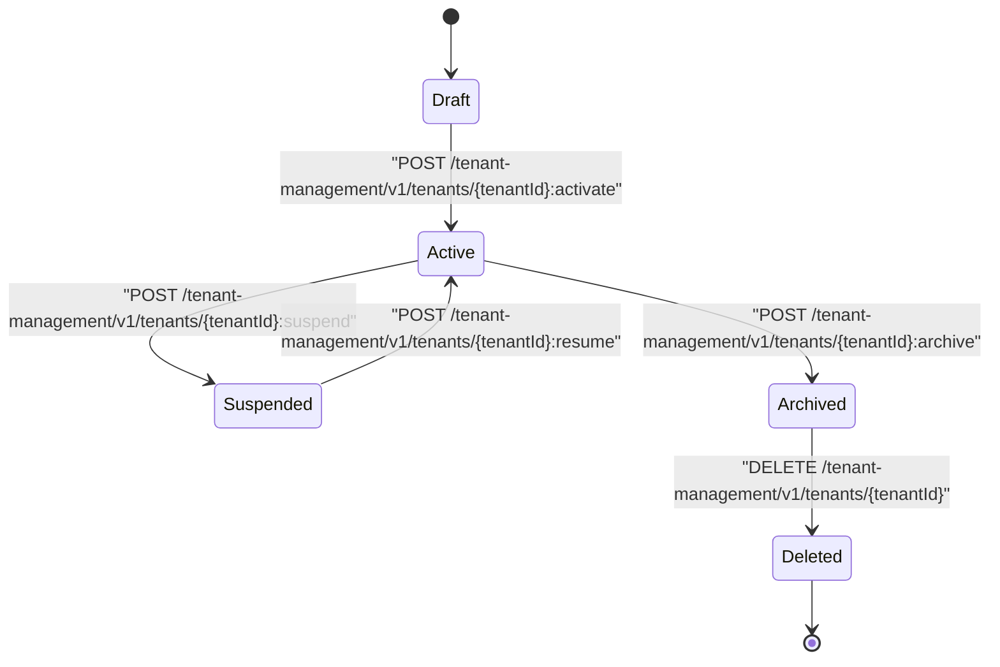
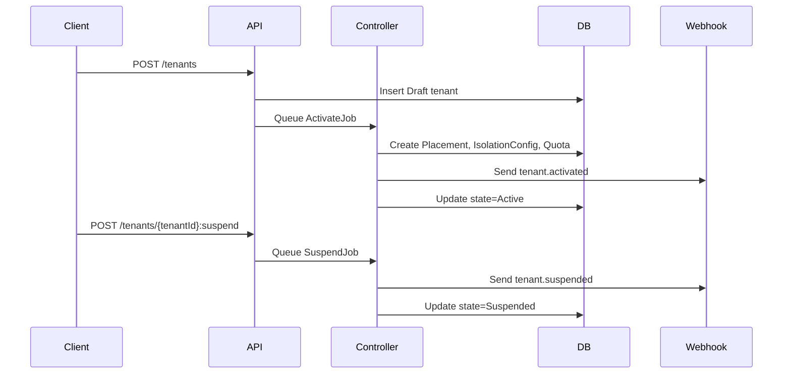

# Tenancy Module Tenant Lifecycle

**Audience:** Platform engineers, service owners, and DevOps teams  
**Status:** Working draft  
**Purpose:** Define the complete lifecycle of a tenant within the Tenancy module, covering all states, transitions, triggers, APIs, and controller workflows. This document merges Tenant Management lifecycle semantics with Tenancy control-plane orchestration logic. It ensures consistent behavior across environments and regions.

## Overview

A tenant progresses through a predictable lifecycle managed by the Tenancy controller and API layer. Each transition is explicitly triggered via API, webhook, or automation workflow. The lifecycle governs provisioning, activation, suspension, resumption, archival, and deletion.

The lifecycle model guarantees idempotency, reversibility, and auditability. All transitions emit audit events, state change logs, and webhook notifications.

## State Machine

## Lifecycle States

| State | Description | Data Access | Billing | Webhooks |
|--------|--------------|-------------|----------|-----------|
| Draft | Tenant created but not yet provisioned. | None | No | Creation webhook only |
| Active | Fully provisioned and operational tenant. | Full | Yes | All lifecycle hooks |
| Suspended | Temporarily disabled for policy or billing reasons. | Read-only | Optional | Suspension notification |
| Archived | Decommissioned but retained for policy or compliance. | None | No | Archival webhook |
| Deleted | Permanently removed from control plane. | None | No | Deletion webhook |

## Transition Rules

1. Transitions are one-way except between Active and Suspended.  
2. Each transition requires the tenant to be in a valid source state.  
3. Invalid transitions return HTTP 409 Conflict.  
4. Controllers validate preconditions (policy, plan, isolation, data residency) before execution.  
5. Every transition updates `tenant.state`, generates an audit entry, and emits webhooks.

## Controller Behavior

**Activation**
- Validates residency, encryption, and quota policies.  
- Creates Placement, IsolationConfig, and database schema or dedicated DB.  
- Assigns per-tenant KMS keys and secret namespaces.  
- Marks state as Active after successful provisioning.  

**Suspension**
- Disables active tokens and webhooks.  
- Puts tenant resources into read-only mode.  
- Queues suspension webhook for external systems.  

**Resumption**
- Validates previous suspension cause.  
- Re-enables API tokens, jobs, and webhooks.  
- Marks state Active again and emits resumption audit entry.  

**Archival**
- Initiates offboarding workflow.  
- Deletes runtime resources but retains registry entries for audit.  
- Moves tenant state to Archived and locks configuration.  

**Deletion**
- Only permitted for test tenants or compliance-approved purges.  
- Controller ensures archival completed and retention timer elapsed.  
- Removes registry and emits final audit event.  

## Lifecycle APIs

| Action | Method | Endpoint | Idempotency | Description |
|---------|---------|-----------|--------------|--------------|
| Create Tenant | POST | /tenant-management/v1/tenants | Yes | Registers a new tenant in Draft state |
| Activate Tenant | POST | /tenant-management/v1/tenants/{tenantId}:activate | Yes | Provisions tenant resources and moves to Active |
| Suspend Tenant | POST | /tenant-management/v1/tenants/{tenantId}:suspend | Yes | Temporarily disables tenant |
| Resume Tenant | POST | /tenant-management/v1/tenants/{tenantId}:resume | Yes | Re-enables tenant |
| Archive Tenant | POST | /tenant-management/v1/tenants/{tenantId}:archive | Yes | Decommissions tenant resources |
| Delete Tenant | DELETE | /tenant-management/v1/tenants/{tenantId} | Yes | Permanently deletes tenant |

All APIs are idempotent and emit standard events with correlation IDs. State mismatch returns HTTP 409 Conflict.

## Policies And Preconditions

**Policy checks before activation**
- Residency: must match region availability.  
- Plan: must have valid plan_code with feature catalog.  
- Isolation: must specify supported strategy and network mode.  
- Encryption: must link to valid KMS key and secret namespace.  

**Policy checks before deletion**
- Retention policy window satisfied.  
- No pending jobs or active webhooks.  
- Audit logs exported and verified.  
- Approval recorded via admin override.

## Workflow Jobs

**ActivateJob**
- Creates resources, assigns keys, populates default quotas.  
- Emits `tenant.activated` webhook.  

**SuspendJob**
- Freezes execution queues, disables access tokens.  
- Emits `tenant.suspended` webhook.  

**ResumeJob**
- Restores tokens, resumes reconcile loop.  
- Emits `tenant.resumed` webhook.  

**ArchiveJob**
- Decommissions DBs and storage.  
- Emits `tenant.archived` webhook.  

**DeleteJob**
- Purges registry entries, KMS grants, secrets, and related metadata.  
- Emits `tenant.deleted` webhook.  

All jobs run idempotently with checkpointing. Failure triggers retry or DLQ escalation.

## Failure Handling And Recovery

**Activation failure**
- Controller retries up to 3 times.  
- Partial provisioning cleaned up via rollback job.  
- Audit recorded with category `ActivationFailure`.  

**Suspension failure**
- Fallback to hard disable mode.  
- Retry after exponential backoff.  

**Resumption failure**
- Trigger alert and manual validation before retry.  

**Archival failure**
- Retried daily until successful.  
- Failure does not block tenant access (already inactive).  

**Deletion failure**
- Pauses deletion and alerts SRE.  
- Requires manual cleanup and audit confirmation.

## Audit And Observability Hooks

- Every transition logs before and after state.  
- Audit events: `TenantActivated`, `TenantSuspended`, `TenantResumed`, `TenantArchived`, `TenantDeleted`.  
- Webhooks mirror audit events for external systems.  
- Metrics recorded: activation_duration_ms, suspend_duration_ms, and failed_transitions_total.  
- Alerts generated if transition latency exceeds SLO.  

## Data Retention And Archival

- Archived tenants retained for 180 days by default.  
- Registry and audit data retained according to retention policy.  
- Deletion purges only after retention expiry.  
- Archival workflows ensure data consistency before deletion.  

## Example Lifecycle Sequence

## Summary

Tenant lifecycle management provides controlled, observable, and reversible transitions across all tenant states. Each transition is API-driven, validated by policy, and fully auditable. Controllers ensure deterministic state convergence and emit consistent events for downstream consumers. The model guarantees operational safety, correctness, and traceability across environments.