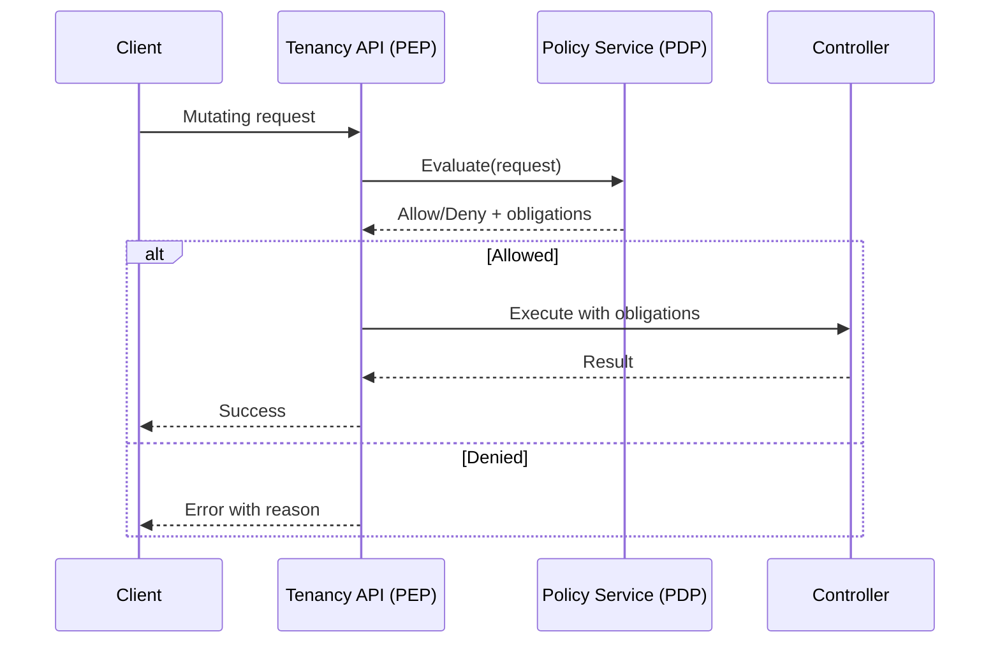

# Tenancy Module Policies

**Audience:** Platform engineers, security engineers, SREs, and service owners  
**Status:** Working draft  
**Purpose:** Define the policy model that governs Tenancy operations. This document covers policy types, evaluation flow, request and response schemas, caching, failure handling, versioning, rollout, and examples. It merges Tenant Management policy semantics with Tenancy control plane behavior. Regulatory mappings are out of scope and handled in parked-scope.md.

## Scope

Policies constrain actions and decisions made by the Tenancy control plane and APIs. Core policy types include residency, encryption, retention, action permissions, and plan derived limits. Policies are authoritative. If a policy cannot be evaluated, the operation fails with a clear error and audit record.

## Policy Types

**Residency policy** determines allowed and preferred regions and governs placement decisions.  
**Encryption policy** selects KMS key classes, per-tenant keys, and rotation intervals.  
**Retention policy** defines archival windows and deletion eligibility.  
**Action policy** specifies which lifecycle and administrative actions are permitted and under what conditions.  
**Plan policy** binds plan codes to feature flags and quota envelopes.  
**Webhook policy** restricts outbound destinations by domain and protocol.  
**Identity policy** constrains who can call sensitive endpoints based on roles and tenant context.

## Architecture

The platform uses a policy decision point and policy enforcement point model.

- Policy Enforcement Point runs inside API handlers and controllers before any mutating operation.  
- Policy Decision Point is an external service that evaluates requests against versioned policy sets.  
- A short lived cache reduces latency for repeated decisions with strict TTL.



## Evaluation Flow

1. API receives a request or controller executes a transition.  
2. Enforcement point constructs a policy request with tenant id, actor, action, resource, and attributes.  
3. Decision point evaluates and returns allow or deny, with optional obligations.  
4. If denied, the API returns a structured error.  
5. If allowed, the controller proceeds and records audit with policy identifiers.

## Request And Response Schema

**Request to decision point**
```json
{
  "tenantId": "t_123456",
  "actor": "user_9f3a",
  "action": "ACTIVATE_TENANT",
  "resource": "tenant",
  "attributes": {
    "planCode": "ENTERPRISE_PLUS",
    "requestedRegion": "ap-south-1",
    "dataSovereigntyRequired": true,
    "isolationStrategy": "dedicatedDatabase"
  },
  "context": {
    "requestId": "req_9f3a",
    "correlationId": "corr_1c77",
    "environment": "prod"
  }
}
```

**Response from decision point**
```json
{
  "allow": true,
  "policyId": "residency/v2",
  "obligations": {
    "kmsKeyClass": "per-tenant",
    "webhookDomainAllowList": ["billing.example.com","crm.example.com"]
  },
  "ttlSeconds": 120
}
```

## Enforcement In Tenancy APIs

Enforcement occurs in all mutating endpoints. Read endpoints may use policy to filter results in multi-tenant admin contexts.

| Endpoint | Action | Policy checks |
|----------|--------|---------------|
| POST /tenant-management/v1/tenants | CREATE_TENANT | action, plan |
| PUT /tenant-management/v1/tenants/{tenantId} | UPDATE_TENANT | action |
| POST /tenant-management/v1/tenants/{tenantId}:activate | ACTIVATE_TENANT | residency, encryption, plan, action |
| POST /tenant-management/v1/tenants/{tenantId}:suspend | SUSPEND_TENANT | action |
| POST /tenant-management/v1/tenants/{tenantId}:resume | RESUME_TENANT | action |
| POST /tenant-management/v1/tenants/{tenantId}:archive | ARCHIVE_TENANT | retention, action |
| DELETE /tenant-management/v1/tenants/{tenantId} | DELETE_TENANT | retention, action |
| PUT /tenant-management/v1/tenants/{tenantId}/regions | UPDATE_REGIONS | residency, action |
| PUT /tenant-management/v1/tenants/{tenantId}/plan | UPDATE_PLAN | plan, action |
| PUT /tenant-management/v1/tenants/{tenantId}/quotas | OVERRIDE_QUOTA | plan, action |

## Residency Policy

**Intent** ensure tenant data lives in acceptable locations and is provisioned in regions that comply with requirements.

**Example policy document**
```yaml
version: 2
kind: ResidencyPolicy
allowedRegions:
  - ap-south-1
  - eu-central-1
preferredRegionStrategy: preferRequested
denyIfOutOfPolicy: true
fallbackRegions:
  - ap-south-2
obligations:
  enforcePrivateEndpoints: true
```

**Evaluation rules**
- requested region must be in allowedRegions.  
- preferred region strategy selects the first valid region.  
- if out of policy and denyIfOutOfPolicy is true, decision is deny with code RESIDENCY_OUT_OF_POLICY.  
- obligations toggle private endpoints or extra controls.

## Encryption Policy

**Intent** select keys and rotation to meet confidentiality requirements.

```yaml
version: 3
kind: EncryptionPolicy
defaultKeyRef: kms://keys/tenancy-default
perTenantKeys: true
rotationDays: 90
auditKeyRef: kms://keys/audit-log
```

**Rules**
- per-tenant keys are required for single tenant profile.  
- rotationDays must be less than or equal to global maximum.  
- audit logs must use dedicated key.

## Retention Policy

**Intent** define archival windows and deletion eligibility.

```yaml
version: 1
kind: RetentionPolicy
archiveAfterDays: 0
deleteAfterDays: 180
requireExportBeforeDelete: true
```

**Rules**
- Archived state required before deletion for production tenants.  
- Deletion permitted only after deleteAfterDays.  
- Export evidence must be attached to the delete request when required.

## Action Policy

**Intent** restrict who can perform sensitive actions.

```yaml
version: 2
kind: ActionPolicy
roles:
  tenancy_writer:
    can:
      - CREATE_TENANT
      - UPDATE_TENANT
      - ACTIVATE_TENANT
      - SUSPEND_TENANT
      - RESUME_TENANT
  tenancy_admin:
    can:
      - ARCHIVE_TENANT
      - DELETE_TENANT
      - OVERRIDE_QUOTA
requireJustification:
  - SUSPEND_TENANT
  - DELETE_TENANT
```

**Rules**
- actor must hold a role that grants the action.  
- selected actions require a justification string for audit.  
- admin scope is required for destructive actions.

## Plan Policy

**Intent** bind plan codes to feature and quota envelopes.

```yaml
version: 3
kind: PlanPolicy
plans:
  ENTERPRISE_PLUS:
    features:
      - enableSandboxCloning
      - enableRegionFailover
    quotas:
      storageGb: 5000
      eventsPerMinute: 3000
      connections: 200
  STANDARD:
    features: []
    quotas:
      storageGb: 200
      eventsPerMinute: 500
      connections: 50
```

**Rules**
- unknown plan codes are rejected.  
- quotas and features are derived first from plan then overridden by policy or per-tenant overrides.

## Webhook Policy

**Intent** reduce exfiltration risk through controlled destinations.

```yaml
version: 1
kind: WebhookPolicy
allowHttpsOnly: true
allowedDomains:
  - billing.example.com
  - crm.example.com
maxEndpointsPerTenant: 10
```

**Rules**
- https only with valid certificate chain.  
- host must match allowed domains.  
- tenants cannot exceed the maximum endpoints allowed.

## Identity Policy

**Intent** ensure caller identity is scoped correctly for tenant operations.

```yaml
version: 1
kind: IdentityPolicy
scopes:
  readTenancy: ["GET:/tenants", "GET:/tenants/{tenantId}"]
  writeTenancy: ["POST:/tenants", "PUT:/tenants/{tenantId}", "PATCH:/tenants/{tenantId}"]
  adminOverride: ["DELETE:/tenants/{tenantId}","POST:/tenants/{tenantId}:archive"]
constraints:
  tenantScopedTokensOnly: true
```

**Rules**
- token must include scope matching the operation.  
- tenant scoped tokens are required for tenant level operations.

## Caching And TTL

**Client cache**
- ETag and conditional GET used for resources. Not a policy concern but reduces PDP load.

**Policy decision cache**
- cache key combines tenantId, action, and request attribute hash.  
- ttlSeconds returned by PDP defines cache window.  
- stale entries are never used for mutating operations after expiry.

## Error Model

**Structure**
```json
{
  "error": {
    "code": "RESIDENCY_OUT_OF_POLICY",
    "message": "Preferred region eu-west-1 is not allowed by policy residency/v2",
    "policyId": "residency/v2",
    "requestId": "req_9f3a",
    "correlationId": "corr_1c77",
    "details": {
      "allowedRegions": ["ap-south-1","eu-central-1"]
    }
  }
}
```

**Common codes**
- VALIDATION_FAILED  
- RESIDENCY_OUT_OF_POLICY  
- ENCRYPTION_POLICY_VIOLATION  
- RETENTION_NOT_SATISFIED  
- ACTION_NOT_ALLOWED  
- PLAN_NOT_FOUND  
- WEBHOOK_POLICY_VIOLATION  
- UNAUTHORIZED

## Rollout And Versioning

- Policies are versioned. New versions are deployed in shadow mode before enforcement.  
- Rollouts are region by region with monitoring for deny spikes.  
- Policy ids and versions are included in audit for traceability.  
- Deprecations keep old versions available for a defined window.

## Change Management

- Changes require code review by security and platform owners.  
- Pre merge tests validate policy syntax and expected outcomes.  
- Staging dry runs evaluate deny rates on production-like traffic.  
- Emergency changes are allowed only with admin override and must be audited.

## Testing

**Unit tests**
- Evaluate allow and deny scenarios for each policy type.  
- Validate obligations are returned correctly.

**Integration tests**
- End to end activation with residency and encryption checks.  
- Webhook creation with domain allow list.  
- Deletion flow blocked until retention satisfied.

**Chaos and fault tests**
- PDP unavailability fails closed and exercises fallback alerts.  
- Cache poisoning attempts are detected and rejected.

## Examples

**Activation request denied by residency**
```json
{
  "allow": false,
  "policyId": "residency/v2",
  "reason": "requestedRegion not in allowedRegions",
  "details": {"requestedRegion":"eu-west-1"}
}
```

**Quota override allowed with justification**
```json
{
  "allow": true,
  "policyId": "action/v2",
  "obligations": {"requireAuditNote": true}
}
```

## Observability

- Metrics: policy_eval_latency_ms, policy_eval_errors_total, denies_by_policy_total.  
- Logs: include policyId, decision, and attribute hash.  
- Alerts: elevated deny rate or latency above SLO.

## Summary

The policy model provides a consistent and enforceable gate for all Tenancy operations. It ensures that placement, encryption, retention, and privileges are validated before action. Decisions are fast, cacheable within strict TTL, and fully auditable. The result is predictable behavior and reduced incident risk across environments and regions.