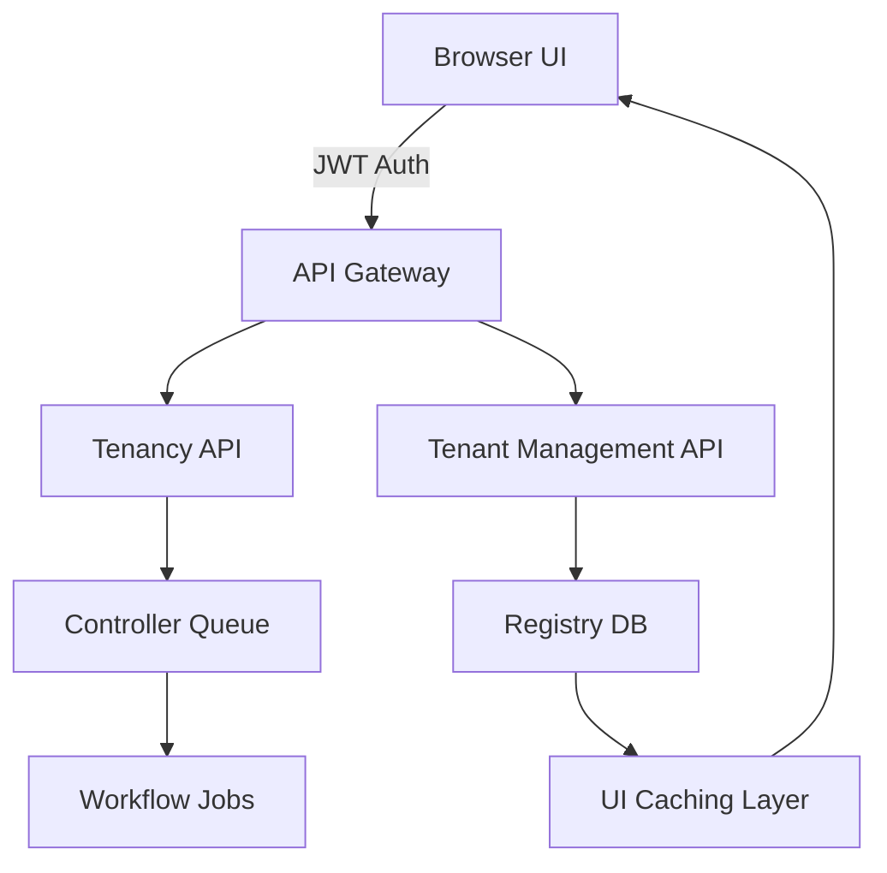
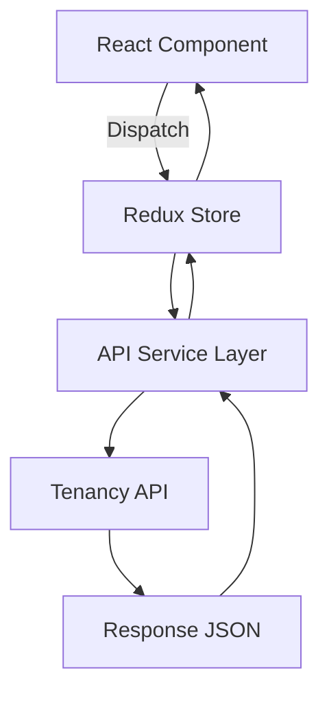
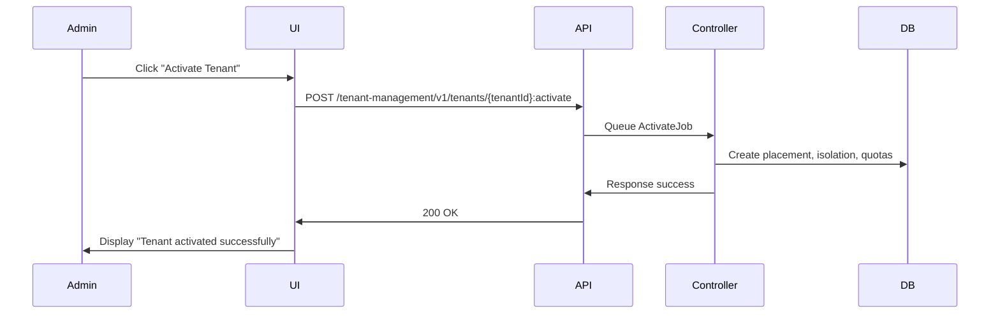

# Tenancy Module User Interface

**Audience:** Platform engineers, operations teams, and implementation partners  
**Status:** Working draft  
**Purpose:** Describe the Tenancy module’s functional user interfaces and their interaction with Tenancy APIs. The document covers the Admin and Customer portals, outlines data flow, permissions, and UI-level integration with the Tenancy API suite. This is functional documentation, not a design specification.

## Overview

The Tenancy module provides two primary UI layers:

1. **Admin Portal** — used by internal operators to manage tenants, lifecycle operations, policies, and configuration.
2. **Customer Portal** — used by tenant administrators to view tenant information, quotas, webhook settings, audit logs, and perform self-service actions where allowed.

Both portals use the same backend APIs exposed by the Tenancy and Tenant Management services. They differ only in role, scope, and permissions.

## Architecture

- UI is a React-based single-page application with secure API integration through JWT.  
- Requests are routed through the API Gateway, which handles authentication and rate limiting.  
- All UI actions correspond to REST endpoints described in Tenancy APIs.  
- The UI reads real-time status from the Registry DB via cached API responses.

## Admin Portal

### Functional Overview

The Admin Portal allows internal operators to:

- Register new tenants (`POST /tenant-management/v1/tenants`)
- Activate or suspend tenants
- Manage plans, quotas, and overrides
- Trigger lifecycle jobs (archive, delete)
- Review audit and webhook delivery logs
- Monitor active jobs and alerts

### Key Screens

**Tenant Registry View**
- Lists all tenants with status, region, plan, and residency indicators.  
- Uses `GET /tenant-management/v1/tenants?state=Active` for listing.  
- Supports filters for region, plan code, and creation time.  

**Tenant Detail Panel**
- Shows summary, contacts, region, and isolation mode.  
- Displays recent lifecycle actions via `GET /tenant-management/v1/tenants/{tenantId}/history`.  
- Includes controls for suspend, resume, archive, and delete.  

**Plan and Quota Editor**
- Invokes `PUT /tenant-management/v1/tenants/{tenantId}/plan`.  
- Displays effective quotas via `GET /tenant-management/v1/tenants/{tenantId}/quotas`.  
- Allows overrides through `PUT /tenant-management/v1/tenants/{tenantId}/quotas`.  

**Webhook Monitor**
- Uses `GET /tenant-management/v1/tenants/{tenantId}/webhooks` for list.  
- Displays delivery metrics and DLQ backlog.  
- Enables requeue via `POST /tenant-management/v1/tenants/{tenantId}/webhooks:requeue`.  

**Audit Log Viewer**
- Fetches logs from `/tenant-management/v1/tenants/{tenantId}/audit`.  
- Supports time-based filters and export to CSV.  

### Admin Roles and Permissions

| Role | Permissions |
|------|--------------|
| tenancy_admin | Full access to lifecycle, quotas, and archival |
| tenancy_operator | Can create, activate, and suspend tenants |
| tenancy_auditor | Read-only access to registry and audit logs |

Access control enforced by the API Gateway and verified by the Action Policy in the backend.

## Customer Portal

### Functional Overview

The Customer Portal gives tenant administrators limited self-service and visibility. Allowed operations depend on plan and policy.

**Capabilities**
- View tenant summary, plan, and quota usage.  
- View or edit webhook configuration (if permitted).  
- Access audit logs scoped to tenant.  
- View lifecycle history and residency.  
- Manage access tokens through self-service API keys.

### Key Screens

**Dashboard**
- Shows tenant name, ID, current state, region, and plan.  
- Pulls data from `GET /tenant-management/v1/tenants/{tenantId}`.  
- Displays health summary from observability metrics endpoint.

**Webhook Configuration**
- Uses `GET /tenant-management/v1/tenants/{tenantId}/webhooks`.  
- Allows `POST` or `DELETE` if plan allows webhook editing.  
- Validates endpoints against Webhook Policy in real time.

**Quota & Plan**
- Fetches via `GET /tenant-management/v1/tenants/{tenantId}/quotas`.  
- Read-only for most plans. Enterprise tenants may request quota increases.

**Audit Viewer**
- Uses `GET /tenant-management/v1/tenants/{tenantId}/audit?scope=self`.  
- Allows tenant admins to export filtered logs.

**Tokens Panel**
- Lists service tokens generated through API keys endpoint.  
- Invokes `POST /tenant-management/v1/tokens` with scope and TTL.  

### Customer Roles and Permissions

| Role | Description |
|------|--------------|
| tenant_admin | Can view and manage webhooks, view quotas, read audit logs |
| tenant_viewer | Read-only tenant summary and quotas |
| tenant_auditor | Can view audit logs and residency information only |

## UI-API Contracts

Each action in the UI maps directly to a REST API call. Requests include `Authorization: Bearer <token>` and carry correlation IDs for observability.

| UI Action | API Endpoint | Method | Policy |
|------------|--------------|--------|---------|
| Create Tenant | /tenant-management/v1/tenants | POST | Action, Plan |
| Activate Tenant | /tenant-management/v1/tenants/{tenantId}:activate | POST | Residency, Encryption |
| Suspend Tenant | /tenant-management/v1/tenants/{tenantId}:suspend | POST | Action |
| Resume Tenant | /tenant-management/v1/tenants/{tenantId}:resume | POST | Action |
| Archive Tenant | /tenant-management/v1/tenants/{tenantId}:archive | POST | Retention |
| Delete Tenant | /tenant-management/v1/tenants/{tenantId} | DELETE | Retention |
| List Tenants | /tenant-management/v1/tenants | GET | None |
| Fetch Quotas | /tenant-management/v1/tenants/{tenantId}/quotas | GET | None |
| Update Plan | /tenant-management/v1/tenants/{tenantId}/plan | PUT | Plan |
| Manage Webhooks | /tenant-management/v1/tenants/{tenantId}/webhooks | GET, POST, DELETE | Webhook |

All calls use JSON and return ETag headers for caching. The UI layer applies client-side diffing to avoid redundant updates.

## Data Flow And State Management

- Redux or Context store manages tenant list and detail state.  
- API service layer centralizes REST calls and retry logic.  
- Local caching keyed by tenantId and ETag.  
- Retry with exponential backoff for transient 5xx errors.

## Authentication And Authorization Flow

- Users log in via OAuth 2.0 with JWT tokens.  
- Access tokens carry tenant context and scopes.  
- UI validates token scopes before enabling action buttons.  
- Token refresh handled via `/auth/refresh` endpoint.  
- Unauthorized responses trigger redirect to login.

## Observability In UI

- Every API request logs correlationId and latency.  
- UI errors surface to Sentry-compatible telemetry.  
- Metrics: api_latency_ms, api_errors_total, render_time_ms.  
- Alert banner displayed when backend reports degraded status.

## Example Interaction Flow

## Future Enhancements

- Role-based view customizations.  
- Localization and time zone display per tenant.  
- Bulk lifecycle actions for enterprise accounts.  
- Advanced alert dashboard integration with Observability service.  
- UI-based policy and webhook configuration editors.

## Summary

The Tenancy UI provides a comprehensive management layer over Tenancy APIs. Admins can safely control tenant lifecycle and configuration, while customers can view and manage their tenancy within defined policies. All UI interactions are auditable, policy-enforced, and traceable via correlation IDs.