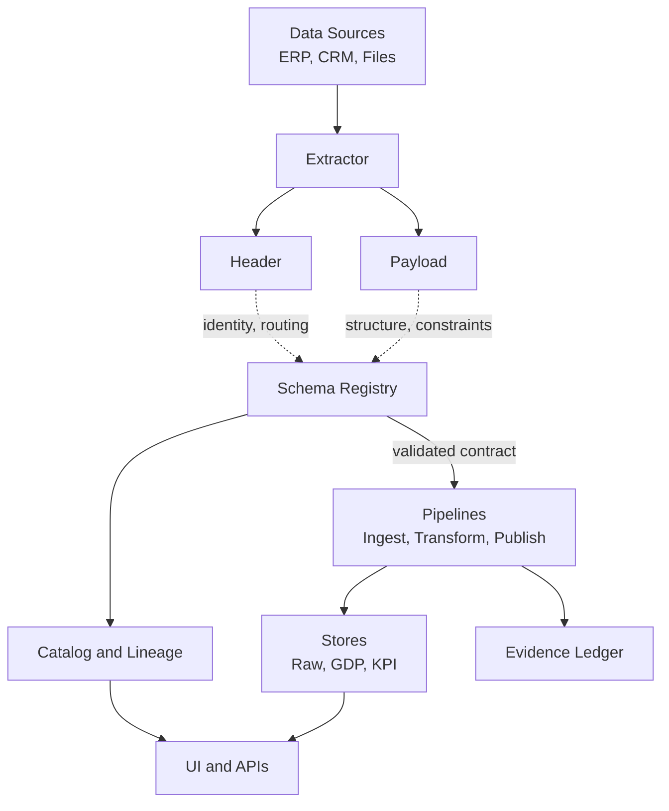

# Construction

## Overview
> **Note:** Extractor Schemas define only the *shape and transport contract* of extraction — covering envelopes, layouts, and CDC markers — not the business or semantic payload structure.

This document describes how contracts are constructed in the Schema Registry and how those contracts are consumed by pipelines and storage. Every contract is composed of a platform header and a versioned payload. The header enables routing, identity, and audit. The payload defines structure and constraints. All payloads are validated by the meta-schema before publication. Subject classes are Raw, GDP, and KPI.

## Structural diagram



## Layered model

The construction model separates identity from structure so that routing and audit remain stable while business shape can evolve. The header is uniform and unversioned. The payload is versioned and validated.

| Layer | Purpose | Stability | Notes |
|------|---------|-----------|------|
| Header | Identity, routing, trace correlation | Stable | Used by extractors and pipelines |
| Payload | Business structure and constraints | Versioned | Validated by the meta-schema |
| Meta | Lifecycle, compatibility, lineage, performance hints | Versioned metadata | Included inside payload document |

## Header

The header is a uniform envelope used on all extractor events and pipeline handoffs. It does not encode business fields. It identifies the payload contract and carries routing and audit information.

Required fields
- event_name
- event_version
- source
- tenant_id
- occurred_at
- trace_id
- payload

Example

```json
{
  "event_name": "sap.mara.row",
  "event_version": 1,
  "source": "sap-erp",
  "tenant_id": "TEN-00123",
  "occurred_at": "2025-10-06T04:25:13Z",
  "trace_id": "4d3a6f2e-5c6a-4d12-8d4a-c4be2d0dfc4b",
  "payload": {}
}
```

## Payload structure

The payload defines the business shape. It is versioned and validated by the meta-schema. The same top level structure applies to Raw, GDP, and KPI.

Top level fields
- title
- description
- type
- version
- columns
- keys
- constraints
- dqc_profile
- enforcement_mode
- validation_policy
- lineage
- profiling_stats
- performance
- lifecycle
- compatibility
- signature

### Columns

Columns declare the field list and types.

| Property | Type | Required | Notes |
|----------|------|----------|------|
| name | string | yes | Unique within the payload |
| logical_type | enum: STRING, INTEGER, NUMBER, BOOLEAN, DATE, TIMESTAMP, JSON | yes | Semantic type |
| length | integer | no | For bounded text fields |
| precision | integer | no | For numeric precision |
| scale | integer | no | For numeric scale |
| nullable | boolean | yes | True if null is allowed |
| ordinal | integer | yes | Position used by position bound enforcement |
| default | any | no | Optional default value |
| description | string | no | Human readable description |

### Keys

Keys define identity and relationships.

| Property | Type | Required | Notes |
|----------|------|----------|------|
| primary | array of strings | no | Primary key columns |
| unique | array of array of strings | no | Unique keys |
| foreign | array of foreign key objects | no | References to other contracts |

Foreign key object

| Property | Type | Required | Notes |
|----------|------|----------|------|
| columns | array of strings | yes | Local columns |
| ref_table | string | yes | Target reference name |
| ref_columns | array of strings | yes | Target columns |
| on_delete | enum: restrict, cascade, set_null | no | Delete behavior hint |

### Constraints

Constraints define row level checks. They are evaluated during transform or publish.

| Property | Type | Required | Notes |
|----------|------|----------|------|
| check | string | yes | Engine evaluated expression |
| name | string | no | Optional label |
| level | enum: Warn, Block | no | Severity on violation |

### Quality profile

The data quality profile is a list of rules evaluated during pipeline validation.

| Property | Type | Required | Notes |
|----------|------|----------|------|
| id | string | yes | Rule identifier |
| level | enum: Warn, Block | yes | Action level |
| config | object | no | Rule parameters |

### Lineage and profiling

Lineage links contracts and transform rule versions. Profiling captures optional diagnostics.

| Property | Type | Notes |
|----------|------|------|
| provider_ref | string | Provider specific reference |
| source_schemas | array of strings | Upstream contract identifiers |
| mapping_version | string | Transform rule version |
| row_count | integer | Observed rows |
| last_profiled_at | string date time | Profile timestamp |

### Performance and lifecycle

Performance hints guide physical modeling. Lifecycle controls publication state.

| Field | Type | Notes |
|------|------|------|
| read_profile | enum: tenant_totals, operator_drill, batch_export | Typical query shape |
| hot_keys | array of strings | Columns that must be indexed |
| target_p95_ms | integer | Read latency target |
| materialized | boolean | Serving view or table hint |
| subject_class | enum: raw, gdp, kpi | Contract category |
| status | enum: draft, published, deprecated | Publication state |
| owner | string | Accountable owner |
| deprecation_date | string date | Planned removal date |

## Enforcement modes

Enforcement mode controls how incoming data is matched to the payload definition.

| Mode | Description | Typical use |
|------|-------------|-------------|
| position_bound | Validate by column count and position | legacy fixed layouts |
| name_bound | Validate by column names | canonical GDP and KPI |
| tolerant | Allow extra nullable columns with warnings | controlled vendor drift |

## Compatibility policy

Changes are classified at the payload boundary. Additive optional columns and widened types are backward compatible. Non null additions require staged backfill and enforcement. Renames, removals, and type tightening are breaking and require a major version and a deprecation window.

| Change | Classification | Action |
|-------|----------------|--------|
| Add optional column | Backward compatible | increase minor version |
| Widen length or precision | Backward compatible | increase minor version |
| Add non null column after backfill | Backward compatible | increase minor version after staged backfill |
| Rename or remove column | Breaking | increase major version and provide deprecation window |
| Narrow type or tighten constraint | Breaking | increase major version and provide migration plan |

## Reuse model

Raw contracts are tenant agnostic. A vendor table is defined once and reused across tenants. Optional fields are nullable. Extra fields can be handled with tolerant enforcement when approved.

GDP contracts are source agnostic. They define stable business semantics. Multiple raw sources can map to the same GDP contract.

KPI contracts are source agnostic. They define measures, dimensions, and windows. They reference GDP contracts in lineage.

## Interaction with pipelines

Ingestion validates envelope and payload using the latest published raw contract. Transform pins specific source and target versions to ensure determinism when mapping raw to GDP and GDP to KPI. Publish provisions physical stores and applies constraints. Evidence is written with contract identifiers, versions, signatures, and input counts.

## Evidence

Pipelines compute a signature for incoming records and compare with the contract signature. Mismatch raises a validation event and, depending on policy, blocks or warns. Evidence is retained for audit with pointers to runs and queries.

## Examples

Raw payload example

```json
{
  "title": "sap.mara.row.v1",
  "type": "object",
  "version": "1.0.0",
  "columns": [
    { "name": "MATNR", "logical_type": "STRING", "length": 40, "nullable": false, "ordinal": 1 },
    { "name": "ERSDA", "logical_type": "DATE", "nullable": false, "ordinal": 2 },
    { "name": "MATKL", "logical_type": "STRING", "length": 9, "nullable": true, "ordinal": 3 }
  ],
  "keys": { "primary": ["MATNR"] },
  "dqc_profile": { "rules": [ { "id": "strict_column_order", "level": "Block" } ] },
  "enforcement_mode": "position_bound",
  "validation_policy": "Block",
  "lineage": { "provider_ref": "SAP-DDIC:MARA" },
  "lifecycle": { "subject_class": "raw", "status": "published", "owner": "data-platform-team" }
}
```

GDP payload example

```json
{
  "title": "gdp.material.v1",
  "type": "object",
  "version": "1.2.0",
  "columns": [
    { "name": "material_id", "logical_type": "STRING", "nullable": false, "ordinal": 1 },
    { "name": "uom_base", "logical_type": "STRING", "nullable": false, "ordinal": 2 },
    { "name": "created_date", "logical_type": "DATE", "nullable": false, "ordinal": 3 }
  ],
  "keys": { "primary": ["material_id"] },
  "constraints": [ { "check": "length(material_id) > 0", "level": "Block" } ],
  "enforcement_mode": "name_bound",
  "validation_policy": "Block",
  "lineage": { "source_schemas": ["sap.mara.row.v1"] },
  "performance": { "read_profile": "tenant_totals", "hot_keys": ["material_id"], "target_p95_ms": 150, "materialized": true },
  "lifecycle": { "subject_class": "gdp", "status": "published", "owner": "data-platform-team" }
}
```

KPI payload example

```json
{
  "title": "kpi.material_count_by_plant.v1",
  "type": "object",
  "version": "1.0.0",
  "columns": [
    { "name": "as_of_date", "logical_type": "DATE", "nullable": false, "ordinal": 1 },
    { "name": "plant", "logical_type": "STRING", "nullable": true, "ordinal": 2 },
    { "name": "division", "logical_type": "STRING", "nullable": true, "ordinal": 3 },
    { "name": "count", "logical_type": "INTEGER", "nullable": false, "ordinal": 4 }
  ],
  "keys": { "primary": ["as_of_date", "plant", "division"] },
  "constraints": [ { "check": "count >= 0", "level": "Block" } ],
  "enforcement_mode": "name_bound",
  "validation_policy": "Block",
  "lineage": { "source_schemas": ["gdp.material.v1"] },
  "lifecycle": { "subject_class": "kpi", "status": "published", "owner": "data-platform-team" }
}
```

## Cross references

See meta-schema for validation rules and required sections. See pipelines integration for stage bindings and retries. See observability for drift and quarantine signals. See runbook for remediation procedures.