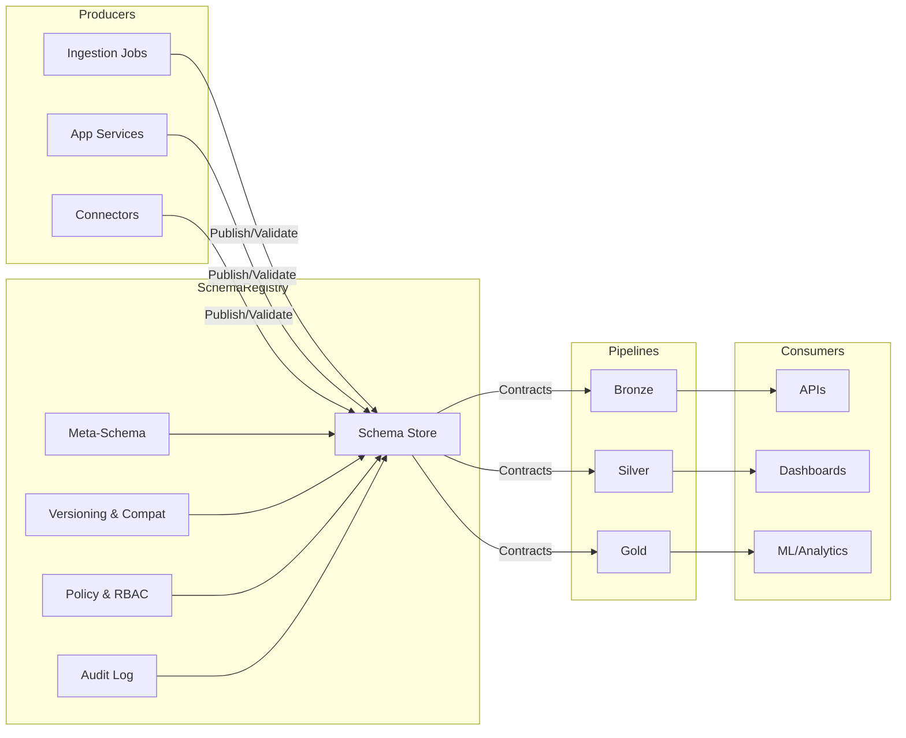

# Schema Registry

**Schema Registry**

The Schema Registry provides authoritative definitions for data structures used across ingestion, transformation, serving, and API layers. It enforces a consistent contract between producers and consumers and integrates with validation, governance, observability, and CI pipelines.

**Audience**

Platform engineers, data engineers, solution architects, and service owners who design, validate, and evolve schemas for enterprise workloads.

**Objectives**

- Establish a single source of truth for canonical, versioned schemas.  
- Enable repeatable validation across data pipelines and services.  
- Provide lifecycle controls for schema proposal, review, approval, and deprecation.  
- Integrate with governance, observability, and deployment workflows.  
- Reduce coupling between producers and consumers through explicit contracts.

**Scope**

- Canonical and domain schemas for Bronze, Silver, and Gold layers.  
- Meta-schema for schema authoring, validation rules, and extensions.  
- Versioning strategy and evolution policy.  
- Runtime validation hooks for pipelines and services.  
- Governance controls, RBAC, and auditability.  
- Interfaces: API, CLI, and UI.

**Non-Goals**

- Storage of business data.  
- BI modeling documentation beyond schema contracts.  
- Vendor-specific serialization deep dives outside contract compatibility.

## Module Structure

- **Overview**  
  Purpose, positioning, and alignment with the Commercial-Ops module.  

- **Concepts**  
  Canonical schema, domain schema, meta-schema, compatibility levels, and versioning.  

- **Configuration**  
  Repository layout, naming conventions, schema annotations, and environment overlays.  

- **Workflows**  
  Authoring, proposal, review, approval, publish, adoption, and deprecation flows.  

- **Validation**  
  Static checks, runtime checks, compatibility gates, and pipeline integration.  

- **Observability**  
  Metrics, logs, traces, dashboards, and alerts for schema events and failures.  

- **Runbook**  
  Standard operating procedures, incident response, and rollback steps.  

- **API**  
  Endpoints, request and response models, pagination, filters, and error semantics.  

- **UI**  
  Views for discovery, diff, lineage, approvals, and integration status.

## Reference Architecture

**Design Principles**

- Contracts first. Schemas are required before data flows are enabled.  
- Validate early. Fail fast on schema violations in authoring and CI.  
- Compatible by default. Enforce additive evolution unless explicitly approved.  
- Observable as code. Emit metrics and logs for every schema event.  
- Governed lifecycle. Each schema state transition is auditable and access-controlled.

**Deliverables**

- Versioned schemas under Git with review gates.  
- Meta-schema definitions and validation policies.  
- CI checks for schema compatibility and linting.  
- API and UI for discovery, approvals, and adoption tracking.  
- Runbook for incident handling and rollbacks.

**Navigation**

- [Overview](overview.md)  
- [Concepts](concepts.md)  
- [Configuration](configuration.md)  
- [Workflows](workflows.md)  
- [Validation](validation.md)  
- [Observability](observability.md)  
- [Runbook](runbook.md)  
- [API](api.md)  
- [UI](ui.md)
