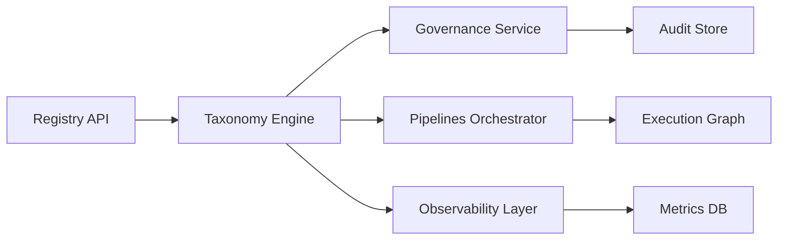
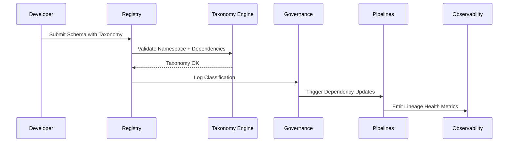

# Schema Lifecycle – Taxonomy
> Applies to: All Schema Layers • Owner: Platform Engineering • Last updated: 2025-10-07

## Objectives
Define a unified classification and dependency model for every schema in the platform.  
The taxonomy acts as the connective tissue across Registry, Governance, Pipelines, and Observability, ensuring that every schema object is discoverable, traceable, and version‑controlled.

## Scope
> **Note:** Extractor Schemas define only the *shape and transport contract* of extraction — covering envelopes, layouts, and CDC markers — not the business or semantic payload structure.

The taxonomy governs:
- Domain and layer hierarchy
- Schema naming and versioning standards
- Dependency mapping and lineage
- Integration hooks for validation, publishing, and monitoring

**Out of Scope:** payload semantics, KPI logic, and runtime data validation.

---

## Core Responsibilities
- Maintain consistent naming and identification rules across tenants.
- Anchor each schema to its domain/layer/subject taxonomy.
- Enable cross‑layer lineage for automated impact analysis.
- Surface taxonomy events to Observability and Pipelines for change propagation.
- Provide Governance with immutable classification metadata for audit.

---

## Architecture Overview
The taxonomy service is a metadata subsystem embedded within the Schema Registry.



**Interactions**
- **Registry**: uses taxonomy metadata to index schemas by domain and layer.
- **Governance**: uses lineage graphs for change control and risk evaluation.
- **Pipelines**: auto‑routes schema changes to appropriate ETL jobs.
- **Observability**: tracks lineage drift and publishes health metrics.

---

## Concept Model
| Element | Description | Example |
|---|---|---|
| **Domain** | Business area such as Finance, Sales, Operations | `Finance` |
| **Layer** | Abstraction tier (Extractor, GDP, KPI, Derived) | `GDP` |
| **Subject** | Entity or metric represented | `Invoice` |
| **FQID** | Fully Qualified Identifier `<domain>.<layer>.<subject>:<version>` | `finance.gdp.invoice:v1.3` |
| **Lineage** | Graph of upstream/downstream dependencies | invoice → DSO KPI |

**Hierarchy**
```
Organization
 └── Domain
     └── Layer
         └── Subject
             └── Schema (Versioned)
```

---

## Lifecycle & Data Flow
1. **Registration** – Developer submits draft schema with taxonomy attributes.
2. **Validation** – Taxonomy engine checks namespace integrity and uniqueness.
3. **Publication** – Registry stores immutable taxonomy record.
4. **Propagation** – Pipelines update lineage DAG; Observability refreshes metrics.
5. **Monitoring** – Drift, orphaned schemas, and lineage health tracked.



---

## Configuration
| Parameter | Description | Required | Default |
|---|---|:---:|---|
| `domain` | Business domain identifier | ✓ | – |
| `layer` | Schema abstraction layer | ✓ | – |
| `subject` | Entity or metric | ✓ | – |
| `version` | Semantic version | ✓ | `v1.0` |
| `compatibility_policy` | `full | forward | none` | ✓ | `full` |
| `lineage_enabled` | Track dependencies automatically |  | `true` |
| `max_depth` | Maximum lineage recursion depth |  | 10 |

---

## API Operations
| Operation | Method | Endpoint | Description |
|---|---|---|---|
| List Taxonomy | GET | `/taxonomy` | Return all domains/layers/subjects |
| Validate Entry | POST | `/taxonomy/validate` | Check compliance and uniqueness |
| Get Lineage | GET | `/taxonomy/lineage/{{fqid}}` | Return upstream/downstream graph |
| Update Tags | PATCH | `/taxonomy/tags/{{fqid}}` | Add or modify tags |
| Delete Draft Entry | DELETE | `/taxonomy/{{fqid}}` | Remove draft taxonomy record |

**Example**
```json
{{
  "fqid": "finance.gdp.invoice:v1.3",
  "domain": "Finance",
  "layer": "GDP",
  "subject": "Invoice",
  "depends_on": ["finance.extractor.invoice_header:v1.1"],
  "referenced_by": ["finance.kpi.dso:v1.0"]
}}
```

---

## Observability Integration
| Metric | Description | Unit | Target |
|---|---|---|---|
| `taxonomy.catalog_count` | Total registered schemas | count | – |
| `taxonomy.orphan_ratio` | Orphaned subjects / total subjects | % | <1 |
| `taxonomy.sync_latency_sec` | Time from publish to catalog availability | sec | ≤60 |
| `taxonomy.drift_events` | Schema lineage drift detections | count/day | 0 |

**Alerts**
- **High orphan ratio (>2%)** → Governance review.
- **Drift event detected** → Pipeline revalidation job triggered.
- **Sync latency >90s** → Investigate registry queue backlog.

---

## Governance Touchpoints
- Each new domain requires governance approval.
- Layer addition/modification logged as **governance change event**.
- Deprecated domains remain queryable but hidden from onboarding workflows.
- Taxonomy metadata is immutable once schema status = `published`.

**Audit Record Structure**
```json
{{
  "event": "DomainAdded",
  "by": "user:neeta",
  "timestamp": "2025-10-07T09:45Z",
  "domain": "Operations",
  "approver": "governance-board"
}}
```

---

## Pipeline Integration
- Pipelines pull lineage DAG nightly for dependency resolution.
- Schema promotions emit `taxonomy.changed` event to orchestration topic.
- DAG updates cascade to dependent transformation jobs.
- Orphan or drifted nodes trigger re‑build notifications.

**Pipeline Event Example**
```json
{{
  "event": "taxonomy.changed",
  "fqid": "finance.gdp.invoice:v1.4",
  "change_type": "minor",
  "affected_downstream": ["finance.kpi.dso:v1.1"]
}}
```

---

## Error Handling
| Code | Meaning | Action |
|---|---|---|
| 400 | Invalid namespace or version | Correct and resubmit |
| 404 | Taxonomy entry not found | Verify FQID |
| 409 | Duplicate entry | Increment version or merge |
| 422 | Invalid dependency | Update `depends_on` |
| 500 | Internal service failure | Retry or escalate |

---

## Limits
| Item | Limit | Notes |
|---|---|---|
| Domains per tenant | 25 | Configurable via policy |
| Layers per domain | 4 | Extractor, GDP, KPI, Derived |
| Max lineage depth | 10 | Beyond depth truncated |
| Max tags per schema | 20 | Enforced by Registry |

---

## Examples
### 1. Minimal GDP schema taxonomy entry
```json
{{
  "fqid": "finance.gdp.payment:v1.0",
  "domain": "Finance",
  "layer": "GDP",
  "subject": "Payment",
  "depends_on": ["finance.extractor.payment_header:v1.0"],
  "tags": ["finance", "cashflow"]
}}
```

### 2. KPI taxonomy entry with dependencies
```json
{{
  "fqid": "finance.kpi.dso:v1.1",
  "domain": "Finance",
  "layer": "KPI",
  "subject": "DaysSalesOutstanding",
  "depends_on": ["finance.gdp.invoice:v1.3", "finance.gdp.payment:v1.0"]
}}
```

---

## Versioning & Change Management
- Taxonomy revisions require governance approval.  
- Minor extensions (new subjects/layers) follow pull‑request workflow.  
- Breaking hierarchy changes create new domain records.  
- All updates logged to `/audit/taxonomy/` with signature and checksum.

---
