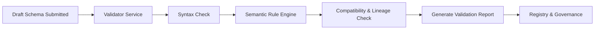
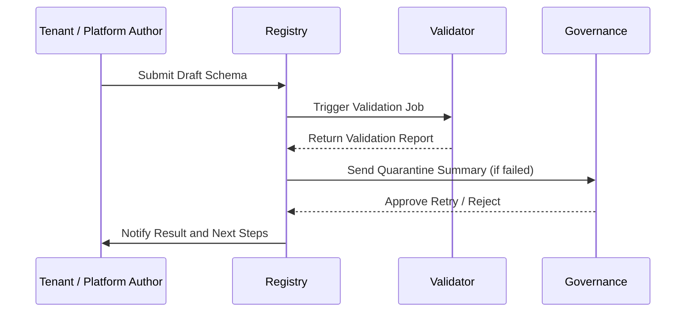

# Schema Lifecycle – Validation Workflow
> Applies to: All Schema Layers • Owner: Platform Engineering • Last updated: 2025-10-07

## Objectives
Ensure every schema submitted to the Registry passes through structured validation stages before publication.  
Validation guarantees syntactic correctness, semantic alignment, and compliance with platform standards while maintaining auditability.

## Scope
> **Note:** Extractor Schemas define only the *shape and transport contract* of extraction — covering envelopes, layouts, and CDC markers — not the business or semantic payload structure.

Covers validation of schema drafts across Extractor, GDP, KPI, and tenant namespaces.  
**Out of Scope:** data-level validation within pipelines (covered separately under Data Quality module).

---

## Core Responsibilities
- Perform syntax, semantic, and compatibility validation on draft schemas.
- Enforce naming, typing, and constraint rules defined in meta-schema.
- Produce machine-readable validation reports with severity levels.
- Manage quarantined schemas for failed validations.
- Integrate with Governance for review and final approval.
- Support tenant-specific schema validation requests via controlled API.

---

## Architecture Overview
The validation engine operates as a stateless service triggered by Registry events.



**Interactions**
- **Registry:** initiates validation and stores results.
- **Governance:** reviews failed or quarantined schemas.
- **Pipelines:** subscribe to validation success events to trigger test data loads.
- **Observability:** records validation performance and failure metrics.

---

## Validation Phases
| Phase | Description | Outcome |
|---|---|---|
| **Syntax** | JSON structure, required fields, datatypes | Pass/Fail |
| **Semantic** | Business rule alignment, naming conventions, constraints | Pass/Fail/Warning |
| **Compatibility** | Diff check against previous version or upstream schema | Compatible/Incompatible |
| **Dependency** | Ensures referenced schemas exist and are active | Valid/Invalid |
| **Policy Enforcement** | Validates governance policies (namespace, tenant rights) | Pass/Fail |

**Result Categories**
- ✅ **Passed** – Schema can proceed to publishing.
- ⚠️ **Passed with Warnings** – Minor rule violations, requires governance review.
- ❌ **Failed** – Sent to quarantine for remediation.

---

## Lifecycle & Workflow
1. **Schema Draft Created** – Submitted via Registry API.
2. **Automatic Validation Triggered** – Validator executes all rule sets.
3. **Results Generated** – Stored in validation bucket and audit index.
4. **Failed Schemas Quarantined** – Await governance review or correction.
5. **Governance Approval** – Allows re-validation or promotion to publish.
6. **Publish on Success** – Schema transitions to published state.



---

## Configuration
| Parameter | Description | Required | Default |
|---|---|:---:|---|
| `validation_policy` | strict / relaxed | ✓ | strict |
| `max_runtime_ms` | Timeout per validation job |  | 30000 |
| `sample_count` | Number of records used for test validation |  | 100 |
| `allow_warnings` | Permit non-critical warnings |  | false |
| `tenant_namespace_enabled` | Enable tenant validation sandbox |  | true |

---

## Validation Rule Sets
| Rule Group | Examples | Enforced By |
|---|---|---|
| **Syntax** | JSON validity, required envelope keys | Core Validator |
| **Semantic** | snake_case field names, type safety | Meta-Schema Engine |
| **Compatibility** | Type widening allowed, narrowing forbidden | Diff Engine |
| **Constraint** | Enum, regex, nullability checks | Constraint Engine |
| **Dependency** | Upstream FQIDs exist and active | Lineage Checker |
| **Tenant Policy** | Tenant may validate but not publish | Governance Filter |

---

## Observability Integration
| Metric | Description | Unit | Target |
|---|---|---|---|
| `validation.success_rate` | Successful validations / total | % | >95 |
| `validation.avg_runtime_ms` | Average duration of validation job | ms | <30000 |
| `validation.quarantine_count` | Failed validations moved to quarantine | count/day | 0 |
| `validation.warning_ratio` | Schemas with non-blocking warnings | % | <10 |

**Alerts**
- **Success rate < 90%** → Review schema submissions for systemic issues.  
- **High quarantine rate (>5/day)** → Possible regression or bad data source.  
- **Average runtime > 45s** → Investigate Validator performance bottleneck.

---

## Error Handling
| Code | Meaning | Resolution |
|---|---|---|
| 400 | Invalid schema format | Correct syntax and resubmit |
| 422 | Semantic or constraint violation | Review detailed report |
| 429 | Too many concurrent validations | Retry later |
| 504 | Validation timeout | Increase timeout or split schema |
| 500 | Internal service error | Retry or escalate |

---

## Limits
| Item | Limit | Notes |
|---|---|---|
| Max concurrent validations | 20 | Per tenant |
| Max validation report size | 10 MB | Stored compressed |
| Max retries per schema | 3 | After which draft archived |
| Quarantine retention | 30 days | Auto-deleted after retention |

---

## Example Validation Report
```json
{
  "fqid": "finance.gdp.invoice:v1.3",
  "status": "failed",
  "duration_ms": 2450,
  "rules_failed": [
    {"rule": "naming.snake_case", "field": "InvoiceID"},
    {"rule": "type.compatibility", "field": "amount_net"}
  ],
  "warnings": [
    {"rule": "field.description.missing", "field": "payment_term"}
  ]
}
```

---

## Tenant Request Integration
- Tenants submitting schema change requests trigger automatic validation after draft creation.  
- Tenant drafts are executed in **sandbox mode** (`tenant.<code>` namespace).  
- Results are visible to tenant admins but cannot be published without platform sign-off.  
- Governance dashboard aggregates tenant validation results to prioritize platform schema updates.

---

## Versioning & Change Management
- Validation rule sets are versioned independently (`validator:v1.x`).  
- Changes to rule definitions require governance approval and version bump.  
- Validation outcomes are immutable once logged and timestamped.  
- Audit records stored in `/audit/validation/` with checksum and signer identity.

---
