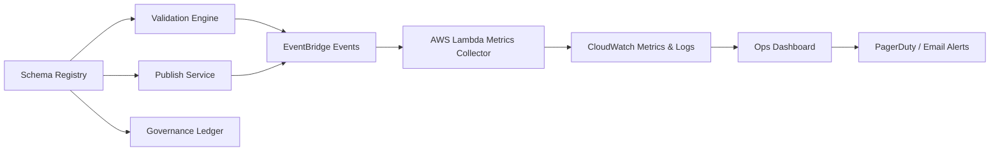

# Schema Registry — Observability
> Context: Monitoring & Telemetry • Owner: Platform Engineering • Last updated: 2025-10-07

## Purpose
Enable full observability across the Schema Registry and all integrated pipelines to ensure schema integrity, data conformity, and operational reliability.  
Observability provides **real‑time visibility** into validation outcomes, drift events, pipeline execution health, and governance compliance, helping teams detect anomalies early and maintain system trust.

---

## Architecture Overview

Observability spans all layers — schema creation, validation, publishing, and runtime drift monitoring — using **AWS CloudWatch**, **EventBridge**, and **Lambda collectors**.

---

## Key Objectives
- Maintain **visibility into every schema event** (draft, validation, publish, drift).  
- Enable **proactive alerting** on anomalies and SLA breaches.  
- Provide **auditable logs** of all schema actions.  
- Support **tenant‑scoped observability** to isolate behavior per organization.  
- Automate **drift detection and remediation triggers** through telemetry signals.

---

## Observability Domains

| Domain | Description | Primary Source |
|---|---|---|
| **Schema Validation** | Envelope and payload validation results | Lambda Validator |
| **Lifecycle Events** | Draft, validated, published transitions | Registry Service |
| **Pipeline Integration** | Glue/Lambda job validation outcomes | EventBridge |
| **Drift Detection** | Schema–data mismatch monitoring | Drift Detector |
| **Governance Compliance** | Approval and audit events | Governance Ledger |

---

## Metrics

### Schema Metrics
| Metric | Description | Unit | Target |
|---|---|---|---|
| `schema.validation_success_rate` | % of schemas passing validation | % | >99 |
| `schema.publish_latency_ms` | Time from draft to publish | ms | P95 ≤ 2000 |
| `schema.version_conflicts` | Detected duplicate or incompatible versions | count/day | 0 |
| `schema.drifts_detected` | Runtime schema drifts | count/day | 0 |
| `schema.audit_log_errors` | Ledger write failures | count/day | 0 |

### Pipeline Metrics
| Metric | Description | Unit | Target |
|---|---|---|---|
| `pipeline.validation_failures` | Glue/Lambda jobs blocked by validation | count/day | <5 |
| `pipeline.drift_events` | Drift alerts from runtime | count/day | 0 |
| `pipeline.reprocess_latency_minutes` | Time to reprocess quarantined data | minutes | <120 |
| `pipeline.job_duration_variance_pct` | Variance from baseline | % | <15 |

### System Metrics
| Metric | Description | Unit | Target |
|---|---|---|---|
| `registry.api_latency_ms` | REST API response latency | ms | P95 ≤ 300 |
| `registry.cache_hit_ratio` | Schema cache efficiency | % | >95 |
| `registry.event_queue_lag_sec` | EventBridge processing delay | sec | <5 |
| `registry.uptime_pct` | Service availability | % | ≥99.9 |

---

## Data Lineage & Audit Logging
Every schema operation produces an **immutable audit event** written to the Governance Ledger (AWS RDS or DynamoDB).  
The lineage engine links schema FQIDs, pipeline runs, and data assets across layers.

**Audit Event Example**
```json
{
  "event": "SchemaPublished",
  "fqid": "finance.gdp.invoice:v1.2",
  "actor": "anant.kulkarni@selenite.in",
  "timestamp": "2025-10-07T09:15:22Z",
  "result": "success",
  "metadata": {
    "previous_version": "v1.1",
    "compatibility_policy": "forward",
    "validation_latency_ms": 431
  }
}
```
Audit logs are queryable for compliance and linked to Data Lineage dashboards in Athena.

---

## Alerts & Dashboards

| Alert | Trigger | Response Owner | SLA |
|---|---|---|---|
| Validation Failure Spike | >5% failure in 1h window | Platform Eng | 30m |
| Drift Detected | Any drift in prod | Platform Ops | 15m |
| Governance Write Error | Ledger insert failure | Platform Eng | 1h |
| Publish Latency > SLA | >2s P95 latency | Platform Eng | 2h |
| API Latency > 300ms | 3 consecutive intervals | SRE | 30m |

Dashboards are deployed via CloudWatch and Grafana, exposing schema and pipeline KPIs per tenant, domain, and environment.

---

## Error Catalog
| Code | Condition | Operator Action |
|---|---|---|
| OBS-1001 | Missing telemetry data | Check Lambda metrics collector |
| OBS-1102 | EventBridge delivery failure | Retry or verify permissions |
| OBS-1203 | CloudWatch metric anomaly | Inspect alarm thresholds |
| OBS-1304 | Audit ledger sync delay | Restart ledger writer |
| OBS-1401 | API latency breach | Scale registry API or cache layer |

---

## Governance Notes
- All observability data is **immutable and audit‑logged**.  
- Metric retention = 13 months; audit logs = 36 months.  
- Tenants may access scoped dashboards only for their namespace.  
- Governance monitors SLAs and compliance violations weekly.  
- Observability pipeline is **out‑of‑band**; failures do not block core ingestion.

---

## Example Dashboards
### Example A — Validation Overview
Displays daily validation success rate, schema latency, and drift counts with tenant filters.

### Example B — Drift Trend Analysis
Shows 7‑day moving average of drift events by domain (e.g., Finance, Sales).

### Example C — Registry API Performance
Tracks API latency, cache hit ratio, and uptime SLAs.

---

## References
- CloudWatch Dashboards: `/infra/monitoring/schema_registry_dashboard.json`  
- EventBridge Event Model: `/events/schema_registry_events.json`  
- Audit Ledger Schema: `/db/schema_audit_ledger.sql`  
- Governance Policy: `/docs/governance/observability_compliance.md`

---
